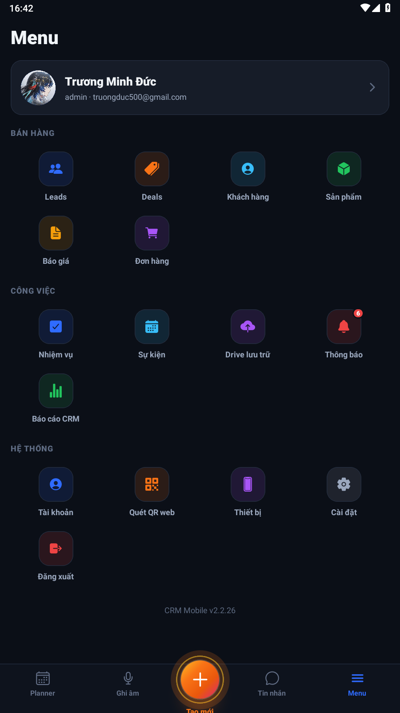
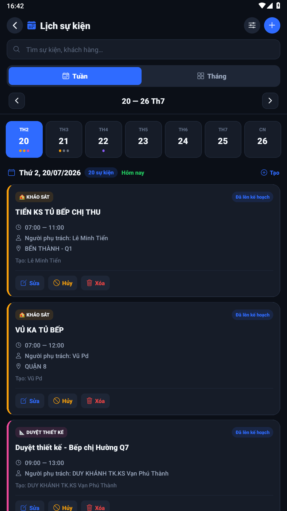
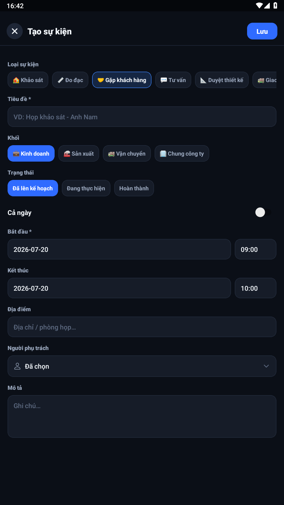

# Hướng dẫn: Tạo sự kiện trên CRM Mobile

Ảnh chụp từ LDPlayer · app **CRM Mobile v2.2.26**.

---

## Bước 1 — Mở Menu

Vào tab **Menu** (biểu tượng ba gạch ở thanh dưới cùng).



---

## Bước 2 — Mở «Sự kiện»

Trong mục **CÔNG VIỆC**, chạm ô **Sự kiện** (icon lịch xanh).

Ứng dụng mở màn **Lịch sự kiện** (xem theo Tuần / Tháng).



Có thể tạo sự kiện bằng một trong các nút:

- Nút **+** (xanh) góc phải trên
- **+ Tạo** cạnh ngày đang chọn
- Nút **Tạo sự kiện** khi ngày không có sự kiện nào

---

## Bước 3 — Mở form «Tạo sự kiện»

Chạm nút **+** (hoặc **+ Tạo** / **Tạo sự kiện**).



### Admin hệ thống — chọn công ty trong form

Với tài khoản **admin không gắn sẵn công ty**, form có thêm trường **Công ty \*** ngay đầu form:

1. Chạm **Chọn công ty…**
2. Chọn công ty trong danh sách
3. (Tuỳ chọn) chọn **Người phụ trách** — danh sách nhân viên theo công ty vừa chọn
4. Điền các trường còn lại → **Lưu**

Không cần chọn công ty trong bộ lọc trước khi tạo. Bộ lọc công ty vẫn dùng để **xem lịch** theo từng công ty.

Tài khoản đã gán công ty sẵn: trường Công ty không hiện; sự kiện gắn theo công ty của tài khoản.

---

## Bước 4 — Điền thông tin

| Trường | Bắt buộc | Ghi chú |
|--------|----------|---------|
| **Công ty** | Có (admin hệ thống) | Chỉ hiện với admin chưa gắn công ty |
| **Loại sự kiện** | — | Chọn chip (Khảo sát, Gặp khách hàng, …) |
| **Tiêu đề** | Có | Ví dụ: `Họp khảo sát - Anh Nam` |
| **Khối** | — | Kinh doanh / Sản xuất / Vận chuyển / Chung công ty |
| **Trạng thái** | — | Mặc định *Đã lên kế hoạch* |
| **Cả ngày** | — | Bật nếu không cần giờ cụ thể |
| **Bắt đầu** | Có | Ngày `yyyy-mm-dd` và giờ `HH:mm` |
| **Kết thúc** | — | Nên ≥ giờ bắt đầu |
| **Địa điểm** | — | Địa chỉ / phòng họp |
| **Người phụ trách** | — | Chạm để chọn nhân viên |
| **Mô tả** | — | Ghi chú thêm |

Cuối cùng chạm **Lưu** (góc phải trên). Chạm **X** để hủy và đóng form.

---

## Tóm tắt nhanh

```text
Menu → Sự kiện → nút + / + Tạo
  → (Admin) chọn Công ty trong form
  → điền Tiêu đề + thời gian → Lưu
```

---

*Ảnh minh họa trong `event-guide/` (một số bước bộ lọc cũ vẫn giữ để tham khảo xem lịch).*
