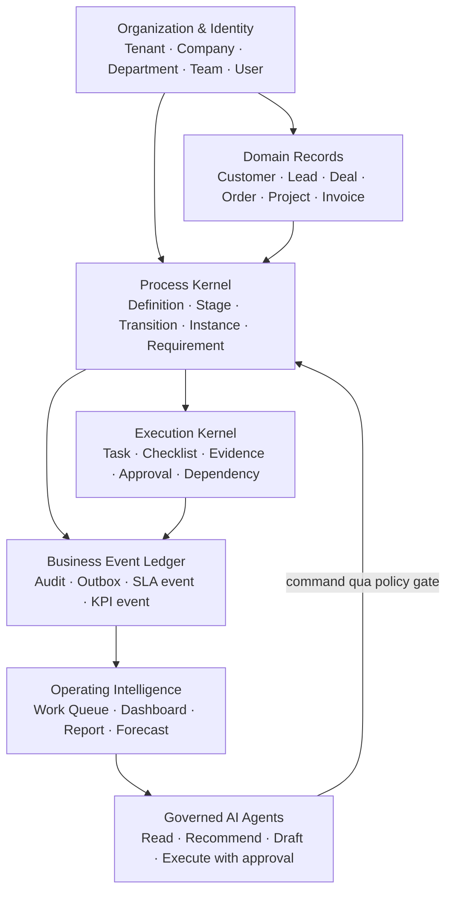
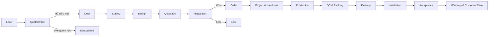

# Quanlycongviec — Business Operating System Blueprint

> Trạng thái: Blueprint kiến trúc mục tiêu, chưa phải đặc tả migration để chạy trực tiếp.
>
> Quyết định phát hành: chưa deploy các thay đổi kiến trúc cho tới khi hoàn tất vertical slice và nghiệm thu trên một công ty thử nghiệm.

## 1. Mục tiêu sản phẩm

Quanlycongviec cần tiến từ tập hợp các module quản lý riêng lẻ thành một hệ điều hành doanh nghiệp có thể trả lời liên tục năm câu hỏi:

1. Hồ sơ kinh doanh đang ở đâu trong vòng đời?
2. Ai chịu trách nhiệm cho bước hiện tại và việc tiếp theo?
3. Điều kiện nào còn thiếu để được chuyển bước?
4. Hồ sơ có đúng SLA, đúng chất lượng và đúng mục tiêu tài chính không?
5. Hệ thống hoặc AI nên nhắc, đề xuất hay thực hiện hành động nào tiếp theo?

Chuỗi kiến trúc đích:

```text
Tenant → Company → Department → Process → Stage → Record
       → Task → SLA → Business Event → KPI → Dashboard → AI Agent
```

Nguyên tắc cốt lõi: màn hình là cách quan sát và ra lệnh cho quy trình; màn hình không được tự trở thành nguồn định nghĩa nghiệp vụ.

## 2. Kết luận khảo sát hệ thống hiện tại

### 2.1 Tài sản nên giữ và phát triển tiếp

Hệ thống đã có phần lớn nguyên liệu để xây Business OS:

- Tổ chức và quyền: `tenants`, `companies`, `company_regions`, `ecosystem_units`, `departments`, `teams`, `users`, RBAC theo permission RPC.
- CRM: `crm_pipelines`, `crm_pipeline_stages`, `crm_leads`, quotations, orders, invoices, payments, lịch sử chuyển stage và task CRM.
- Dự án/vận hành: `projects`, `workflow_stages`, `tasks`, `stage_transitions`, approval và tài liệu.
- Sản xuất/vận chuyển: pipeline riêng theo công ty/phân loại, SLA, handover và đồng bộ ngược CRM.
- Cấu hình quy trình: `workflow_flows`, `workflow_flow_steps`, `company_processes`, task/checklist mẫu và liên kết flow-step/process.
- Công việc hợp nhất: `unified_tasks_v` và `/api/work-tasks` đã gom `tasks`, `crm_tasks`, `crm_assignments` qua một gateway.
- Work Unified: `work_projects`, `work_project_stages`, `work_tasks`, dependencies, links, approval, audit, command receipt và outbox event.
- KPI/SLA: stage history, business calendar, KPI definitions/targets/scores và `crm_kpi_ledger`.
- AI: playbook, lịch chạy, run log, user facts, bot skills và task flows.

Do đó không nên viết lại toàn bộ. Hướng đúng là chọn một lõi hội tụ, thêm hợp đồng quy trình còn thiếu và đặt adapter quanh dữ liệu legacy.

### 2.2 Các engine đang chồng lấn

| Nhu cầu | Cách hiện tại | Hệ quả |
|---|---|---|
| Pipeline | CRM, SX và VC dùng ba bảng stage khác nhau | Rule chuyển bước, SLA và sync phải viết lại nhiều nơi |
| Quy trình mẫu | `workflow_stages`, `workflow_flows`, `company_processes`, CRM/SX task templates | Không có một phiên bản định nghĩa quy trình duy nhất |
| Công việc | `tasks`, `crm_tasks`, `crm_assignments`, `work_tasks` | Status, checklist, evidence và quyền không đồng nhất |
| Lịch sử | `stage_transitions`, `crm_lead_stage_history`, unified history, audit log | KPI và timeline phải ghép từ nhiều ledger |
| Phê duyệt | project approvals, work approvals và các gate viết trong route/UI | Không có policy engine dùng chung |
| Automation | trigger DB, route side-effect, batch job, AI schedule | Khó biết hành động nào đã chạy, retry hoặc rollback |
| Màn hình chi tiết | Lead, Project, SX và VC có nhiều tab khác nhau | Người dùng phải học lại cùng một thao tác ở từng module |

### 2.3 Các điểm rủi ro đã thấy

- Một số điều kiện chuyển stage quan trọng nằm ở frontend, ví dụ logic chặn/kéo CRM sau khi đã tạo dự án SX. Backend phải là nơi quyết định cuối cùng.
- Pipeline SX có thể chứa cả bước sản xuất, vận chuyển, thu tiền và chuyển kế toán. Đây là dấu hiệu trộn workflow liên phòng ban với task/milestone chuyên môn.
- Sidebar hiện phản ánh lịch sử phát triển module hơn là hành trình công việc. Nhiều chức năng quản trị và chức năng hàng ngày nằm cùng cấp.
- Trang chi tiết Lead và Production có số lượng tab lớn; các khái niệm tài liệu, ghi chú, comments, chat và hoạt động bị tách nhỏ.
- App switcher có module Mua hàng trỏ tới `/mua-hang`, nhưng route tương ứng chưa được mount trong `App.jsx`.
- Work Unified đã có thiết kế tốt cho idempotency, audit, outbox và liên kết domain, nhưng chưa có reusable process definition, stage rule, requirement/evidence và process instance dùng cho Lead/Deal.

## 3. Kiến trúc mục tiêu



### 3.1 Sáu lớp kiến trúc

1. **Organization & Identity**: tenant/company/department/team/user, phạm vi dữ liệu và quyền.
2. **Domain Records**: Customer, Lead, Deal, Order, Project, Invoice vẫn là bảng nghiệp vụ chuyên biệt; không gom tất cả vào một “god table”.
3. **Process Kernel**: định nghĩa quy trình, stage, transition, requirement và instance đang chạy.
4. **Execution Kernel**: task, checklist, evidence, dependency và approval.
5. **Event & Insight**: sự kiện bất biến làm nguồn cho SLA, KPI, dashboard, forecast và audit.
6. **Agent Layer**: AI chỉ đọc hoặc gửi command qua đúng policy; không ghi thẳng database.

### 3.2 Lõi hội tụ được chọn

`work_*` nên là **orchestration/convergence plane**, không thay thế ngay các bảng domain hiện tại.

Lý do:

- Đã có multi-company project, links tới domain record, dependencies, approval, audit, idempotency và outbox.
- Phù hợp cho chuyển đổi song song thay vì big-bang migration.
- Cho phép CRM, SX, VC, kế toán tiếp tục vận hành trong khi adapter dần đưa event và task về lõi chung.

Phần cần bổ sung quanh `work_*`:

| Thành phần đề xuất | Vai trò |
|---|---|
| `work_process_definitions` | Quy trình có version, scope theo tenant/company/department/record type |
| `work_stage_definitions` | Stage có owner rule, SLA, UI metadata và macro phase |
| `work_transition_definitions` | Các đường chuyển hợp lệ, quyền được chuyển và loại transition |
| `work_requirement_definitions` | Trường, task, checklist, evidence hoặc approval bắt buộc |
| `work_task_templates` | Task sinh khi vào stage, deadline tương đối và rule gán người |
| `work_checklist_templates` | Definition of done và bằng chứng cho task |
| `work_automation_rules` | Trigger/event, condition, action, retry policy và approval policy |
| `work_process_instances` | Một lần chạy process cho Lead/Deal/Order/Project |
| `work_stage_instances` | Ledger thời gian vào/ra stage, SLA deadline và kết quả gate |
| `work_business_events` | Event chuẩn phục vụ KPI/AI; có thể triển khai từ outbox + audit hiện có |

Tên bảng trên là định hướng. Migration chỉ được viết sau khi chốt mapping với schema production thực tế.

## 4. Hợp đồng Process và Stage dùng chung

### 4.1 Process Definition

Mỗi process definition tối thiểu có:

- `code`, `name`, `version`, `status`: draft/published/retired.
- `tenant_id`, `company_id`, `department_id` nullable theo phạm vi kế thừa.
- `record_type`: lead/deal/order/project/production_job/delivery_job/installation_job/service_case.
- `variant_key`: loại tủ bếp, kính, công ty, vùng hoặc business line.
- `effective_from`, `effective_to`.
- owner và quyền publish.
- default business calendar.

Không sửa trực tiếp version đã publish. Mọi thay đổi tạo version mới; process instance đang chạy tiếp tục dùng version cũ trừ khi có migration có chủ đích.

### 4.2 Stage Definition

Mỗi stage phải trả lời đủ các câu hỏi sau:

| Nhóm | Thuộc tính bắt buộc |
|---|---|
| Nhận diện | code, name, sequence, macro phase, terminal type |
| Trách nhiệm | owner role/team/user rule, watcher rule, escalation owner |
| SLA | duration, business calendar, warning thresholds, pause conditions |
| Entry | task/checklist/approval được sinh, notification và automation |
| Exit | required fields, required tasks, evidence, approval và expression rule |
| Transition | target hợp lệ, quyền, reason/file bắt buộc, backward policy |
| KPI | event được phát, attribution owner, metric tags |
| AI | context được đọc, suggestion được phép, action cần phê duyệt |

### 4.3 Transition Command

Mọi thao tác kéo Kanban, bấm “Chuyển bước”, automation hoặc AI đều phải gọi cùng một command backend:

```text
transitionRecord({
  recordType,
  recordId,
  targetStageId,
  actorUserId,
  reason,
  evidenceIds,
  idempotencyKey,
  expectedVersion
})
```

Backend xử lý theo một transaction logic:

1. Kiểm tra record, company scope, permission và optimistic version.
2. Kiểm tra transition hiện tại → đích có hợp lệ không.
3. Tính toàn bộ blocker từ field, task, checklist, evidence và approval.
4. Nếu còn blocker, trả cấu trúc machine-readable để UI mở đúng hành động cần hoàn tất.
5. Đóng stage instance cũ và mở stage instance mới.
6. Sinh task/checklist/approval theo entry rule, bảo đảm idempotent.
7. Cập nhật domain record qua adapter.
8. Ghi audit + business event + outbox.
9. Automation bất đồng bộ nhận event và chạy với retry/dead-letter.

Ví dụ response khi bị chặn:

```json
{
  "code": "TRANSITION_BLOCKED",
  "current_stage": "qualification",
  "target_stage": "survey",
  "blockers": [
    { "type": "required_field", "field": "phone", "label": "Số điện thoại" },
    { "type": "task", "task_id": "...", "label": "Xác nhận nhu cầu" },
    { "type": "approval", "policy": "survey_cost", "label": "Duyệt chi phí khảo sát" }
  ]
}
```

### 4.4 Phân biệt Stage, Milestone và Task

- **Stage**: một trạng thái/queue có owner, SLA và điều kiện thoát rõ ràng.
- **Milestone**: sự kiện quan trọng nhưng không giữ record trong một queue, ví dụ “Đã thu cọc”.
- **Task**: hành động có assignee và deadline, ví dụ “Gọi xác nhận lịch khảo sát”.
- **Checklist**: definition of done của task.
- **Evidence**: file, biểu mẫu, chữ ký, ảnh, cuộc gọi hoặc business event chứng minh hoàn tất.

Không tạo stage chỉ để biểu diễn một checkbox. Không đưa milestone tài chính vào pipeline SX nếu nó không thay đổi queue sản xuất.

## 5. Vòng đời chuẩn xuyên suốt doanh nghiệp

### 5.1 Macro lifecycle



Macro phase là chuẩn báo cáo toàn hệ thống. Pipeline chi tiết theo công ty/phân loại được map vào macro phase, không thay thế macro phase.

### 5.2 Sales process chuẩn đầu tiên

| Stage | Definition of done | Owner/SLA đề xuất | Automation và AI |
|---|---|---|---|
| Lead | Có nguồn, tên/SĐT, công ty/vùng, owner và consent phù hợp | Sales Admin; phản hồi đầu ≤ 15 phút làm việc | Dedupe SĐT, phân tuyến owner; AI tóm tắt nguồn và gợi ý câu mở đầu |
| Qualification | Có nhu cầu, ngân sách sơ bộ, thời điểm, địa điểm và mức phù hợp | Sales; ≤ 2 ngày làm việc | Sinh task liên hệ; AI phân loại nóng/ấm/lạnh kèm lý do |
| Deal | Lead đủ điều kiện đã được convert, có expected value/probability/close date | Sales owner | Tạo deal, liên kết customer, giữ attribution từ lead |
| Survey | Có lịch, người khảo sát, địa chỉ; hoàn tất phải có biên bản/ảnh/kích thước | Survey team; đặt lịch ≤ 1 ngày, hoàn tất theo lịch | Calendar/task/checklist; AI đọc biên bản và phát hiện dữ liệu thiếu |
| Design | Có brief đã duyệt, designer, version bản vẽ và feedback | Design; SLA theo loại sản phẩm | Tạo task 2D/3D/review; AI tóm tắt feedback, không tự duyệt thiết kế |
| Quotation | Báo giá có line item, margin, điều khoản, version và approval nếu vượt ngưỡng | Sales + approver; ≤ 2 ngày sau design | Draft từ catalog; kiểm tra margin/thiếu hạng mục; gửi chỉ sau approval |
| Negotiation | Có next action, lịch follow-up, objections và forecast category | Sales; không để quá SLA follow-up | AI tóm tắt trao đổi, gợi ý objection handling và cảnh báo deal im lặng |
| Order/Won | Báo giá/hợp đồng được chấp nhận, lịch thanh toán và đơn vị SX đã chọn | Sales/Finance | Tạo order/project/handover idempotent, sinh milestone thu cọc và thông báo SX |
| Lost | Có lý do chuẩn hóa, đối thủ/giá trị mất và khả năng nurture | Sales owner | Hủy task không còn hiệu lực; AI phân nhóm nguyên nhân và lịch nuôi dưỡng |

### 5.3 Order → Project → Operations

1. **Order confirmed**: snapshot phạm vi thương mại, version báo giá/hợp đồng và payment plan.
2. **Project initialized**: chọn process variant theo company + product type; tạo macro stages.
3. **Handover accepted**: SX xác nhận đủ hồ sơ; thiếu gì trả blocker cụ thể về Sales/Design.
4. **Production planning**: chốt BOM/vật tư/capacity/deadline và owner.
5. **Material ready**: milestone độc lập; dependency chặn task sản xuất liên quan.
6. **Production execution**: stage chi tiết tùy loại xưởng, nhưng map vào macro `production`.
7. **QC & packing**: evidence bắt buộc, verdict và exception workflow.
8. **Delivery booking**: xe, pickup time, địa chỉ, người nhận và packing evidence.
9. **Delivery**: proof of delivery và incident nếu có.
10. **Installation**: site readiness, đội lắp, checklist, ảnh và phát sinh.
11. **Acceptance**: biên bản ký, punch list và approval đóng dự án.
12. **Warranty/customer care**: lịch 7/30 ngày, case bảo hành và CSAT/NPS.

### 5.4 Quy tắc cho pipeline chi tiết của xưởng

- Cho phép mỗi `workshop_project_type` có stage chi tiết riêng.
- Mỗi stage chi tiết bắt buộc map tới một macro phase.
- Stage như CNC, dán cạnh, sơn chỉ tồn tại nếu doanh nghiệp cần nhìn WIP/queue/SLA riêng.
- “Thu tiền”, “kiểm tra công nợ” là milestone/task của Finance, không phải stage SX.
- Handover SX → VC và VC → Installation là transition liên process có acceptance contract, không chỉ là một boolean flag.

### 5.5 Project Cockpit và hợp đồng sức khỏe macro phase

Màn Vận hành là Project Portfolio để quản lý phát hiện Project thiếu vật tư, trễ sản xuất, chờ KCS, chờ đóng gói, sẵn sàng giao hoặc có rủi ro. Bấm mã Project luôn mở Tổng quan Project theo chuỗi:

**Thiết kế → Thu mua → Sản xuất → KCS → Kho/Đóng gói → Giao nhận → Lắp đặt → Nghiệm thu**

Mỗi macro phase phải trả về cùng một cấu trúc:

| Trường | Câu hỏi phải trả lời |
|---|---|
| `progress_pct` | Chặng đã hoàn thành bao nhiêu phần trăm? |
| `missing_requirements` | Còn thiếu thông tin, vật tư, hồ sơ hoặc evidence gì? |
| `owner` | Ai/đội nào chịu trách nhiệm hiện tại? |
| `deadline` | Deadline riêng của chặng là khi nào? |
| `blockers` | Điều gì đang chặn Project và phát sinh từ đâu? |
| `risk` | Mức nguy cơ trễ và lý do giải thích được là gì? |

Stage chi tiết của từng công ty được map vào macro phase này. Công nợ, thu tiền, hóa đơn và trạng thái thanh toán thuộc Finance facet/milestone; không được tính vào tiến độ Sản xuất. AI chỉ đọc cùng hợp đồng sức khỏe để chỉ ra Project có nguy cơ trễ và nguyên nhân nằm ở Thu mua, Sản xuất, Kho hay Lắp đặt.

### 5.6 Phát sinh và tài chính Project

Project Cockpit có facet **Phát sinh & Thay đổi** để quản lý phát sinh thiết kế, vật tư, khối lượng, công trường, thi công lại hoặc yêu cầu khách hàng. Phát sinh phải có owner, bằng chứng, ảnh hưởng chi phí/tiến độ, bên chịu chi phí, approval và liên kết tới task/chứng từ phát sinh.

Hóa đơn, thanh toán và công nợ thuộc Finance theo chuỗi:

**Project → Đơn hàng/Hợp đồng → Kế hoạch thanh toán → Hóa đơn → Thanh toán → Công nợ**

Project Cockpit chỉ tổng hợp và cảnh báo; Finance là System of Record. Hiệu quả Project phải tách rõ:

- **P&L:** doanh thu, chi phí, lợi nhuận và biên lợi nhuận.
- **Cashflow:** đã thu/chi, phải thu và phải trả.
- **Forecast:** doanh thu/chi phí dự kiến đến khi hoàn thành.

Tiền đã thu hoặc giá trị hóa đơn không tự động đồng nghĩa với lợi nhuận. AI dùng Project health và Project finance read model để giải thích cả nguy cơ trễ lẫn nguyên nhân giảm lợi nhuận, nhưng không tự duyệt phát sinh hoặc ghi chứng từ.

## 6. Kiến trúc thông tin và Sidebar mục tiêu

Sidebar phải theo công việc người dùng, đồng thời ẩn các mục không có quyền.

### 6.1 Cấp điều hướng chính

| Workspace | Nội dung |
|---|---|
| Trang chủ | Command Center theo vai trò, cảnh báo, KPI và next actions |
| Công việc | Việc của tôi, đội nhóm, approvals, lịch và planner |
| Kinh doanh | Leads, Deals, Survey/Design, Quotations, Orders, Customers |
| Vận hành | Projects, Production, Delivery, Installation, Quality/Incidents |
| Mua hàng | Purchase requests/orders, suppliers, catalogs, receiving |
| Tài chính | Invoices, payments, receivables, bank accounts, profitability |
| Khách hàng | Customer 360, care schedule, warranty/service cases |
| Báo cáo | Executive, Sales, Operations, Finance, SLA/KPI |
| Kiến thức | SOP, training, templates và certificates |
| AI | Agent inbox, suggestions, runs, approvals và audit |
| Quản trị | Organization, Process Studio, permissions, integrations, settings |

### 6.2 Sidebar theo vai trò

- Nhân viên: Trang chủ, Công việc, workspace chuyên môn, Kiến thức.
- Trưởng nhóm: thêm Team queue, approvals và báo cáo đội.
- Quản lý công ty: thêm command center công ty, cross-functional exceptions, KPI và cấu hình giới hạn.
- System admin: thêm Platform/Tenant; không trộn các mục SaaS vào menu vận hành hằng ngày.

Người dùng vẫn có thể ghim module/màn hình, nhưng quyền và cấu trúc chuẩn quyết định menu gốc.

### 6.3 Route map mục tiêu

| Route mục tiêu | Gom từ route hiện tại |
|---|---|
| `/home` | `/dashboard`, `/management` |
| `/work/my` | `/work/tasks-unified`, `/personal-tasks`, `/my-tasks` |
| `/work/team` | giao việc CRM/SX và task theo phòng ban |
| `/sales/pipeline` | `/crm/dashboard`, `/crm/pipeline` |
| `/sales/leads/:id` | `/crm/leads/:id` với mode Lead |
| `/sales/deals/:id` | `/crm/leads/:id` với mode Deal, `/management/deals/:id` |
| `/sales/quotes` | `/crm/quotations*` |
| `/sales/orders` | `/crm/orders*` |
| `/operations/projects/:id` | `/projects/:id`, `/sx/projects/:id`, `/vc/projects/:id` dưới một cockpit |
| `/operations/production` | `/sx/dashboard`, `/sx/pipeline` |
| `/operations/delivery` | `/vc/dashboard` tab vận chuyển |
| `/operations/installation` | `/vc/dashboard` tab lắp đặt |
| `/finance/*` | `/ketoan/*`, invoices, payments, bank accounts |
| `/customers/:id` | `/customers/:id`, customer context rải trong CRM |
| `/reports/*` | các route KPI/report hiện có |
| `/admin/processes` | workflow hub, flows, company processes, template sets, pipeline settings |

Không đổi route đồng loạt. Giữ alias/redirect, đo usage và chuyển dần từng vertical slice.

## 7. Kiến trúc màn hình chuẩn

### 7.1 Role Command Center

Trang đầu không chỉ là dashboard số liệu. Thứ tự ưu tiên:

1. **Cần xử lý ngay**: blocker, SLA breach, approval, incident.
2. **Việc tiếp theo của tôi**: sắp hạn và next best action.
3. **Sức khỏe pipeline/process**: WIP, aging, bottleneck, forecast.
4. **KPI/outcome**: chỉ số có thể drill-down tới record/event gốc.
5. **AI brief**: tóm tắt có nguồn và action đề xuất.

### 7.2 List/Board chuẩn

Mọi workspace dùng chung:

- Saved view, scope company/department/team.
- Search và filter chung; URL có thể chia sẻ.
- View: Board, List, Planner/Calendar khi phù hợp.
- Cột/stage hiển thị count, value, aging, SLA risk và capacity.
- Card chỉ hiển thị identity, owner, next action, SLA và blocker.
- Bulk action phải qua cùng command/policy với action đơn.

### 7.3 Record Cockpit chuẩn

Lead, Deal, Order và Project dùng cùng một khung:

```text
Header: Mã + tên + trạng thái + owner + SLA + giá trị + hành động chính
Progress rail: macro lifecycle + current stage + blockers
Main: thông tin của stage hiện tại và next best action
Right rail: task sắp hạn, approval, risk, AI suggestion
Tabs: Overview | Process | Work | Documents | Communication | Finance | Activity
```

Quy tắc giảm tab:

- Notes, comments, Facebook, Zalo, call và team chat đi vào `Communication` với filter theo kênh.
- File thủ công, file task, Drive và file chia sẻ đi vào `Documents` với nguồn và quyền rõ ràng.
- Task CRM/SX/VC đi vào `Work`, nhóm theo process/stage/source.
- Timeline stage, audit và automation run đi vào `Activity`.
- Tab phụ hiếm dùng đặt trong “Thêm”, không chiếm hàng điều hướng chính.

### 7.4 Process Studio

Một màn hình quản trị duy nhất thay cho nhiều trang cấu hình rời:

1. Chọn scope: tenant/company/department/business line.
2. Chọn record type và process variant.
3. Canvas stage/transition.
4. Inspector của stage: owner, SLA, requirements, task templates, approvals, automation, KPI, AI.
5. Validate trước publish: stage không có đường ra, rule mâu thuẫn, owner thiếu, automation loop.
6. Version diff, publish, rollback và danh sách instance đang dùng version cũ.

### 7.5 Blueprint cho từng màn hình trọng yếu

| Màn hình | Quyết định chính của người dùng | Cấu trúc đề xuất | Hành động chính |
|---|---|---|---|
| Sidebar/App switcher | Tôi cần vào workspace nào? | Workspace theo hành trình; ghim cá nhân; admin tách riêng | Chuyển workspace, mở global search |
| Dashboard/Home | Việc gì cần xử lý ngay? | Exceptions → My next actions → Process health → KPI → AI brief | Mở blocker, nhận việc, duyệt, drill-down |
| Lead Inbox | Lead nào cần phản hồi/phân loại? | Board/List; source, owner, response SLA, duplicate warning | Gọi/nhắn, assign, qualify/disqualify |
| Lead Cockpit | Lead còn thiếu gì để đủ điều kiện? | Qualification form, conversation timeline, next action, SLA | Hoàn tất dữ liệu, tạo lịch, convert Deal |
| Deal Pipeline | Deal nào cần đẩy tiếp và forecast thế nào? | Stage board; value, probability, aging, next action, blocker | Chuyển stage, follow-up, request approval |
| Deal Cockpit | Làm gì để chốt Deal? | Commercial summary, process rail, survey/design/quote versions, work, communication | Tạo survey, duyệt design/quote, Won/Lost |
| Project Portfolio | Dự án nào trễ/rủi ro/cần handover? | List/board theo macro phase; health, deadline, budget, blockers | Mở cockpit, đổi owner, recovery plan |
| Project Cockpit | Toàn bộ dự án đang vận hành ra sao? | Macro progress, dependency, teams, documents, finance, activity | Accept handover, xử lý blocker, approve |
| Work Queue/Task | Hôm nay tôi phải làm gì và cần bằng chứng gì? | My/Team queue; status, deadline, checklist, form/evidence, context | Start, block, complete, request help/review |
| Production Control | WIP nằm ở đâu và bottleneck nào nguy hiểm? | Board theo stage chi tiết + capacity, aging, material readiness, QC | Nhận việc, chuyển stage, log incident, QC |
| Delivery Control | Đơn nào sẵn sàng giao và lịch xe ra sao? | Readiness queue, schedule/map, packing proof, driver/team | Book, dispatch, proof of delivery |
| Installation Control | Công trình nào sẵn sàng và còn punch item gì? | Calendar/team capacity, site readiness, checklist, photos | Assign team, start, incident, acceptance |
| Customer 360 | Quan hệ tổng thể với khách hàng là gì? | Identity, contacts, Leads/Deals/Orders/Projects, revenue, care/warranty, timeline | Tạo opportunity/care case, merge duplicate |
| Report Center | Chỉ số nào thay đổi và nguyên nhân từ record nào? | Semantic metric catalog, filters, trend, cohort/funnel, drill-down | Save/share view, export snapshot, inspect events |
| AI Agent Center | AI đang đề xuất/chạy gì và có an toàn không? | Agent inbox, evidence, proposed action, approval, run/audit log | Approve/reject/edit, pause agent, inspect trace |

### 7.6 Global Search và Command Palette

Search toàn hệ thống phải tìm theo mã, tên, SĐT, khách hàng, project, order, task và document trong đúng permission scope. Kết quả nhóm theo record type, hiển thị current stage/owner và hỗ trợ command nhanh:

- Mở record.
- Tạo task gắn record.
- Gọi/nhắn khách hàng.
- Chuyển owner nếu có quyền.
- Chạy một saved action/AI playbook đã allowlist.

Không cho command palette bỏ qua transition gate hoặc approval policy.

## 8. Công việc, SLA, KPI và sự kiện

### 8.1 Hợp nhất công việc

Mục tiêu dài hạn là một task contract:

- Identity: id, title, source/domain link.
- Ownership: owner company, team, primary assignee, collaborators.
- Time: planned start, due, started, completed, business calendar.
- State: todo/in progress/blocked/review/done/cancelled.
- Completion: checklist, form, evidence types, verdict và completion note.
- Context: process instance, stage instance, record, project.
- Governance: permission, approval, audit, version.

Lộ trình không phá dữ liệu:

1. Tiếp tục dùng `unified_tasks_v` làm read gateway.
2. Chuẩn hóa command gateway để mutation của mọi nguồn có cùng validation/status response.
3. Phát business event thống nhất từ mutation legacy.
4. Dual-write task mới của vertical slice vào `work_tasks` và bảng domain khi cần.
5. Backfill + parity report.
6. Chỉ cutover nguồn ghi sau khi parity và rollback đã được kiểm chứng.

### 8.2 SLA

SLA phải gắn với stage/task và business calendar, không chỉ là `sla_days`:

- Target duration theo business minutes.
- Warning tại 50/75/90% hoặc cấu hình.
- Pause reason: chờ khách, chờ vật tư, chờ approval; mọi pause đều có owner và max duration.
- Breach event một lần/idempotent, không spam mỗi giờ.
- Escalation ladder: owner → team lead → department manager.
- Dashboard phân biệt “đã breach”, “có nguy cơ breach” và “đang pause hợp lệ”.

### 8.3 KPI

KPI được tính từ business event, không từ trạng thái hiện tại đơn thuần.

Ba lớp chỉ số:

- Activity: cuộc gọi, task, follow-up; dùng để chẩn đoán, không nên là outcome chính.
- Process: response SLA, time-in-stage, conversion, rework, blocker aging.
- Outcome: revenue, margin, on-time delivery, first-pass quality, CSAT, receivable days.

Mỗi KPI phải drill-down tới event và record nguồn. Khi chốt kỳ, snapshot definition version, target và dữ liệu nguồn để có thể audit.

### 8.4 Event taxonomy tối thiểu

```text
record.created
record.assigned
record.stage_entered
record.stage_exited
record.transition_blocked
task.created
task.started
task.blocked
task.completed
approval.requested
approval.decided
sla.warning
sla.breached
order.confirmed
project.handover_requested
project.handover_accepted
quality.failed
delivery.completed
installation.accepted
payment.received
customer.feedback_received
automation.executed
agent.action_proposed
agent.action_approved
agent.action_executed
```

Event có `event_id`, tenant/company, actor, entity, process/stage, occurred_at, schema_version, payload và correlation/causation id.

## 9. AI Agent Architecture

### 9.1 Các agent mục tiêu

| Agent | Vai trò ban đầu |
|---|---|
| Sales Copilot | Tóm tắt lead/deal, phát hiện thiếu dữ liệu, gợi ý follow-up và draft nội dung |
| Project Coordinator | Tóm tắt blockers, dependency, risk deadline và draft kế hoạch phục hồi |
| Production Exception Agent | Phát hiện WIP aging, thiếu vật tư/evidence, QC failure và đề xuất escalation |
| Delivery/Installation Agent | Kiểm tra readiness, lịch xe/đội lắp, địa chỉ và chứng từ bàn giao |
| Finance Agent | Đối chiếu milestone thanh toán, invoice/payment mismatch và công nợ sắp hạn |
| Executive Analyst | Trả lời từ semantic metrics, drill-down record và giải thích biến động |

### 9.2 Bốn cấp quyền AI

1. **Read**: đọc dữ liệu trong scope và tóm tắt.
2. **Recommend**: tạo suggestion có evidence và confidence.
3. **Draft**: chuẩn bị task/message/quotation nhưng chưa gửi hoặc ghi chính thức.
4. **Execute**: gọi command đã allowlist; hành động nhạy cảm phải có approval.

AI không được:

- Ghi trực tiếp Supabase.
- Tự chuyển Won/Lost, duyệt báo giá, xác nhận nghiệm thu hoặc thanh toán.
- Truy cập dữ liệu ngoài company/permission scope.
- Thực hiện action không có idempotency key và audit trace.

Mỗi câu trả lời hoặc đề xuất nghiệp vụ phải chỉ ra nguồn record/event. Mọi tool call lưu prompt version, input scope, output, actor, approval và kết quả.

## 10. Lộ trình triển khai

### Phase 0 — Design Foundation

Đã bắt đầu: design tokens, app shell/sidebar responsive và dashboard điều hành. Chưa deploy.

### Phase 1 — Architecture Contract

- Chốt glossary, macro lifecycle, ownership và source-of-truth.
- Chốt schema Process/Stage/Transition/Requirement/Event.
- Viết API contract và structured blockers.
- Không đổi nghiệp vụ production.

**Gate:** chủ doanh nghiệp, Sales, SX, VC và Finance duyệt cùng một lifecycle.

### Phase 2 — Kernel quan sát, chưa điều khiển

- Event adapter cho CRM stage/task và project/SX/VC transition.
- Timeline hợp nhất và SLA read model.
- Process Studio ở chế độ draft/preview.
- Dashboard drill-down từ event.

**Gate:** dữ liệu event parity với màn hình hiện tại trong ít nhất một kỳ vận hành.

### Phase 3 — Vertical slice Sales

- Lead → Qualification → Deal → Survey → Design → Quotation → Negotiation → Order.
- Record Cockpit mới cho Lead/Deal.
- Transition command backend, requirements, task generation, approval và SLA.
- Feature flag theo company; adapter giữ route/API cũ.

**Gate:** một công ty chạy end-to-end, không cần thao tác song song ở màn hình cũ.

### Phase 4 — Order/Project/Handover

- Order snapshot, project initialization và process variant.
- Handover contract Sales/Design → SX.
- Work/task convergence và unified project cockpit.
- Facet Phát sinh & Thay đổi của Project: bằng chứng, owner, ảnh hưởng chi phí/tiến độ, bên chịu chi phí, approval và liên kết task/chứng từ.

**Gate:** không tạo project trùng; mọi handover và phát sinh có evidence, owner, approval và blocker rõ ràng.

### Phase 5 — Production/Delivery/Installation

- Map stage chi tiết vào macro phase.
- Capacity/WIP, dependencies, QC, packing, delivery booking và acceptance.
- Loại bỏ finance stage khỏi SX bằng milestone/dependency.
- Phát sinh chưa xử lý được phản ánh thành risk/blocker ở đúng macro phase, không biến thành một trạng thái sản xuất mới.

**Gate:** CRM, SX và VC cùng đọc một macro lifecycle; không cần sync bằng tên stage.

### Phase 6 — Finance/Customer/Reporting

- Chuỗi Order/Hợp đồng → mốc thanh toán → hóa đơn → thanh toán → công nợ; Finance là System of Record.
- Phát sinh thương mại đã duyệt cập nhật doanh thu/forecast Project mà không sửa mất dấu chứng từ cũ.
- Profitability tách P&L, dòng tiền và dự báo; Project Cockpit hiển thị tổng hợp và drill-down về chứng từ nguồn.
- Payment milestones, receivables và customer 360.
- KPI event-based, scorecard có drill-down và snapshot kỳ.
- Warranty/service case.

**Gate:** doanh thu, chi phí, công nợ và lợi nhuận Project đối chiếu được với chứng từ thật; tiền đã thu hoặc hóa đơn đã xuất không được dùng thay cho lợi nhuận.

### Phase 7 — Governed AI Agents

- Bắt đầu Read/Recommend.
- Cảnh báo phát sinh chưa duyệt, công nợ đến hạn và nguy cơ giảm biên lợi nhuận Project dựa trên dữ liệu có nguồn truy vết.
- Draft action sau khi dữ liệu/process ổn định.
- Execute chỉ với allowlist, approval, idempotency và audit.

### Phase 8 — Blueprint đa công ty và nhân bản có kiểm soát

- Blueprint version là cấu hình chuẩn cấp tenant; mỗi công ty có installation, lifecycle và override độc lập.
- Effective definition của công ty được tạo bằng cách hợp nhất version đã publish với override module, phòng ban, quy trình và operating kernel.
- Khi nâng version, override công ty được tái áp dụng; cấu hình ngoài Blueprint được giữ và không có thao tác xóa tự động.
- Chỉ materialize cấu hình idempotent. Customer, Lead, Deal, Order, Project, task đang chạy, hóa đơn và thanh toán không bao giờ được nhân bản.
- Business OS đọc Blueprint theo `company_id`, fallback về tenant để hỗ trợ công ty chưa cutover.

**Gate:** cài thử cùng Blueprint cho công ty thứ hai trong staging; xác nhận tenant isolation, override A/B độc lập, migration/rollback và không phát sinh dữ liệu giao dịch sao chép.

## 11. Chiến lược chuyển đổi an toàn

- Không big-bang rewrite.
- Mọi tính năng mới có feature flag theo tenant/company.
- Read adapter trước, command adapter sau, cutover nguồn ghi cuối cùng.
- Dùng outbox và idempotency cho mọi side-effect cross-module.
- Có parity report cho stage, task, document, approval và KPI.
- Giữ route cũ bằng redirect/compatibility API cho tới khi usage về gần 0.
- Mỗi migration có backfill, smoke query và rollback/hướng phục hồi.
- Không thay đổi schema production chỉ từ Blueprint này.

## 12. Tiêu chí nghiệm thu Business OS

Một vertical slice chỉ được coi là hoàn chỉnh khi:

- Người dùng biết rõ current stage, owner, SLA và next action.
- Không thể chuyển bước khi thiếu requirement; blocker có link sửa trực tiếp.
- Entry automation/task không tạo trùng khi retry.
- Tất cả transition và action nhạy cảm có audit/event.
- Dashboard drill-down tới record và business event.
- Quyền company/department/user được kiểm tra ở backend.
- Desktop và mobile dùng cùng contract.
- AI không vượt quá quyền người dùng và mọi action đều truy vết được.
- Có rollback hoặc đường quay lại UI cũ trong giai đoạn thử nghiệm.

## 13. Các quyết định cần chủ doanh nghiệp chốt

1. `companies` hay `ecosystem_units` là nguồn chuẩn cho Company/Department trong kiến trúc dài hạn?
2. Điều kiện chính thức để Lead được convert thành Deal là gì?
3. Một Deal có thể sinh nhiều Order và một Order có thể sinh nhiều Project không?
4. Bộ macro stage chính thức cho Sales và Operations gồm những gì?
5. Khoản tiền/margin nào bắt buộc approval, theo role và company nào?
6. Những pause reason nào được loại khỏi SLA?
7. KPI nào dùng thưởng/phạt chính thức và cần snapshot/audit ở mức nào?
8. Công ty được tùy biến process đến đâu trước khi cần process variant mới?
9. Hành động AI nào được phép chạy tự động; hành động nào luôn cần người duyệt?
10. Công ty nào và nhóm người dùng nào sẽ là pilot đầu tiên?

## 14. Đề xuất nhiệm vụ triển khai kế tiếp

Vertical slice nên bắt đầu bằng **Sales Qualification**, vì có phạm vi nhỏ nhưng kiểm chứng được toàn bộ kernel:

1. Chốt Lead và Deal là hai record state hay hai record liên kết.
2. Đặc tả ba stage đầu: Lead → Qualification → Deal.
3. Tạo Process/Stage contract và transition API ở backend.
4. Dùng adapter đọc/ghi `crm_leads` hiện tại.
5. Xây Record Cockpit tối thiểu: header, progress, required information, tasks và activity.
6. Phát event, tính SLA và đưa cảnh báo lên Command Center.
7. Chạy feature flag trên một company, so sánh với CRM cũ rồi mới mở rộng Survey/Design.

Đây là lát cắt nhỏ nhất có thể chứng minh kiến trúc mới mà không buộc hệ thống dừng vận hành.
