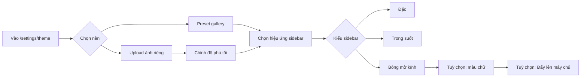
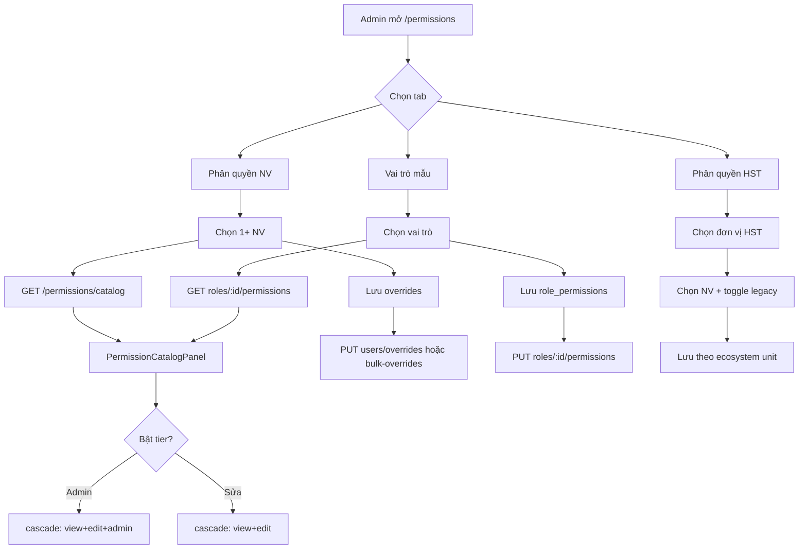

# Giao diện Cài đặt hệ thống

Tài liệu mô tả cấu trúc menu **Cài đặt**, hướng dẫn cài **hình nền & mờ sidebar**, và chi tiết giao diện các trang cấu hình trong ứng dụng web QLCV.

## Mục lục

1. [Điểm vào menu Cài đặt](#1-điểm-vào-menu-cài-đặt)
2. [Hướng dẫn: Hình nền & mờ sidebar](#2-hướng-dẫn-hình-nền--mờ-sidebar)
3. [Trang Phân quyền](#3-trang-phân-quyền-permissions)
4. [Tab Phân quyền nhân viên](#4-tab-phân-quyền-nhân-viên)
5. [Tab Vai trò mẫu](#5-tab-vai-trò-mẫu)
6. [Catalog quyền](#6-catalog-quyền-permissioncatalogpanel)
7. [Tab Phân quyền HST](#7-tab-phân-quyền-chi-tiết-hst)
8. [Các trang cài đặt khác](#8-các-trang-cài-đặt-khác-tóm-tắt-ui)
9. [Sơ đồ luồng phân quyền](#9-sơ-đồ-luồng-phân-quyền-tier)
10. [Liên hệ migration DB](#10-liên-hệ-migration-db)
11. [File nguồn tham chiếu](#11-file-nguồn-tham-chiếu)

---

## 1. Điểm vào menu Cài đặt

### 1.1 Sidebar — Nhóm **4. Cài đặt** (chỉ Admin)

| Đường dẫn | Tên hiển thị | Mô tả |
|-----------|--------------|-------|
| `/workflow-settings` | Quy trình & KH | Cấu hình quy trình công việc và khách hàng |
| `/approval-rules` | Quy tắc duyệt | Quy tắc phê duyệt tự động |
| `/settings/pdf` | Thông tin PDF | Thông tin công ty trên báo giá / đơn hàng / hóa đơn PDF |
| `/settings/theme` | Giao diện & Hình nền | Theme, hình nền, màu chữ, hiệu ứng sidebar |
| `/settings/ai-chat-bot` | AI Bot trong chat | Cấu hình bot AI trong messenger |
| `/settings/app-updates` | Cập nhật App | Quản lý bản phát hành app mobile |
| `/settings/request-monitor` | Theo dõi Request | Giám sát request API |

**Sidebar — Nhóm 3. Hệ thống** (liên quan phân quyền):

| Đường dẫn | Tên hiển thị |
|-----------|--------------|
| `/permissions` | Phân quyền |

### 1.2 TopNavBar — Menu **4. Cài đặt**

| Đường dẫn | Tên hiển thị |
|-----------|--------------|
| `/permissions` | Phân quyền |
| `/workflow-settings` | Quy trình & KH |
| `/templates` | Dự án mẫu |
| `/stage-groups` | Nhóm quy trình |
| `/approval-rules` | Quy tắc duyệt |
| `/settings/app-updates` | Cập nhật App |

### 1.3 CRM — Cài đặt theo module

| Đường dẫn | Tên | Quyền truy cập |
|-----------|-----|----------------|
| `/settings/misa` | MISA meInvoice | Admin CRM |
| `/crm/kpi/settings` | Cấu hình KPI Tủ bếp | Executive |
| `/crm/settings/deal-stage-report` | Phân loại cột BC Deal | Executive |
| `/crm/deadline-settings` | Cấu hình Deadline CRM | Executive |
| `/crm/pipeline-settings` | Pipeline | Admin CRM |
| `/crm/sources-settings` | Nguồn & phân loại | Admin CRM |
| `/crm/auto-project-config` | Auto tạo dự án | Admin CRM |

### 1.4 Hỗ trợ & công cụ (mọi user CRM)

| Đường dẫn | Tên |
|-----------|-----|
| `/settings/password` | Đổi mật khẩu |
| `/settings/location` | Vị trí làm việc |
| `/settings/devices` | Thiết bị đăng nhập |
| `/settings/api-keys` | API Key tích hợp (Admin) |

### 1.5 Route placeholder

- `/settings` — Hiển thị placeholder *"Cài đặt — sắp ra mắt"* (chưa có trang hub tổng hợp).

---

## 2. Hướng dẫn: Hình nền & mờ sidebar

**Trang:** `/settings/theme` — **Giao diện & Hình nền**  
**File:** `frontend/src/pages/ThemeSettingsPage.jsx`  
**Logic áp dụng:** `frontend/src/components/ThemeProvider.jsx`

### 2.1 Cách vào trang

1. Mở sidebar trái → nhóm **4. Cài đặt** → **Giao diện & Hình nền**
2. Hoặc truy cập trực tiếp: `/settings/theme`
3. (CRM) Cũng có shortcut icon palette ở cuối sidebar

> Mọi user đã đăng nhập đều truy cập được trang này (không cần admin).

### 2.2 Cài đặt hình nền

#### Cách A — Dùng preset có sẵn (khuyên dùng)

1. Trong khối **Chọn hình nền**, chọn tab danh mục:

| Tab | Nội dung |
|-----|----------|
| 🗂️ Tất cả | Toàn bộ ~20 preset |
| Cực quang (aurora) | Nền gradient aurora |
| Tối giản (minimal) | Nền đơn giản |
| Pastel | Tông màu pastel |
| Phong cảnh (landscape) | Ảnh 4K |
| Nền động (animated) | Mưa, sao, tuyết, giọt nước… |

2. **Click** vào ô hình → nền áp dụng **ngay lập tức**
3. Màu chữ **tự động** đổi theo preset (`textTheme`: light/dark) để dễ đọc
4. Bấm **Xem thêm** nếu danh sách đang thu gọn (chỉ hiện 1 dòng cuộn ngang)

#### Cách B — Tải ảnh riêng

1. Chọn tab **⬆️ Tải ảnh riêng**
2. Bấm **Chọn hình từ máy** — hỗ trợ JPG / PNG / WebP
3. Khuyến nghị kích thước **≥ 1920×1080**
4. Kéo thanh **Độ phủ tối** (0–80%) nếu chữ khó đọc trên nền sáng

```
Độ phủ tối = lớp rgba(0,0,0, opacity) phủ lên ảnh upload
Slider: 0% (trong suốt) → 80% (tối dần, chữ rõ hơn)
```

#### Xóa / khôi phục nền

| Nút | Tác dụng |
|-----|----------|
| **Xoá nền hiện tại** | Bỏ preset hoặc ảnh upload → quay về `pageBg` đơn sắc |
| **Khôi phục mặc định** | Reset toàn bộ theme về preset `default` |

### 2.3 Cài đặt mờ thanh menu (sidebar)

Cuộn xuống khối **Hiệu ứng sidebar** → chọn 1 trong 3 kiểu:

| Kiểu | ID | Mô tả | Blur (CSS) | Độ trong suốt nền |
|------|-----|-------|------------|-------------------|
| 🧱 **Đặc** | `solid` | Sidebar tô màu đầy đủ — rõ ràng, tương phản cao | Không | 100% |
| 🌫️ **Trong suốt** | `transparent` | Thấy hình nền phía sau, blur nhẹ | `blur(8px) saturate(130%)` | ~28% |
| ✨ **Bóng mờ kính** | `frosted` | Hiệu ứng kính mờ (frosted glass) như Bitrix24 / iOS | `blur(22px) saturate(180%)` | ~55% |

**Gợi ý combo đẹp nhất:**

```
Bước 1: Chọn hình nền (preset nền động hoặc phong cảnh 4K)
Bước 2: Chọn sidebar → Bóng mờ kính ✨
Bước 3: (Tuỳ chọn) Chỉnh màu chữ ở khối "Màu chữ" nếu cần
```

> Hiệu ứng mờ chỉ **rõ ràng** khi đã có hình nền phía sau sidebar. Nếu chọn **Đặc**, sidebar sẽ không trong suốt dù đã có nền.

CSS biến áp dụng toàn app (từ `ThemeProvider.applyTheme`):

```css
--color-sidebar          /* màu nền sidebar (có alpha nếu frosted/transparent) */
--color-sidebar-hover    /* hover item menu */
--color-sidebar-active   /* item đang active */
--sidebar-backdrop       /* backdrop-filter cho sidebar */
```

### 2.4 Màu chữ (tuỳ chọn)

Khối **Màu chữ** cho phép override 4 loại:

| Trường | Dùng cho |
|--------|----------|
| Tiêu đề (H1, H2…) | `--color-text-heading` |
| Nội dung chính | `--color-text-body` |
| Chữ phụ / mờ | `--color-text-muted` |
| Chữ trong card | `--color-text-card` |

- Mặc định: **auto** theo preset đang chọn
- **Áp dụng màu chữ** → lưu override thủ công
- **Khôi phục auto** / **Dùng màu gợi ý theo nền** → xóa override

### 2.5 Đồng bộ giữa các máy

| Nút | API | Ghi chú |
|-----|-----|---------|
| **Đẩy lên máy chủ** | `PUT /settings/theme` | Lưu theme hiện tại lên server theo tài khoản |
| **Tải từ máy chủ** | `GET /settings/theme` | Ghi đè theme đang chỉnh trên máy này |

Cần **đăng nhập**. Ngoài ra theme còn được lưu **local** trong trình duyệt:

```
localStorage key: qlcv_theme_{userId}
```

Thay đổi trên trang theme **không cần bấm Lưu** — áp dụng và persist ngay khi chọn.

### 2.6 Xem trước

Khối **Xem trước thực tế** ở cuối trang mô phỏng sidebar + vùng nội dung với tiêu đề, card mẫu — dùng để kiểm tra độ tương phản chữ trước khi dùng thật.

### 2.7 Xử lý sự cố

| Triệu chứng | Nguyên nhân | Cách xử lý |
|-------------|-------------|------------|
| Sidebar vẫn đặc, không mờ | Đang chọn kiểu **Đặc** | Chuyển sang **Bóng mờ kính** hoặc **Trong suốt** |
| Mờ không thấy rõ | Chưa có hình nền | Chọn preset hoặc upload ảnh trước |
| Chữ khó đọc trên nền sáng | Thiếu lớp phủ tối | Tăng **Độ phủ tối** (ảnh upload) hoặc chỉnh **Màu chữ** |
| Mất giao diện khi đổi máy | Chưa đồng bộ server | Bấm **Đẩy lên máy chủ** trên máy cũ, **Tải từ máy chủ** trên máy mới |

### 2.8 Luồng cài đặt (tóm tắt)



---

## 3. Trang Phân quyền (`/permissions`)

**File:** `frontend/src/pages/PermissionsPage.jsx`  
**Quyền truy cập:** Chỉ quản trị viên (`requirePermissionsAdmin` trên API).

### 3.1 Header

```
┌─────────────────────────────────────────────────────────────┐
│ 🛡 Phân Quyền Hệ Thống                    [+ Tạo vai trò mới]│
│ Bật/tắt quyền theo module — phân quyền một hoặc nhiều NV     │
└─────────────────────────────────────────────────────────────┘
```

- Nút **Tạo vai trò mới** chỉ hiện ở tab **Vai trò mẫu**.

### 3.2 Ba tab chính

```
┌──────────────────┬──────────────────┬──────────────────────────┐
│ 👥 Phân quyền    │ ⚙ Vai trò mẫu    │ 🏢 Phân quyền chi tiết   │
│    nhân viên     │                  │    (HST)                 │
└──────────────────┴──────────────────┴──────────────────────────┘
```

| Tab | Component | Mục đích |
|-----|-----------|----------|
| Phân quyền nhân viên | `UserPermissionsTab` | Bật/tắt quyền theo catalog module; hỗ trợ 1 hoặc nhiều NV |
| Vai trò mẫu | `RolePermissionsTab` | Định nghĩa bộ quyền mẫu gắn với `users.role` |
| Phân quyền chi tiết (HST) | `EcosystemPermissionsTab` | Phân quyền theo cây đơn vị hệ sinh thái |

---

## 4. Tab: Phân quyền nhân viên

**Layout:** Grid 12 cột — cột trái 4, cột phải 8.

### 4.1 Cột trái — Chọn nhân viên

```
┌─ Chọn nhân viên ─────────────── [N đã chọn] ─┐
│ 🔍 Tìm tên, email...                          │
│ ☐ Chọn tất cả trong danh sách                 │
│ ┌─────────────────────────────────────────┐   │
│ │ ☐ [A] Nguyễn Văn A                      │   │
│ │     email@company.com                   │   │
│ │     sales_admin                         │   │
│ └─────────────────────────────────────────┘   │
│ ... (scroll max 520px)                          │
└─────────────────────────────────────────────────┘
```

**Tương tác:**
- **Tick checkbox** → thêm/bỏ NV khỏi danh sách chọn (multi-select).
- **Click thẻ NV** → chọn đúng 1 người.
- **Chọn tất cả** → chọn/bỏ chọn toàn bộ danh sách đang lọc.

### 4.2 Cột phải — Panel quyền

**Khi chưa chọn NV:** Placeholder *"Chọn một hoặc nhiều nhân viên để phân quyền"*.

**Khi đã chọn:**

```
┌─ Phân quyền — [Tên NV / N nhân viên] ──── [Hoàn tác] [Lưu (N)] ─┐
│                                                                    │
│ ┌─ Áp dụng bộ quyền từ vai trò mẫu ─────────────────────────────┐ │
│ │ [— Chọn vai trò mẫu — ▼]          [Áp dụng cho N người]       │ │
│ └───────────────────────────────────────────────────────────────┘ │
│                                                                    │
│ ℹ Mỗi quyền là nút bật/tắt. Module CRM/SX/VC: 3 cột Xem·Sửa·Admin│
│   Toggle vàng = NV đang khác nhau (bulk)                          │
│                                                                    │
│ [🎯 CRM] [🏭 Sản xuất] [🚚 Vận chuyển] [🧾 Kế toán] [📁 Công việc]...│
│                                                                    │
│ ┌─ Bán hàng ────────────────────────────────────────────────────┐ │
│ │ Chức năng          │  Xem  │  Sửa  │ Admin │                   │ │
│ │ Pipeline Lead/Deal │  ○──  │  ○──  │  ○──  │                   │ │
│ │ Lead               │  ●──  │  ●──  │  ○──  │  ← nhãn nguồn     │ │
│ │ ...                │       │       │       │                   │ │
│ └─────────────────────────────────────────────────────────────────┘ │
└────────────────────────────────────────────────────────────────────┘
```

**Thanh công cụ:**
- **Hoàn tác** — hủy thay đổi chưa lưu (`draftMap`).
- **Lưu (N)** — ghi override qua API (`PUT /permissions/users/:id/overrides` hoặc bulk).
- **Áp dụng vai trò mẫu** — cập nhật `users.role` + quyền tương ứng.

**Nhãn nguồn quyền** (dưới mỗi toggle):

| Nhãn | Ý nghĩa |
|------|---------|
| Vai trò HT | Từ `users.role` / role hệ thống |
| Gán thêm | Role được gán thêm |
| Ghi đè | Override grant |
| Thu hồi | Override deny |
| Vai trò mẫu | Preview khi chọn dropdown vai trò mẫu |
| *(mới)* | Thay đổi chưa lưu (nền amber) |

---

## 5. Tab: Vai trò mẫu

**Layout:** Grid 12 cột — danh sách vai trò (4) + panel quyền (8).

### 5.1 Danh sách vai trò

```
┌─ Vai trò mẫu ─────────────────┐
│ 🛡 admin          [Hệ thống]  │  ← selected: viền tím
│ 🛡 sales_admin    [Hệ thống]  │
│ 🛡 customer_care              │
│ 🛡 production_admin           │
└───────────────────────────────┘
```

- Vai trò **Hệ thống** (`is_system = true`): chỉ xem, không sửa — banner xanh *"Vai trò hệ thống — chỉ xem"*.
- Vai trò tùy chỉnh: có thể bật/tắt và **Lưu** qua `PUT /permissions/roles/:id/permissions`.

### 5.2 Panel bộ quyền

- Dùng chung component `PermissionCatalogPanel` (giống tab NV).
- Header: *"Bộ quyền: {role.name}"* — *"{N} quyền đang bật — dùng làm mẫu cho users.role và gán NV"*.
- Nút **Lưu (N)** disabled khi vai trò hệ thống hoặc không có thay đổi.

### 5.3 Modal Tạo vai trò mới

| Trường | Bắt buộc | Ghi chú |
|--------|----------|---------|
| Tên vai trò | Có | VD: Kế toán, Giám sát |
| Mô tả | Không | Textarea |

API: `POST /permissions/roles`.

---

## 6. Catalog quyền (PermissionCatalogPanel)

**API:** `GET /permissions/catalog`  
**Backend:** `backend/src/helpers/permissionCatalog.js`

### 6.1 Hai chế độ hiển thị

| displayMode | Module | Giao diện |
|-------------|--------|-----------|
| `tiered` | CRM, Sản xuất, Vận chuyển, Kế toán | Bảng 3 cột: **Xem · Sửa · Admin** |
| `legacy` | Công việc, Drive, Nhân sự, Báo cáo, Hệ thống | Toggle đơn theo từng action |

### 6.2 Module tiered (3 cột)

#### 🎯 CRM

| Nhóm | Chức năng |
|------|-----------|
| Tổng quan | Dashboard CRM |
| Bán hàng | Pipeline Lead/Deal, Lead, Deal, Công việc CRM, Giao việc CRM, CSKH theo hạn |
| Tài chính | Báo giá, Đơn hàng, Hóa đơn |
| Dữ liệu & KPI | Khách hàng, Sản phẩm, KPI CRM, Báo cáo CRM |
| Quản trị & Kênh | Cài đặt CRM, Facebook / Zalo |

#### 🏭 Sản xuất

| Nhóm | Chức năng |
|------|-----------|
| Điều hành xưởng | Dashboard xưởng, Deal vào xưởng, Giao việc SX, Pipeline xưởng, Bộ mẫu nhiệm vụ, Bàn giao CRM→SX, Khu vực xưởng |

#### 🚚 Vận chuyển

| Nhóm | Chức năng |
|------|-----------|
| Điều hành VC/LĐ | Dashboard VC, Dự án VC, Pipeline VC, Quản lý đội nhóm, Bộ nhiệm vụ VC |

#### 🧾 Kế toán

| Nhóm | Chức năng |
|------|-----------|
| Kế toán công ty | Tổng hợp deal SX, Báo giá / ĐH / HĐ |

### 6.3 Module legacy (toggle đơn)

| Module | Nhóm quyền |
|--------|------------|
| 📁 Công việc chung | Dự án, Quy trình, Bộ mẫu, Khách hàng |
| 💾 Drive | view, upload, create_folder, share, delete, delete_forever, manage_shared, link_entity |
| 👥 Nhân sự & Tổ chức | Nhân viên, Cấu trúc công ty |
| 📊 Báo cáo hệ thống | view, export |
| ⚙️ Hệ thống | settings:view, settings:edit |
| 📦 Khác (DB) | Quyền orphan chưa map trong catalog |

### 6.4 Cascade tier (logic bật/tắt)

Khi bật/tắt cột tier, hệ thống tự cascade:

| Hành động | Cascade |
|-----------|---------|
| Bật **Admin** | Tự bật Sửa + Xem |
| Bật **Sửa** | Tự bật Xem |
| Tắt **Xem** | Tự tắt Sửa + Admin |
| Tắt **Sửa** | Tự tắt Admin |

**File:** `cascadeTierDraft()` trong `PermissionCatalogPanel.jsx`.

---

## 7. Tab: Phân quyền chi tiết (HST)

**Component:** `EcosystemPermissionsTab.jsx`

**Luồng 3 bước:**

```
Bước 1: Cây đơn vị HST          Bước 2: Chọn NV / vai trò      Bước 3: Toggle quyền
┌─ 🏢 Tập đoàn                  ┌─ Danh sách NV đơn vị         ┌─ Nhóm quyền legacy
│  └─ 📦 Khối KD                │  🔍 Tìm kiếm                 │  📁 Dự án: view, create...
│     └─ 🏭 Công ty A           │  Lọc công ty / phòng ban     │  👥 Nhân viên: view, edit...
└─ ...                          └─ Chọn NV → panel quyền       └─ Toggle + Lưu
```

**Vai trò chức danh** (chỉ label, không ảnh hưởng quyền): Giám đốc, Quản lý, Giám sát, Trưởng nhóm, Nhân viên, Hỗ trợ.

**Cấp HST:**

| Depth | Tên |
|-------|-----|
| 0 | Tập đoàn |
| 1 | Khối |
| 2 | Công ty |
| 3 | Phòng ban |
| 4 | Đội nhóm |

---

## 8. Các trang cài đặt khác (tóm tắt UI)

### 8.1 Giao diện & Hình nền (`/settings/theme`)

> Hướng dẫn chi tiết từng bước: xem [Mục 2 — Hình nền & mờ sidebar](#2-hướng-dẫn-hình-nền--mờ-sidebar).

| Khối | Nội dung |
|------|----------|
| Chọn hình nền | Preset gallery + tab upload ảnh riêng |
| Độ phủ tối | Slider 0–80% (chỉ ảnh upload) |
| Màu chữ | Auto theo preset + override thủ công |
| Hiệu ứng sidebar | Đặc / Trong suốt / Bóng mờ kính |
| Xem trước | Preview sidebar + nội dung mẫu |
| Đồng bộ | Push/Pull theme lên server |

### 8.2 Thông tin PDF (`/settings/pdf`)

| Trường | Mô tả |
|--------|-------|
| name | Tên công ty |
| addresses[] | Danh sách địa chỉ (thêm/xóa) |
| website, hotline | Liên hệ |
| contacts[] | Người liên hệ |
| taxCode, bankAccount, bankName | Thông tin thuế & ngân hàng |
| greeting, quotationTitle, orderTitle, invoiceTitle | Tiêu đề tài liệu |
| warrantyText, signatureLeft, signatureRight | Nội dung chữ ký |

API: `GET/PUT /settings/company`.

### 8.3 Đổi mật khẩu (`/settings/password`)

| Trường | Validation |
|--------|------------|
| Mật khẩu hiện tại | Bắt buộc |
| Mật khẩu mới | ≥ 8 ký tự |
| Xác nhận | Phải khớp mật khẩu mới |

API: `POST /auth/change-password`.

### 8.4 MISA meInvoice (`/settings/misa`)

| Trường | Ghi chú |
|--------|---------|
| appId, taxcode, username, password | Thông tin đăng nhập MISA |
| invSeries | Preset: 1C26TYY, 1K26TYY, 2C26TYY, 2K26TYY |
| signType | 1: USB Token / 2: HSM có CKS / 3: HSM bất đồng bộ |
| isProduction | Sandbox vs Production |

Nút: **Lưu**, **Kiểm tra kết nối**.

### 8.5 Cấu hình KPI Tủ bếp (`/crm/kpi/settings`)

7 tab:

| Tab | Mô tả |
|-----|-------|
| Thông số KPI | Weight, mục tiêu, công thức, gating |
| Target nhân viên | Target riêng theo người/kỳ |
| Kỳ KPI | Khóa/đóng kỳ, recompute |
| Lịch làm việc | Giờ hành chính, ngày lễ, ngày phép |
| Pipeline KPI | Map stage → canonical_slug (nhóm B) |
| Bộ NV CRM · KD | Minh chứng Lead/Deal/Chung (B1, A3…) |
| Bộ NV CRM · Sales Admin (A) | Lead & Chung — KPI nhóm A |

### 8.6 API Key tích hợp (`/settings/api-keys`)

- Danh sách key: tên, prefix, active, webhook URL.
- Thao tác: Tạo, Bật/tắt, Rotate, Xóa.
- Hiển thị secret một lần khi tạo/rotate.

---

## 9. Sơ đồ luồng phân quyền tier



---

## 10. Liên hệ migration DB

Migration `354_backfill_role_tier_permissions.sql` bổ sung quyền tier CRM/SX/VC/Kế toán vào `role_permissions` cho các vai trò hệ thống (`admin`, `sales_admin`, `production_admin`, `logistics_admin`, `crm_production_*`, `customer_care`, …).

Sau khi chạy migration, các quyền mới xuất hiện trong **PermissionCatalogPanel** (tab module tương ứng) và có thể được gán qua tab **Vai trò mẫu** hoặc **Phân quyền nhân viên**.

---

## 11. File nguồn tham chiếu

| Thành phần | File |
|------------|------|
| Trang theme | `frontend/src/pages/ThemeSettingsPage.jsx` |
| Theme provider | `frontend/src/components/ThemeProvider.jsx` |
| Preset nền | `frontend/src/lib/backgroundPresets.js` |
| Trang phân quyền | `frontend/src/pages/PermissionsPage.jsx` |
| Tab NV | `frontend/src/components/UserPermissionsTab.jsx` |
| Tab vai trò | `frontend/src/components/RolePermissionsTab.jsx` |
| Tab HST | `frontend/src/components/EcosystemPermissionsTab.jsx` |
| Panel catalog | `frontend/src/components/permissions/PermissionCatalogPanel.jsx` |
| Toggle switch | `frontend/src/components/permissions/PermissionToggleSwitch.jsx` |
| Catalog backend | `backend/src/helpers/permissionCatalog.js` |
| API routes | `backend/src/routes/permissions.js` |
| Menu sidebar | `frontend/src/components/Sidebar.jsx` |
