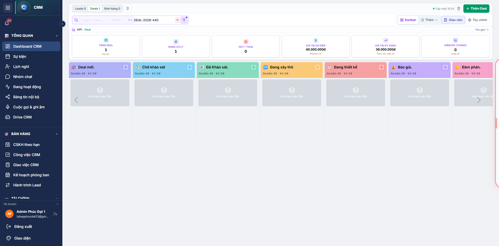
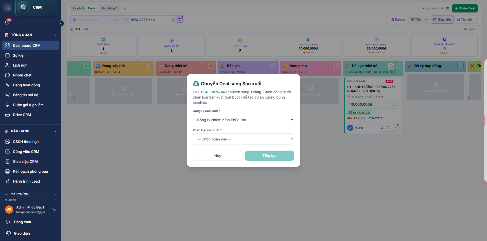
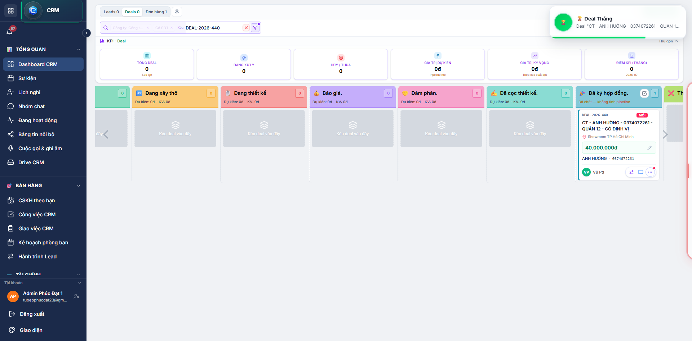
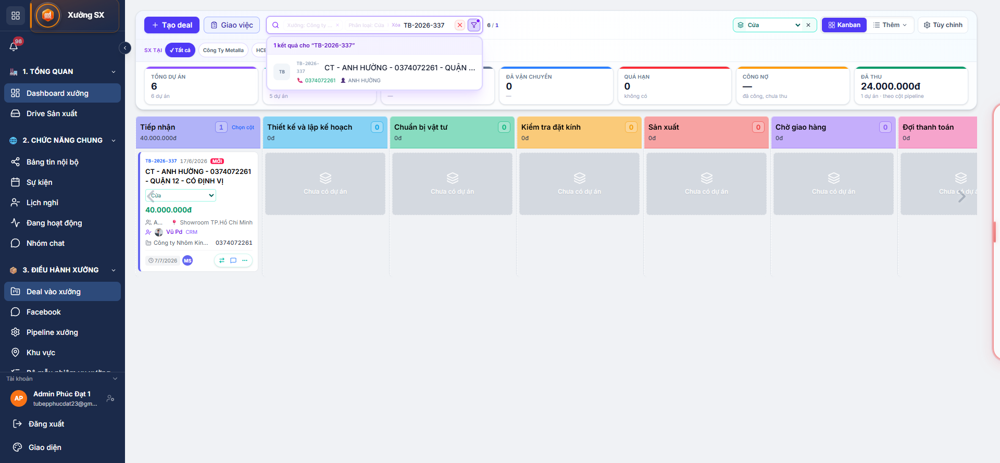
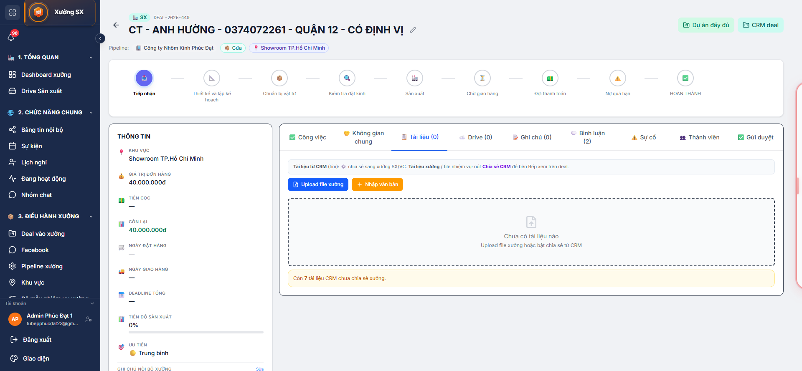
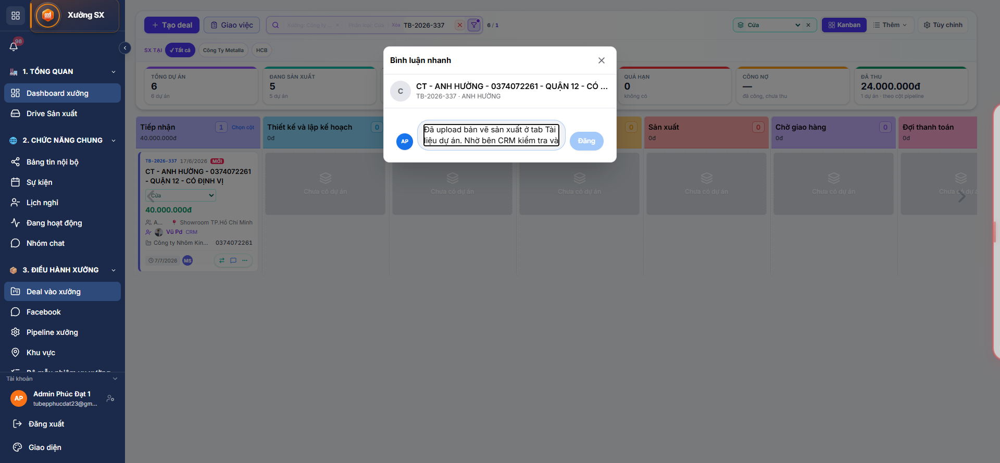
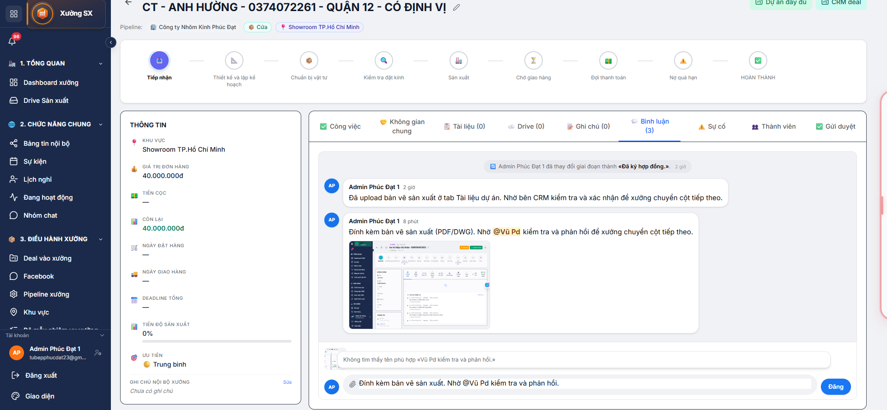
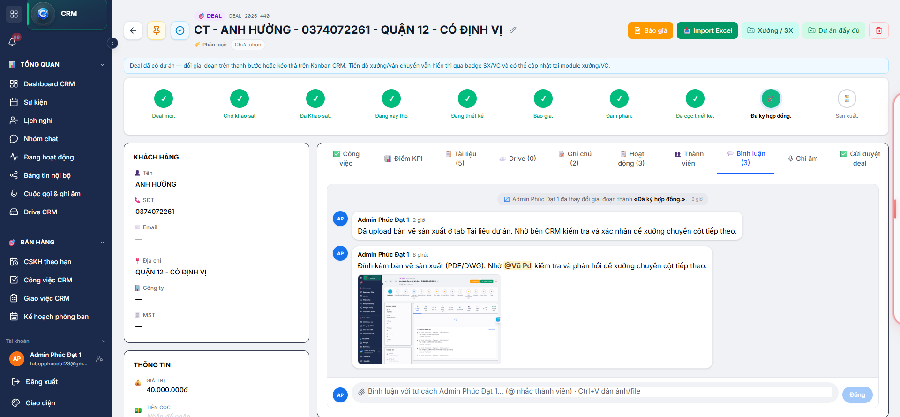
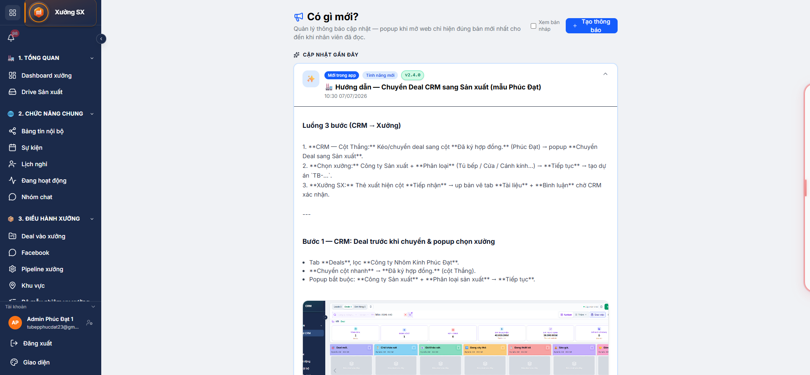

# Hướng dẫn chuyển Deal CRM sang Sản xuất

Mẫu thực tế: Công ty Nhôm Kính Phúc Đạt · Deal DEAL-2026-440 → Dự án xưởng TB-2026-337 · Phân loại Cửa

Ảnh minh họa full màn hình (1920×1080) nằm trong `docs/huong-dan-chuyen-deal-sx/` và hiển thị trên Có gì mới? (`/updates`).

---

## Tổng quan luồng

```text
CRM Kanban (Deal)
    → Chuyển cột nhanh / kéo thả sang cột Thắng (Phúc Đạt: «Đã ký hợp đồng.»)
    → Popup «Chuyển Deal sang Sản xuất»: chọn Công ty SX + Phân loại → Tiếp tục
    → Tự tạo dự án xưởng (mã TB-YYYY-NNN)
    → Xưởng SX: Kanban cột «Tiếp nhận»
    → Up bản vẽ (tab Tài liệu) + đính kèm file trong tab Bình luận để CRM ↔ xưởng trao đổi
    → CRM xác nhận → xưởng chuyển cột pipeline tiếp theo
```

### Phân công theo vai trò

NVKD / Admin CRM
- Chuyển deal sang cột Thắng, chọn xưởng và phân loại
- Theo dõi bình luận và tài liệu từ xưởng, phản hồi xác nhận

Nhân viên Sản xuất
- Nhận thẻ ở cột Tiếp nhận
- Up bản vẽ tab Tài liệu; đính kèm file trong Bình luận khi cần trao đổi nhanh

Admin
- Cấu hình pipeline, phân loại xưởng (Tủ bếp / Cửa / Cánh kính…) tại Pipeline xưởng

---

## Chuẩn bị

1. Đăng nhập TuBep Pro (CRM hoặc Xưởng SX).
2. Lọc Công ty: Công ty Nhôm Kính Phúc Đạt trên CRM Dashboard.
3. Mở tab Deals (Kanban).
4. Deal cần chuyển phải chưa có dự án xưởng — thường là deal đang ở các cột trước Thắng.

---

## Bước 1 — CRM: Chuyển deal sang cột Thắng và chọn công ty sản xuất

### 1.1. Xác định deal trên Kanban

- Vào CRM → Dashboard CRM → tab Deals.
- Bộ lọc: Công ty Nhôm Kính Phúc Đạt.
- Tìm deal (VD: DEAL-2026-440 — CT - ANH HƯỜNG) đang ở cột trước Thắng (VD: Đã cọc thiết kế.).



Ghi chú trên ảnh:
- (1) Tab Deals — không dùng tab Leads.
- (2) Chip lọc Công ty Nhôm Kính Phúc Đạt.
- (3) Thẻ deal — nút Chuyển cột nhanh trên thẻ.
- (4) Cột đích Đã ký hợp đồng. = cột Thắng của Phúc Đạt.

### 1.2. Chuyển sang cột Thắng

Cách A — Chuyển cột nhanh (khuyến nghị): Bấm nút chuyển cột trên thẻ → chọn 🎉 Đã ký hợp đồng.

Cách B — Kéo thả: Kéo thẻ deal sang cột Đã ký hợp đồng.

### 1.3. Popup «Chuyển Deal sang Sản xuất»

Ngay khi deal vào cột Thắng, hệ thống hiện popup bắt buộc:



Ghi chú trên ảnh:
- (1) Tiêu đề Chuyển Deal sang Sản xuất — deal đã Thắng.
- (2) Công ty Sản xuất (bắt buộc): Phúc Đạt tự SX → chọn Công ty Nhôm Kính Phúc Đạt; có thể chọn xưởng khác nếu gia công ngoài.
- (3) Phân loại sản xuất (bắt buộc): Tủ bếp, Cánh kính, Cửa… — quyết định pipeline Kanban xưởng.
- (4) Tiếp tục — tạo dự án TB-… và liên kết deal.



Sau khi tạo dự án, tab CRM có thể chuyển sang Đơn hàng. Deal vẫn xem được ở cột Đã ký hợp đồng khi lọc deal.

---

## Bước 2 — Sản xuất: Deal hiển thị ở cột Tiếp nhận

### 2.1. Mở module Xưởng SX

- Bấm CRM — chuyển sang Xưởng SX trên sidebar.
- Vào Deal vào xưởng (`/sx/dashboard`).

### 2.2. Lọc đúng xưởng và phân loại

- Xưởng / Công ty Sản xuất: Công ty Nhôm Kính Phúc Đạt
- Phân loại: Cửa (khớp bước 1)
- Tìm kiếm: TB-2026-337 hoặc tên khách

Lưu ý: Nếu không thấy thẻ, kiểm tra lọc xưởng đang trỏ sai công ty, hoặc phân loại Kanban không khớp (Tủ bếp vs Cửa).



Ghi chú trên ảnh:
- (1) Chip Xưởng: Công ty Nhôm Kính Phúc Đạt + Phân loại: Cửa.
- (2) Cột Tiếp nhận — cột đầu pipeline phân loại Cửa.
- (3) Thẻ TB-2026-337 — badge CRM, tên khách và NVKD.
- (4) Nhãn MỚI — vừa bàn giao từ CRM.

Bấm tiêu đề thẻ → mở Chi tiết dự án (`/sx/projects/{id}`).

---

## Bước 3 — Sản xuất: Tài liệu, bình luận và trao đổi bản vẽ

### 3.1. Lưu bản vẽ chính thức — tab Tài liệu

1. Từ Kanban, mở dự án TB-2026-337.
2. Chọn tab 📋 Tài liệu.
3. Bấm Upload file xưởng → chọn file bản vẽ (PDF, DWG, JPG…).
4. (Tuỳ chọn) Bấm Chia sẻ CRM trên file vừa up → bên CRM/deal cũng thấy tài liệu.

Gợi ý:
- File chỉ dùng nội bộ xưởng: up bình thường, không bật chia sẻ CRM.
- Cần NVKD duyệt trên deal: bật Chia sẻ CRM sau khi up.



Ghi chú trên ảnh:
- (1) Tab 📋 Tài liệu trong chi tiết TB-2026-337.
- (2) Nút Upload file xưởng.
- (3) Chú thích tài liệu CRM (tím) vs tài liệu xưởng; nút Chia sẻ CRM.
- (4) Banner vàng: tài liệu CRM chưa chia sẻ xưởng.
- (5) Pipeline stepper đang ở Tiếp nhận.

### 3.2. Bình luận nhanh trên Kanban (chỉ text)

Bấm Bình luận nhanh trên thẻ → gõ nội dung → Đăng. Không đính kèm file — dùng khi chỉ cần nhắc CRM.



### 3.3. Phía CRM xác nhận (qua tab Tài liệu)

1. Mở deal DEAL-2026-440.
2. Kiểm tra tab Tài liệu.
3. Phản hồi qua tab Bình luận hoặc chuyển cột sau khi OK.

---

## Bước 4 — Trao đổi bản vẽ qua tab Bình luận (CRM ↔ Sản xuất)

Cách khuyến nghị để CRM và xưởng bàn giao nhanh: gửi file bản vẽ trực tiếp trong luồng bình luận — hai bên cùng thấy một chỗ, có thể trả lời và đính kèm bản chỉnh sửa.

### 4.1. Phía Sản xuất — gửi bản vẽ kèm bình luận

1. Từ Kanban, bấm tiêu đề thẻ TB-2026-337 → mở chi tiết dự án.
2. Cột phải: bấm tab 💬 Bình luận trên thanh tab (Công việc · Tài liệu · Bình luận…).
3. Gõ nội dung ngắn, dùng @ nhắc NVKD (VD: @Vũ Pd).
4. Bấm biểu tượng đính kèm (kẹp giấy) → chọn PDF/DWG/JPG bản vẽ.
5. Hoặc dán trực tiếp ảnh/PDF (Ctrl+V) → bấm Đăng.



Ghi chú trên ảnh:
- (1) Header deal và pipeline stepper Tiếp nhận.
- (2) Thanh tab cột phải — tab 💬 Bình luận (3) đang được chọn.
- (3) Luồng bình luận chung CRM ↔ xưởng; file đính kèm hiển thị thumbnail.
- (4) Ô soạn phía dưới: icon kẹp giấy + Ctrl+V + nút Đăng.

### 4.2. Phía CRM — xem file và phản hồi

1. Mở deal DEAL-2026-440 (link CRM deal hoặc từ Kanban CRM).
2. Cột phải: bấm tab 💬 Bình luận trên thanh tab.
3. Xem file đính kèm dưới bình luận xưởng — bấm xem/tải.
4. Trả lời hoặc đính kèm bản chỉnh trong cùng luồng.



Ghi chú trên ảnh:
- (1) Header deal CRM DEAL-2026-440 và pipeline stepper.
- (2) Thanh tab — tab 💬 Bình luận (3) đang mở.
- (3) Cùng luồng bình luận với xưởng; file bản vẽ hiển thị inline.
- (4) CRM trả lời tại ô soạn phía dưới (cũng hỗ trợ đính kèm file).

### 4.3. Phân biệt Tài liệu vs Bình luận

- Tab Tài liệu: lưu bản vẽ chính thức, có nút Chia sẻ CRM.
- Tab Bình luận + đính kèm: trao đổi nhanh, hỏi–đáp, gửi bản phác thảo.
- Bình luận nhanh Kanban: chỉ text, không file.

---

## Xử lý sự cố thường gặp

Không hiện popup chọn xưởng
- Nguyên nhân: Deal đã có dự án liên kết.
- Cách xử lý: Mở deal kiểm tra; dùng thẻ trên Kanban SX, không chuyển lại cột Thắng.

Popup báo thiếu phân loại
- Nguyên nhân: Công ty chưa khai báo phân loại.
- Cách xử lý: SX → Pipeline xưởng → thêm phân loại.

Kanban SX trống
- Nguyên nhân: Lọc sai xưởng hoặc phân loại.
- Cách xử lý: Bộ lọc → Công ty Sản xuất = Phúc Đạt, Phân loại = đúng loại bước 1.

Cột «Tiếp nhận đơn hàng về SX» vs «Tiếp nhận»
- Nguyên nhân: Phân loại Tủ bếp vs Cửa dùng pipeline khác.
- Cách xử lý: Đổi phân loại trên dropdown Kanban.

CRM không thấy bản vẽ
- Nguyên nhân: Chưa Chia sẻ CRM (tab Tài liệu) hoặc chỉ up nội bộ xưởng.
- Cách xử lý: Bật Chia sẻ CRM trên file, hoặc gửi lại qua Bình luận kèm đính kèm.

---

## Đường dẫn nhanh

- CRM Deals (Phúc Đạt): `/crm/dashboard` + lọc công ty
- Kanban xưởng: `/sx/dashboard?company={company_id}`
- Chi tiết dự án + Tài liệu: `/sx/projects/{project_id}?tab=documents`
- Chi tiết dự án + Bình luận: `/sx/projects/{project_id}?tab=comments`
- Chi tiết deal CRM: `/crm/leads/{deal_id}`
- Cấu hình pipeline xưởng: `/sx/pipeline-settings`
- Hướng dẫn (Có gì mới?): `/updates`

---

## Xem trên Có gì mới?

Toàn bộ hướng dẫn (ảnh full màn hình + ghi chú) tại menu Có gì mới? (`/updates`), mục 🏭 Hướng dẫn — Chuyển Deal CRM sang Sản xuất (mẫu Phúc Đạt) — v2.4.0.



---

## Tài liệu liên quan

- [HUONG_DAN_CRM.md](./HUONG_DAN_CRM.md) — luồng Lead/Deal tổng quát

Cập nhật: 07/07/2026 — môi trường dev TuBep Pro, công ty Phúc Đạt.
