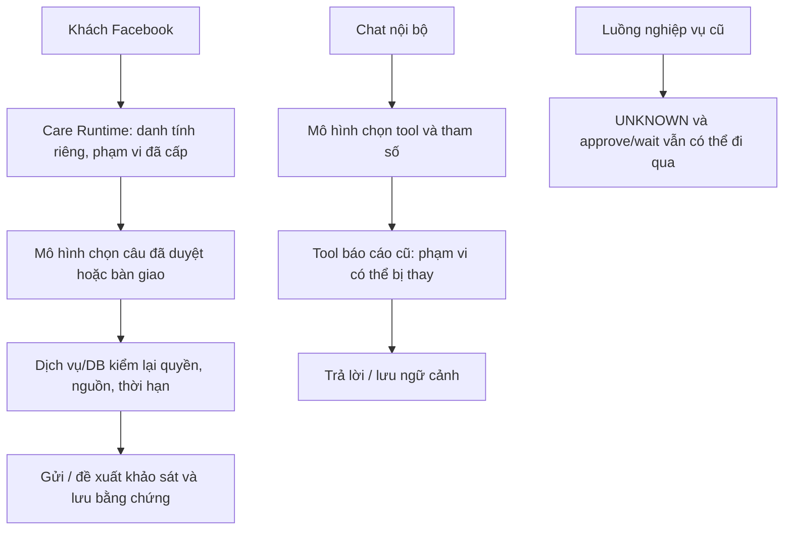

# Audit kiến trúc Agent — Business AI OS, 05/10/2026

## Các phát hiện theo mức độ

**Có 6 điểm cần xử lý: 2 critical, 1 high, 3 medium.** Bảy phép thử với mô hình/DB giả đã tái hiện sáu cơ chế này trên source `679cb9266ecb87c560421f3f6fc3c3e31b50b831`. Chưa xác minh chúng đang được bật hoặc đã gây sự cố trên hệ thống thật.

### AA-01 · CRITICAL — Phạm vi công cụ báo cáo cũ có thể bị đầu vào mô hình thay thế

Chatbot có thể truy xuất báo cáo nhân viên/công ty ngoài phạm vi người hỏi. executeTool trộn args do mô hình chọn với context; resolveAssigneeIds ưu tiên user_filter_ids hơn personal_recipient_user_id. getCompanyLeadSummary dùng company_id đầu vào, không đối chiếu ctx.companies/actor tại nhánh này.

- **Gốc vấn đề:** Phạm vi được coi là tham số tìm kiếm thay vì quyền bắt buộc do server xác lập.
- **Bằng chứng:** [backend/src/helpers/aiReportTools.js:127](https://github.com/backen-pixel/Quanlycongviec/blob/679cb9266ecb87c560421f3f6fc3c3e31b50b831/backend/src/helpers/aiReportTools.js#L127); [backend/src/helpers/aiReportTools.js:504](https://github.com/backen-pixel/Quanlycongviec/blob/679cb9266ecb87c560421f3f6fc3c3e31b50b831/backend/src/helpers/aiReportTools.js#L504); [backend/src/helpers/aiReportTools.js:3603](https://github.com/backen-pixel/Quanlycongviec/blob/679cb9266ecb87c560421f3f6fc3c3e31b50b831/backend/src/helpers/aiReportTools.js#L3603).
- **Thử tái hiện:** P1_MODEL_SCOPE_OVERRIDE, P1B_FOREIGN_COMPANY_SUMMARY trong [kết quả chẩn đoán](diagnostic-results.json). Độ tin cậy về cơ chế: 0.99.
- **Cách sửa:** Áp dụng quyền actor/company/region ở Application Service cho mọi tool; giao phạm vi đề nghị với phạm vi được phép, từ chối sai công ty trước truy vấn. Model không được chọn principal, schedule quyền hoặc personal recipient.
- **Giới hạn:** Đã tái hiện bằng DB giả; chưa xác nhận người dùng hay dữ liệu thật đã bị lộ.

### AA-02 · CRITICAL — Điều phối cũ vẫn đi qua điều kiện UNKNOWN và node approve/wait

Một luồng hiển thị chờ/duyệt có thể được tính là đã đi tới bước sản xuất dù điều kiện chưa biết. walkToNextModules chỉ loại FAIL, ghi hasUnknown rồi tiếp tục; approve/wait là pass-through. flowAllowsProductionCreate trả reachable khi bật enforce, không chặn hasUnknown.

- **Gốc vấn đề:** Thuật toán đi trên đồ thị được dùng như điều kiện cho thực thi, nhưng chưa có trạng thái chờ/duyệt bền vững tương ứng.
- **Bằng chứng:** [backend/src/helpers/flowRuntime.js:26](https://github.com/backen-pixel/Quanlycongviec/blob/679cb9266ecb87c560421f3f6fc3c3e31b50b831/backend/src/helpers/flowRuntime.js#L26); [backend/src/helpers/flowRuntime.js:426](https://github.com/backen-pixel/Quanlycongviec/blob/679cb9266ecb87c560421f3f6fc3c3e31b50b831/backend/src/helpers/flowRuntime.js#L426); [backend/src/helpers/flowRuntime.js:451](https://github.com/backen-pixel/Quanlycongviec/blob/679cb9266ecb87c560421f3f6fc3c3e31b50b831/backend/src/helpers/flowRuntime.js#L451).
- **Thử tái hiện:** P4_UNKNOWN_AND_APPROVAL_PASS_THROUGH trong [kết quả chẩn đoán](diagnostic-results.json). Độ tin cậy về cơ chế: 0.99.
- **Cách sửa:** Giữ chức năng này ở chế độ quan sát cho lệnh nhạy cảm; chỉ PASS mới cho đi tiếp. Chờ/duyệt cần bản ghi bền vững gắn phiên bản lệnh, actor và phạm vi; Domain kiểm lại trước ghi.
- **Giới hạn:** Mặc định mã là shadow. Giá trị FLOW_RUNTIME_ENFORCE và các chốt Domain khác trên môi trường thật chưa được xác minh; chưa chứng minh có đơn thật vượt duyệt.

### AA-03 · HIGH — Yêu cầu dùng công cụ để trả số liệu chỉ nằm trong prompt cũ

Bot có thể trả con số nghe chắc chắn mà chưa đọc nguồn. tool_choice:auto; nếu model không phát tool_calls, wrapper nhận choice.content và trả ngay. Không có điều kiện chứng minh một báo cáo số liệu đã được công cụ thực hiện thành công.

- **Gốc vấn đề:** Prompt đóng vai trò bảo đảm nghiệp vụ nhưng kết quả cuối không được kiểm bằng hợp đồng bằng chứng.
- **Bằng chứng:** [backend/src/helpers/aiConversation.js:40](https://github.com/backen-pixel/Quanlycongviec/blob/679cb9266ecb87c560421f3f6fc3c3e31b50b831/backend/src/helpers/aiConversation.js#L40); [backend/src/helpers/aiConversation.js:619](https://github.com/backen-pixel/Quanlycongviec/blob/679cb9266ecb87c560421f3f6fc3c3e31b50b831/backend/src/helpers/aiConversation.js#L619); [backend/src/helpers/aiConversation.js:648](https://github.com/backen-pixel/Quanlycongviec/blob/679cb9266ecb87c560421f3f6fc3c3e31b50b831/backend/src/helpers/aiConversation.js#L648).
- **Thử tái hiện:** P2_UNGROUNDED_FINAL_ACCEPTED trong [kết quả chẩn đoán](diagnostic-results.json). Độ tin cậy về cơ chế: 0.99.
- **Cách sửa:** Phân biệt lời chào với yêu cầu dữ liệu; câu trả lời số liệu bắt buộc kèm kết quả công cụ thành công, nguồn/phạm vi/thời điểm. Dùng kết quả báo cáo do server định dạng; chưa có bằng chứng thì trả chưa xác minh.
- **Giới hạn:** Mô hình giả trả 999 được wrapper chấp nhận; không phải bằng chứng model thật thường xuyên bịa số.

### AA-04 · MEDIUM — Cắt chuỗi làm hỏng kết quả công cụ và có thể cắt báo cáo cuối

Mô hình thấy dữ liệu thiếu hoặc JSON không còn hợp lệ; người đọc có thể mất phần cuối báo cáo. JSON.stringify(result).slice(0,8000) cắt giữa giá trị; final text.slice(0,1900) cũng cắt mù. Prompt đồng thời yêu cầu in nguyên báo cáo.

- **Gốc vấn đề:** Giới hạn độ dài được áp dụng trên chuỗi đã tuần tự hóa thay vì cấu trúc dữ liệu hoặc phân trang.
- **Bằng chứng:** [backend/src/helpers/aiConversation.js:190](https://github.com/backen-pixel/Quanlycongviec/blob/679cb9266ecb87c560421f3f6fc3c3e31b50b831/backend/src/helpers/aiConversation.js#L190); [backend/src/helpers/aiConversation.js:651](https://github.com/backen-pixel/Quanlycongviec/blob/679cb9266ecb87c560421f3f6fc3c3e31b50b831/backend/src/helpers/aiConversation.js#L651); [backend/src/helpers/aiConversation.js:685](https://github.com/backen-pixel/Quanlycongviec/blob/679cb9266ecb87c560421f3f6fc3c3e31b50b831/backend/src/helpers/aiConversation.js#L685).
- **Thử tái hiện:** P3_TOOL_JSON_CUT_MID_VALUE trong [kết quả chẩn đoán](diagnostic-results.json). Độ tin cậy về cơ chế: 0.99.
- **Cách sửa:** Giảm số hàng trước serialize, giữ JSON hợp lệ với truncated/total/nextCursor; báo cáo dài chia phần hoặc dẫn tới màn chi tiết. Không cắt im lặng con số/bằng chứng.
- **Giới hạn:** Đã xác minh wrapper cắt JSON; chưa kiểm mọi trình hiển thị Messenger/mobile.

### AA-05 · MEDIUM — Kết quả công cụ lỗi vẫn làm đổi ngữ cảnh hội thoại

Câu hỏi tiếp nối có thể tự chuyển sang công ty/nhân viên của lần tra cứu thất bại. updateSessionFromToolResult nhận args và gán company/user/time dù result.error; vòng tool gọi hàm này trước kiểm trạng thái kết quả, sau đó lưu session vào conversation.

- **Gốc vấn đề:** Đồng nhất ý định đề nghị với kết quả đã được xác thực.
- **Bằng chứng:** [backend/src/helpers/aiChatSessionContext.js:169](https://github.com/backen-pixel/Quanlycongviec/blob/679cb9266ecb87c560421f3f6fc3c3e31b50b831/backend/src/helpers/aiChatSessionContext.js#L169); [backend/src/helpers/aiConversation.js:667](https://github.com/backen-pixel/Quanlycongviec/blob/679cb9266ecb87c560421f3f6fc3c3e31b50b831/backend/src/helpers/aiConversation.js#L667); [backend/src/helpers/aiConversation.js:882](https://github.com/backen-pixel/Quanlycongviec/blob/679cb9266ecb87c560421f3f6fc3c3e31b50b831/backend/src/helpers/aiConversation.js#L882).
- **Thử tái hiện:** P5_FAILED_TOOL_PERSISTS_SCOPE trong [kết quả chẩn đoán](diagnostic-results.json). Độ tin cậy về cơ chế: 0.99.
- **Cách sửa:** Chỉ cập nhật ngữ cảnh từ result có trạng thái thành công và scope đã được server xác minh; lỗi giữ scope cũ, tách pending intent và confirmed context.
- **Giới hạn:** Đã chứng minh ở helper và đường gọi; chưa xác nhận phiên hội thoại thật bị ảnh hưởng.

### AA-06 · MEDIUM — Bộ nhớ có thể bỏ mất lời sửa của người dùng trước khi xếp ưu tiên

Bot có thể quên một lời sửa quan trọng dù mã nói luôn ưu tiên correction. Query sắp theo confidence và lấy limit+5 trước khi tách correction. Với 12 suy luận confidence=1 và hai correction=.95, một correction đã bị loại khỏi kết quả DB nên không được ưu tiên lại.

- **Gốc vấn đề:** Ưu tiên correction chỉ áp dụng sau bước cắt dữ liệu; confidence do GPT đưa ra có thể đạt 1.
- **Bằng chứng:** [backend/src/helpers/aiUserMemory.js:180](https://github.com/backen-pixel/Quanlycongviec/blob/679cb9266ecb87c560421f3f6fc3c3e31b50b831/backend/src/helpers/aiUserMemory.js#L180); [backend/src/helpers/aiUserMemory.js:199](https://github.com/backen-pixel/Quanlycongviec/blob/679cb9266ecb87c560421f3f6fc3c3e31b50b831/backend/src/helpers/aiUserMemory.js#L199); [backend/src/helpers/aiUserMemory.js:311](https://github.com/backen-pixel/Quanlycongviec/blob/679cb9266ecb87c560421f3f6fc3c3e31b50b831/backend/src/helpers/aiUserMemory.js#L311).
- **Thử tái hiện:** P6_CORRECTION_LOST_BEFORE_PRIORITY_SORT trong [kết quả chẩn đoán](diagnostic-results.json). Độ tin cậy về cơ chế: 0.98.
- **Cách sửa:** Lấy correction có hiệu lực bằng truy vấn riêng trước ngân sách context; dùng khóa chủ đề và supersedes/validUntil; giữ nguồn/thời điểm của suy luận, không biến trí nhớ thành quyền hoặc quyết định Founder.
- **Giới hạn:** Dữ liệu tổng hợp hợp lệ dùng để chứng minh đường mất correction; chưa đọc bảng memory thật.

## Chẩn đoán kiến trúc

**Các tuyến Agent đang dùng hai chuẩn kiểm soát khác nhau.** Tuyến chăm khách mới kiểm danh tính, phạm vi, dữ liệu được duyệt và bằng chứng thực hiện trong dịch vụ/DB. Chatbot nội bộ cùng điều phối cũ còn dựa nhiều vào prompt, tham số do mô hình chọn và trạng thái lưu chưa phân biệt kết quả thành công/lỗi. Vì vậy PASS của tuyến Marketing mới không đồng nghĩa các Agent khác đều đạt chuẩn.



Phần mới có những kiểm soát đã thấy trực tiếp trong mã và 64 ca kiểm tập trung: chỉ chọn câu bằng ID trong thư viện đã duyệt, trích nhu cầu bằng đúng lời khách; không nhận văn bản giá/cam kết mới hoặc tool gửi do model tự đưa ra. Runtime có principal/grant/company riêng, kiểm Primary, kiểm lại quyền và phiên bản tại DB; gửi câu trả lời là worker riêng. Mất phản hồi provider không tự gửi/gọi lại; retry lưu receipt tách khỏi retry ngoại tác.

Nguồn: [backend/src/modules/marketingAutomation/careAdvisor.js:13](https://github.com/backen-pixel/Quanlycongviec/blob/679cb9266ecb87c560421f3f6fc3c3e31b50b831/backend/src/modules/marketingAutomation/careAdvisor.js#L13), [backend/src/modules/marketingAutomation/careRuntime.js:10](https://github.com/backen-pixel/Quanlycongviec/blob/679cb9266ecb87c560421f3f6fc3c3e31b50b831/backend/src/modules/marketingAutomation/careRuntime.js#L10), [backend/src/modules/marketingAutomation/careOpenAiInference.js:35](https://github.com/backen-pixel/Quanlycongviec/blob/679cb9266ecb87c560421f3f6fc3c3e31b50b831/backend/src/modules/marketingAutomation/careOpenAiInference.js#L35), [database/693_crm_care_runtime.sql:170](https://github.com/backen-pixel/Quanlycongviec/blob/679cb9266ecb87c560421f3f6fc3c3e31b50b831/database/693_crm_care_runtime.sql#L170), [backend/src/modules/marketingAutomation/careAnswerDispatch.js:11](https://github.com/backen-pixel/Quanlycongviec/blob/679cb9266ecb87c560421f3f6fc3c3e31b50b831/backend/src/modules/marketingAutomation/careAnswerDispatch.js#L11).

**Chưa cần đổi ranh giới kiến trúc đã chọn.** Cần đưa các đường cũ về cùng nguyên tắc Domain giữ luật, Application Service kiểm quyền, Agent chỉ đề nghị hoặc thực hiện trong ủy quyền. Audit này không quyết định thay model, thêm nền tảng hoặc mở rộng baseline.

## Phạm vi 12 lớp

| Lớp | Kết quả rà |
|---|---|
| 1. System prompt | AA-03; chatbot nội bộ dùng chỉ dẫn must-tool nhưng wrapper chưa ép. Care mới giới hạn schema/selection bằng mã. |
| 2. Session history | AA-05; history còn giới hạn số tin, open conversation có expires_at, không kết luận mọi history vô hạn. |
| 3. Long-term memory | AA-06 trong legacy; chưa thấy kho nhớ dài hạn tự học trong care path đã rà. |
| 4. Distillation | GPT-derived facts tồn tại; confidence tối đa 1 và admission vào memory, liên quan AA-06. Không chứng minh model tự bịa trong production. |
| 5. Active recall | Memory/session/skill snapshot ghép vào system prompt; nguồn và ưu tiên cần chặt hơn. Chưa đo chi phí context trùng. |
| 6. Tool selection | AA-01/03. Care mới chỉ chọn ANSWER/HANDOFF/SURVEY, không chọn công cụ gửi. |
| 7. Tool execution | AA-01/02. Care mới có principal/grant/company, RPC kiểm lại và Primary-only. |
| 8. Tool interpretation | AA-03/04/05. Care mới kiểm exact keys, answer ID, quote thật và usage receipt. |
| 9. Answer shaping | AA-04: cắt final 1.900 ký tự. Care mới lấy nguyên câu đã duyệt từ service. |
| 10. Platform rendering | AA-04 được thấy ở wrapper trước vận chuyển; chưa audit mọi UI/mobile/streaming production. |
| 11. Hidden repair loops | Care mới không tự gọi lại provider khi mất phản hồi; retry receipt tách riêng, retry advisor có request/reason riêng. Legacy có LLM báo cáo và memory nightly riêng; chưa chứng minh vòng repair im lặng. |
| 12. Persistence | AA-02/05/06 trên legacy. Care có claim/receipt/replay, revocation checks và UNKNOWN; DB thật chưa đối chiếu. |

## Thứ tự xử lý đề xuất

1. **Khóa phạm vi công cụ cũ theo danh tính server.** AA-01 liên quan dữ liệu giữa công ty/người dùng. Kết quả cần có: Đầu vào model không thể mở rộng quyền; test trái công ty/nhân viên bị từ chối trước DB.

2. **Chặn UNKNOWN và tách chờ/duyệt bền vững khỏi graph traversal.** AA-02 mâu thuẫn với điều kiện kiến trúc trước khi mở quyền tác động. Kết quả cần có: Lệnh nhạy cảm chỉ chạy khi Domain xác nhận PASS và approval còn hiệu lực.

3. **Bắt buộc bằng chứng khi trả số liệu, giữ kết quả có cấu trúc.** AA-03 và AA-04 gây câu trả lời tự tin nhưng thiếu nguồn hoặc mất dữ liệu. Kết quả cần có: Không có tool result hợp lệ thì báo chưa xác minh; kết quả dài vẫn đầy đủ/phân trang.

4. **Chỉ lưu scope đã xác minh và ưu tiên correction trước truy vấn giới hạn.** AA-05/06 có thể mang lỗi sang lượt sau. Kết quả cần có: Lỗi không đổi company/user; sửa của người dùng không bị suy luận confidence cao đẩy ra.

5. **Khép đánh giá và cấu hình riêng cho tuyến Marketing mới.** 64 unit test không thay model thật, lịch CRM và quyền nguồn thực tế. Kết quả cần có: Chạy bộ 18 tình huống đúng model/library/bindings trong gói được phép; UAT và quyết định phát hành vẫn riêng.

Các sửa nên làm bằng guard/hợp đồng/kết quả có cấu trúc trước khi chỉnh prompt. Với AA-01 cần kiểm user đúng/sai công ty và nhân viên, actor thiếu/thu hồi quyền, args model cố thay phạm vi. Với AA-02 cần kiểm UNKNOWN, DB lỗi, approval thiếu/hết hạn/sửa nội dung, khởi động lại khi chờ. Chỉ chuyển phép chẩn đoán hiện tại thành kiểm hồi quy đạt sau khi hành vi nguy hiểm bị chặn; không coi “tái hiện đúng lỗi” là đạt phát hành.

## Bằng chứng, giới hạn và bàn giao

- Cây mã được rà: `679cb926`, sạch trước audit; audit không sửa runtime hoặc SQL.
- [Diagnostic](diagnostic.cjs) thực thi mã thật trong VM, chỉ cho các dependency giả được khai báo; provider/network thật bị cấm. **7 phép chẩn đoán OBSERVED**, chứng minh 6 cơ chế. DB giả không thay chứng minh RLS/HTTP/auth/triển khai thật.
- Care unit tests: **64 PASS, 0 FAIL, 0 SKIP**, Node 24.19.0, chạy cùng tiến trình bằng `--test-isolation=none`; [log](care-unit-tests.tap). Đây là kiểm hợp đồng/adapter, không phải model quality hoặc benchmark.
- Chưa có reviewer độc lập riêng cho audit này. Các review PASS trước thuộc phạm vi PR19/PR22 đã ghi, không phủ mọi đường Agent cũ.
- Chưa đọc secret, memory/CRM thật, cấu hình live hoặc gọi model/khách. Không sửa quyết định Founder, quyền, ngân sách hay cấu hình vận hành.
- Bộ 18 câu đã được Founder duyệt nhưng chất lượng chọn câu bằng model thật chưa chạy; Admin VPT, roster/độ đủ lịch CRM và cấu hình AI còn chờ đối chiếu. Xem [readiness](../../vpt-marketing-automation/RELEASE_READINESS.md).
- Các lời gọi LLM cũ dùng key chung ngoài cơ chế cấp phép/chi phí riêng của care mới. Chưa đo tổng chi, không kết luận đã có giới hạn chi AI trên toàn hệ thống.
- Tài liệu và kết quả này đang ở **working tree cục bộ trong repo, chưa commit/publish**. [JSON cấu trúc theo skill](report.json) lưu đầy đủ symptom/layer/root cause/evidence/confidence/fix. Trạng thái phát hành vẫn HOLD theo hồ sơ hiện hành.

Tái chạy chẩn đoán khi đang ở source đã ghim:
```text
node docs/ai-handoff/audits/2026-10-05-agent-architecture/diagnostic.cjs
node --test --test-isolation=none backend/tests/facebookCustomerCare.advisor.test.js backend/tests/facebookCustomerCare.inference.test.js backend/tests/facebookCustomerCare.runtime.test.js backend/tests/careAnswerDispatch.test.js
```
