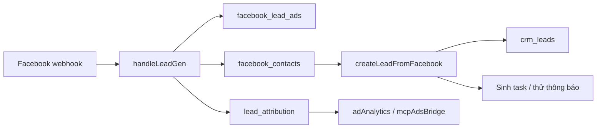

# Bản đồ nguồn và kết luận khảo sát
Ngày: 02/10/2026. Khảo sát tĩnh; không chạy server, không gọi CRM/DB/Meta thật.

## Phiên bản
- main: `0db11ce1adb0fb89fc87529036e495a62d58fce7`, tree `f9d33069dc9058be4cf312f4013f477915ef6954`.
- PR #19: `e16c885ae7c2305645be02a1227bf378cb59137f`, open/non-draft/unmerged. Báo cáo kiểm trước ghi 53 test giả lập PASS, chưa thay nghiệm thu thật.
- PR #20: `ba8781412ba09750d81ee3ad6b62c6fc5dac30b6`, open/draft/unmerged; chuẩn kiến trúc đích.
- [Manifest](source-manifest.json) ghi toàn bộ file tải để đối chiếu; danh sách tải không đồng nghĩa mọi dòng đã được audit.

## Sơ đồ luồng đã đọc ở mã

Luồng trên mô tả call path, không bảo đảm transaction chung, độ đầy đủ hay trạng thái deployment.

## Phát hiện có nguồn
| Mã | Bằng chứng ở main | Kết luận và tác động cho pilot |
|---|---|---|
| S01 | [facebook.js L3486–3538](https://github.com/backen-pixel/Quanlycongviec/blob/0db11ce1adb0fb89fc87529036e495a62d58fce7/backend/src/routes/facebook.js#L3486) | Webhook lưu inbox Messenger cho Page opt-in rồi ACK; `handleLeadGen` nằm sau ACK. Gói Messenger không chứng minh retry/crash của Lead Ads. Phải thử riêng trước nghiệm thu tiếp nhận biểu mẫu. |
| S02 | [facebook.js L4010–4103](https://github.com/backen-pixel/Quanlycongviec/blob/0db11ce1adb0fb89fc87529036e495a62d58fce7/backend/src/routes/facebook.js#L4010) | Kiểm leadgen đã có thì bỏ qua; lưu lead ad trước các bước tạo/liên kết và processed. Có khoảng lỗi giữa lưu nguồn và hoàn tất; cần thử tái nhận khi bản ghi còn dang dở. Không khẳng định đã có lỗi/mất khách trên production. |
| S03 | [facebook.js L2950–2981, L3215–3338](https://github.com/backen-pixel/Quanlycongviec/blob/0db11ce1adb0fb89fc87529036e495a62d58fce7/backend/src/routes/facebook.js#L3215) | Owner lấy default_lead_owner_id, dự phòng created_by; task/notification làm sau tạo Lead. Có Lead/notification không chứng minh người nhận active, có quyền hoặc đã tiếp nhận. |
| S04 | [leadAttribution.js L61–106, L138–155](https://github.com/backen-pixel/Quanlycongviec/blob/0db11ce1adb0fb89fc87529036e495a62d58fce7/backend/src/helpers/leadAttribution.js#L138) | Attribution thiên về lead/contact và lần chạm đầu; lỗi có thể trả ok:false/skipped. Không dùng một hàng attribution làm sổ tất cả biểu mẫu/event. Link receipt→Lead cần đối chiếu nguồn intake. |
| S05 | [adAnalytics.js L73–134](https://github.com/backen-pixel/Quanlycongviec/blob/0db11ce1adb0fb89fc87529036e495a62d58fce7/backend/src/routes/adAnalytics.js#L73) | Chỉ lấy attribution đã có lead_id, giới hạn 20.000 dòng; chi tiêu giới hạn 50.000; main có nhánh lỗi→rỗng. Không trả lời “mọi khách đã vào CRM” bằng báo cáo này; hồ sơ chưa liên kết bị bỏ ngoài tập đọc. |
| S06 | [mcpAdsBridge.js L87–117](https://github.com/backen-pixel/Quanlycongviec/blob/0db11ce1adb0fb89fc87529036e495a62d58fce7/backend/src/helpers/mcpAdsBridge.js#L87) | Có đường báo cáo Ads riêng, dùng phạm vi API key và cũng có nhánh đọc CRM lỗi→rỗng. PR #19 sửa adAnalytics không tự sửa/kiểm chứng đường bridge này. |
| S07 | [leadLifecycle.js L578–618](https://github.com/backen-pixel/Quanlycongviec/blob/0db11ce1adb0fb89fc87529036e495a62d58fce7/backend/src/routes/crm/routes/leadLifecycle.js#L578) và [mcpCrmReadBridge.js L628–630](https://github.com/backen-pixel/Quanlycongviec/blob/0db11ce1adb0fb89fc87529036e495a62d58fce7/backend/src/helpers/mcpCrmReadBridge.js#L628) | GET chi tiết Lead có thể ghi lead_seen_by theo user act-as. Agent đọc qua alias hiện tại có thể tạo dấu “đã xem”. Pilot phải có dịch vụ đọc không gây tác động này; đọc tự động không được thành bằng chứng người nhận. |
| S08 | [leadLifecycle.js L3360–3416, L3733–3787](https://github.com/backen-pixel/Quanlycongviec/blob/0db11ce1adb0fb89fc87529036e495a62d58fce7/backend/src/routes/crm/routes/leadLifecycle.js#L3360) | API activities ghép hoạt động hệ thống của xưởng và dùng data||[] khi đọc CRM. type mặc định note, có outcome/activity_date/created_by. Không suy “đã gọi khách” từ mọi activity hoặc last_activity_at; adapter phải xử lý lỗi và phân loại bằng chứng. |
| S09 | [crmTasks.js L305–400](https://github.com/backen-pixel/Quanlycongviec/blob/0db11ce1adb0fb89fc87529036e495a62d58fce7/backend/src/routes/crm/routes/crmTasks.js#L305) | Tasks có thể gồm việc sau bán/fulfillment và lọc module. Phân loại theo ý nghĩa; không gắn mọi task chưa xong thành chăm khách quá hạn. |
| S10 | [mcpCrmReadBridge.js L125–158](https://github.com/backen-pixel/Quanlycongviec/blob/0db11ce1adb0fb89fc87529036e495a62d58fce7/backend/src/helpers/mcpCrmReadBridge.js#L125) | Payload có thể bị cắt với _truncated. Adapter cần pagination/coverage rõ; kết quả một phần không được dùng kết luận “không có”. |
| S11 | [mcpGateway.js L43–55, L310–390](https://github.com/backen-pixel/Quanlycongviec/blob/0db11ce1adb0fb89fc87529036e495a62d58fce7/backend/src/helpers/mcpGateway.js#L310) | Đã có scope, act-as, audit và allowlist. Đây là điểm khảo sát/tái sử dụng; phải thử quyền theo tool/đối tượng, không mặc nhiên coi gateway đạt mọi yêu cầu V1.1. |
| S12 | [aiConversation.js L625–667](https://github.com/backen-pixel/Quanlycongviec/blob/0db11ce1adb0fb89fc87529036e495a62d58fce7/backend/src/helpers/aiConversation.js#L625), [aiChatBot.js](https://github.com/backen-pixel/Quanlycongviec/blob/0db11ce1adb0fb89fc87529036e495a62d58fce7/backend/src/routes/aiChatBot.js) | Có bot dùng Chat Completions, executeTool, cấu hình playbook/lịch. Không thay bot, lịch, memory hoặc đăng ký tool diện rộng trong gói khảo sát. Backend manifest khảo sát chưa khai dependency openai; cần kiểm lại khi tích hợp. |

## Ánh xạ dữ liệu tối thiểu
| Câu hỏi | Nguồn cần đối chiếu | Giới hạn |
|---|---|---|
| Có biểu mẫu nào được nhận? | facebook_lead_ads: page_id, leadgen_id, form_id, lead_id, processed; sổ receipt được nghiệm thu sau này | Bảng đã lưu không chứng minh đủ tất cả thông báo Meta; metadata coverage bắt buộc. |
| Biểu mẫu đã nối Lead nào? | Liên kết nguồn intake/contact với crm_leads.id và company_id | Không suy từ tên, số điện thoại hoặc attribution đơn lẻ. |
| Ai chịu trách nhiệm? | crm_leads.assigned_to/lead_owner_id và users/role/scope | Hai owner khác nhau hoặc người không hoạt động → cần xác minh; không tự chọn một người. |
| Người đã tiếp nhận/chăm sóc? | Bằng chứng thao tác của người và hoạt động CRM đủ điều kiện | “Đã xem” tự động, thông báo, cập nhật timestamp, system event không đủ. |
| Có quá hạn? | Chính sách deadline/SLA hiện có đúng module, phiên bản và múi giờ | Chưa xác nhận chính sách chăm sóc thì UNKNOWN; không tự áp 15/30 phút. |
| Chi tiêu, hiệu quả? | Catalog/attribution/spend đúng account/Page/company/kỳ, currency và độ mới | Không lấy ngân sách 500.000/ngày làm tiền đã chi; thiếu mẫu số hoặc khác cohort thì không tính CPL. |

## Điều chưa kiểm chứng
Deployment SHA, cấu hình tenant/company/Page/form, chữ ký webhook trên toàn call path, quyền/ACL/RLS thật, tính đầy đủ intake, trạng thái người dùng và quyền xem, độ sẵn sàng Claude, quyền Agents API, policy chăm sóc. Chưa đọc cấu hình CRM thật; hồ sơ PR #19 ghi lần đọc cũ bị chặn, không thử lại qua đường khác trong khảo sát này.

Những nhận định ở S01–S12 là kết luận khảo sát có phạm vi, không phải báo cáo lỗ hổng hoặc kết quả kiểm thử production. Việc sửa sẽ là gói implementation riêng theo [backlog](PILOT_AND_ACCEPTANCE.md).

