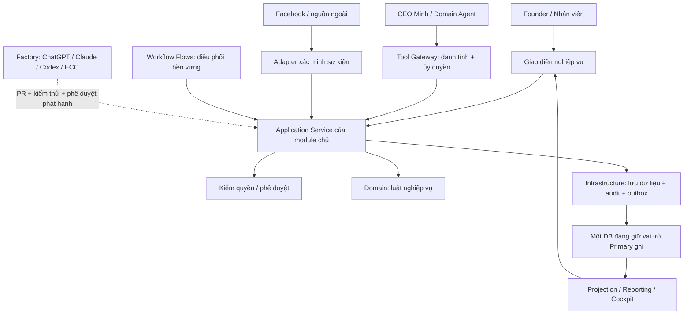

# Business AI OS — Kiến trúc chuẩn V1.1

Ngày: 01/10/2026. Phạm vi: hệ thống VPT–Metala trong repo Quanlycongviec.

**Định hướng được Founder duyệt để triển khai theo chặng; bản diễn giải V1.1 này là gói tài liệu chặng 0 chờ review/merge.** Đây là chuẩn đích, không phải chứng nhận các cơ chế đã chạy trên production. Quyền triển khai chặng 0 không mở các chặng lớn tiếp theo.

- Quyết định và phạm vi phê duyệt: [sổ Founder](../ai-handoff/FOUNDER_DECISIONS_ARCHITECTURE_V1_1_20261001.md).
- Hiện trạng có nguồn, giới hạn kiểm chứng: [bằng chứng chặng 0](../ai-handoff/ARCHITECTURE_V1_1_EVIDENCE_20261001.md).
- Thứ tự thực hiện, dependency, gate và đầu vào: [lộ trình](./BUSINESS_AI_OS_V1_1_ROADMAP.md).
- Các lựa chọn được ghi riêng trong ADR-0016 đến ADR-0020 ở [sổ ADR](../adr/README.md).

## 1. Mục tiêu và các quyết định nền

Founder giao mục tiêu → hệ thống phân rã → con người/Agent phối hợp → Business OS kiểm quyền, luật và phê duyệt → ngoại lệ quay về Founder. Chuỗi đầu tiên: Marketing → CRM → Order → Project → Sản xuất → Giao lắp → Tài chính.

Tiến hóa trong repo hiện có. Giữ Express, React, Supabase PostgreSQL và Render; không mở codebase song song. Module mới/tái cấu trúc theo domain / application / infrastructure / public bên trong backend/src/modules/<module>. Chuyển TypeScript toàn hệ thống, dịch vụ đăng ký SaaS và tính phí thuê bao nằm ngoài V1.1.

Sáu hệ quản trị là các góc nhìn xuyên module, không phải sáu DB. Tên kiến trúc đích là Business AI OS; các tài liệu BizMind/Tủ Bếp Pro cũ giữ vai trò lịch sử/hiện trạng được ghi rõ.

**CRM giữ việc trước bán; Work Unified giữ việc sau bán.** Không hợp nhất tất cả crm_tasks. Không chuyển lịch sử chăm khách sang hệ sau bán chỉ vì khách đã có Order.

## 2. Các lớp và luồng dữ liệu

Domain không trực tiếp thao tác DB. Application Service gọi Domain để kiểm luật, dùng Infrastructure để ghi. UI, webhook, Agent và Workflow đi qua cùng các kiểm soát của dịch vụ; không có đường đặc cách cho Agent.

Module khác đọc qua giao tiếp public hoặc projection được kiểm quyền; không import phần infrastructure/private của module chủ. Với mã cũ, chuyển từng lát qua adapter; mỗi lát phải có bằng chứng đã loại đường ghi bỏ qua dịch vụ trước khi bật.

Một transaction trong module chủ ghi thay đổi nghiệp vụ, audit của thay đổi thành công và outbox. Worker chuyển sự kiện có thể giao lặp; bên nhận phải chống trùng. Từ chối quyền/phê duyệt không ghi thay đổi nghiệp vụ; nhật ký từ chối được ghi riêng theo cơ chế audit có kiểm soát. Không tuyên bố có transaction phân tán giữa các module.

## 3. Bản đồ sở hữu đích

| Thực thể / dữ liệu | Module chủ ghi | Ranh giới |
|---|---|---|
| Campaign, spend, source receipt, bằng chứng attribution | Marketing | Xác minh nguồn; không tự chấp nhận Lead hoặc chuyển Deal. |
| Customer, Contact nghiệp vụ, Lead, Deal | CRM/Sales | Quyết định tiếp nhận/chống trùng khách và vòng đời bán hàng. Contact nền tảng ở biên Marketing chỉ liên kết về CRM. |
| Quote/version, CustomerAcceptance cho báo giá, Order | CRM/Sales | Tận dụng quotations, quotation_items, orders hiện có; không tạo lõi đơn hàng thứ hai. |
| Nhiệm vụ chăm khách/bán hàng và lịch sử | CRM/Sales | Có thể còn mở sau khi Order được tạo; ownership dựa vào nghiệp vụ, không dựa thời điểm. |
| Project, Milestone, WorkItem, dependency và bằng chứng hoàn tất công việc sau bán | Work Unified | Chỉ giữ trạng thái thực hiện chung; không tự xác nhận QC, nghiệm thu chuyên môn hoặc ghi sổ kế toán. |
| ProductionOrder, QC, WIP | Sản xuất | Luật sản xuất; báo kết quả cho Work qua sự kiện/dịch vụ. |
| Giao hàng, lắp đặt, nghiệm thu giao lắp | Giao lắp | Nghiệm thu bàn giao khác với khách chấp thuận báo giá. Work lưu liên kết bằng chứng, không bản gốc cạnh tranh. |
| Chứng từ tài chính, công nợ, thanh toán, đối soát | Tài chính | Phân biệt giá trị Order, doanh thu và tiền thu; MISA ở phạm vi đọc/đối soát. Dữ liệu nhập giữ nguồn gốc MISA. |
| Danh tính, ủy quyền, bản ghi approval, audit | Governance | Cơ chế thực thi kiểm soát; điều kiện nghiệp vụ yêu cầu duyệt do Domain sở hữu. |
| Trạng thái chạy workflow, chờ/retry/deadline | Workflow Flows | Không sở hữu trạng thái nghiệp vụ gốc của Order/Project. |
| Chỉ số, projection, trạng thái độ mới | Reporting | Hỗ trợ quyết định; lệnh phát sinh phải kiểm lại dữ liệu gốc trong dịch vụ. |

Đây là ownership logic ở đích. Không suy bảng vật lý bằng tên module. Ví dụ mã hiện có chứa việc xưởng trong crm_tasks và có nhiều nhóm trường chuyên môn trên projects. Chặng 0 chưa trao quyền cho nhiều module cùng sửa một bảng legacy.

Trong chuyển đổi, mỗi nhóm dữ liệu có đúng một writer được đăng ký và một tuyến adapter vào writer đó. Nếu một bảng legacy chứa nhiều nhóm nghiệp vụ, giữ một façade ghi có kiểm soát cho bảng; module chuyên môn gửi command. Chỉ tách writer khi đã tách ownership/lưu trữ và đối soát, không để hai đường cũ/mới đồng thời ghi cùng bản ghi.

### Nhiệm vụ trước và sau bán

- Phân loại bằng liên kết nghiệp vụ, pipeline/module, trường production/logistics và mục đích công việc; tên bảng hoặc is_won đơn lẻ không đủ.
- Nhóm không phân loại chắc chắn vào danh sách cần xác nhận, không tự chuyển/xóa.
- Khi Order hợp lệ: mở Project/công việc sau bán và lưu liên kết về Order/CRM. Việc chăm khách cũ giữ nguyên lịch sử.
- Việc sau bán ở nguồn cũ chuyển từng nhóm với bảng ánh xạ ID; giữ người nhận, thời hạn, ghi chú, tệp, lịch sử và phạm vi công ty.
- unified_tasks_v và màn hình chung có thể tiếp tục đọc hai nguồn. Một màn hình tổng hợp không đồng nghĩa một module ghi mọi công việc.
- crm_assignments phải được phân loại tương tự; không nhập toàn bộ vào Work Unified.

## 4. Hợp đồng giao tiếp bắt buộc

Đây là yêu cầu hành vi cho implementation từng chặng, chưa công bố endpoint/schema mới đang hoạt động.

| Giao tiếp | Đầu vào và thẩm quyền | Kết quả / bất biến |
|---|---|---|
| Marketing → CRM tiếp nhận khách | Receipt đã xác minh ở biên nguồn; event key ổn định trong scope; context tenant/company do server xác lập | CRM tạo/liên kết/từ chối; trả định danh chuẩn hoặc mã lỗi. Retry không nhân Lead; UTM không phải chứng minh paid click. |
| Quote → CustomerAcceptance → Order | Phiên bản báo giá và bằng chứng khách chấp thuận đúng phiên bản | Tái gửi cùng yêu cầu trả Order đã tạo; sửa báo giá không tái sử dụng chấp thuận cũ. Duyệt nội bộ không thay bằng chứng khách đồng ý. |
| Order → Work Unified | Order hợp lệ, phân đoạn thực hiện/đích bàn giao và khóa chống trùng | Tạo/liên kết Project theo đơn vị thực hiện hợp lệ. Một Order có thể có nhiều Project/đợt được yêu cầu rõ; không áp UNIQUE(order_id) làm mất luồng đa xưởng hiện có. |
| Module → Workflow | Sự kiện có ID, phiên bản schema, đối tượng, scope và correlation | Workflow lưu trạng thái, retry và ngoại lệ; không viết lại nghiệp vụ của module khác. |
| Agent → Tool Gateway → dịch vụ | Danh tính workload, ủy quyền còn hạn, input schema và phạm vi được cấp | Thành công / từ chối / chờ duyệt / lỗi tách biệt; không có execute_sql/update_any_table hoặc khóa DB trong Agent. |

Các lệnh có tác động phải có cơ chế chống trùng phù hợp nghiệp vụ, kiểm phiên bản đối tượng và giữ liên kết nhân quả. Tên trường, mã HTTP và schema chi tiết được khóa trong PR của từng lát; không ép thay API hiện có chỉ vì tài liệu đổi.

## 5. Quyền, tenant/company, phê duyệt và DB

Tenant là khách hàng nền tảng; company là pháp nhân/đơn vị kinh doanh trong tenant. Phân loại dữ liệu thành tenant-shared, company-owned hoặc giao dịch liên công ty. Không thêm company_id bắt buộc một cách máy móc cho mọi bảng.

Server suy danh tính và quyền từ xác thực tin cậy, kiểm phạm vi đối tượng/quan hệ; không nhận phạm vi có hiệu lực từ body, UTM hoặc model. Tầng dịch vụ và DB cùng bảo vệ. Role ứng dụng thông thường ở đích không được bypass RLS; tác vụ quản trị đặc quyền phải tách credential, phạm vi, audit và phê duyệt. Mã hiện còn service_role và nhánh legacy: cần migration quyền theo chặng, không tuyên bố RLS hiện đã bảo vệ mọi đường ghi.

Ba kiểm tra trước ghi:
1. Quyền: actor được phép tác động đối tượng này trong phạm vi nào?
2. Luật: Domain xác định chuyển trạng thái/giá trị có hợp lệ?
3. Phê duyệt: policy của Domain yêu cầu ai duyệt, theo cơ chế Governance?

Approval gắn nội dung lệnh, phiên bản đối tượng/policy và scope; thay đổi hoặc thu hồi làm approval cũ không sử dụng được. Thiếu policy/điều kiện cần thiết cho lệnh nhạy cảm thì chờ xử lý hoặc từ chối. Audit ghi người thực, Agent/ủy quyền nếu có, quyết định, nguồn approval, đối tượng, kết quả, thời điểm và correlation; role ứng dụng không tự sửa/xóa lịch sử audit.

**Một DB giữ vai trò Primary ghi tại một thời điểm.** Backup chỉ nhận bản sao qua kênh sao lưu/replication được kiểm soát, không nhận lệnh nghiệp vụ trực tiếp. Khi chuyển vai trò phải chặn writer cũ, xác minh dữ liệu, ghi quyết định và chỉ sau đó mở writer mới. Mất nguồn ghi thì dừng lệnh ghi thay vì âm thầm ghi hai nơi. Không thay cấu hình Primary/Backup trong chặng 0.

## 6. Workflow và bàn giao liên công ty

Journey là góc nhìn đọc ghép hành trình; không tạo Journey Domain có quyền ghi cạnh tranh.

Workflow Flows là cơ chế điều phối được giữ lại và cần hoàn thiện: lưu trạng thái chạy, chờ, thời hạn, retry, khôi phục và xử lý thủ công ngoại lệ. Một node có nhãn approve trên sơ đồ không thay cơ chế approval thật. UNKNOWN không cho phép bước có tác động nhạy cảm đi tiếp; quy tắc này phải nằm ở dịch vụ, không chỉ tại bộ chọn nhánh.

Không tự hủy/xóa giao dịch đã thành công để giả lập rollback xuyên module. Khi bước sau thất bại, giữ bằng chứng bước trước, đánh dấu pending/failed và retry hoặc thực hiện nghiệp vụ bù được phép.

VPT–Metala trao đổi qua hồ sơ giao dịch/bàn giao hai bên, có liên kết nguồn và nhận; mỗi bên thấy phần được cấp. Các nghiệp vụ PO/SO nội bộ được thiết kế cụ thể ở chặng 6, không hardcode tên hoặc ID cặp công ty. Quyền một công ty không tự mở thành quyền toàn tenant.

## 7. AI Runtime và Software Factory

CEO Minh/Domain Agent là runtime nghiệp vụ khi có triển khai thật: nhận mục tiêu, đề xuất, gọi tool, tổng hợp ngoại lệ. Không tự duyệt hoặc giữ luật nghiệp vụ chuẩn. Kiểm kê Agent và lịch chạy hiện có trước khi gộp, bật hay ngừng; không coi con số trong tài liệu cũ là số Agent đang chạy.

Mở quyền theo thứ tự: đọc → nháp → đề xuất → thực thi có duyệt; tự động trong ủy quyền chỉ được xét bằng quyết định riêng sau đánh giá. Quyền Agent là giao của quyền được cấp cho Agent, quyền người ủy quyền và phạm vi nhiệm vụ; subagent không mở rộng quyền cha.

| Vai trong Factory | Trách nhiệm |
|---|---|
| ChatGPT | Founder Advisor, phản biện kiến trúc, chuyển mục tiêu thành yêu cầu. |
| Claude Code | Khảo sát repo, chuẩn bị hồ sơ có nguồn, đề xuất ADR; viết mã trong phần việc được giao; review trong phiên độc lập. |
| Cowork | Tổng hợp tài liệu/báo cáo; môi trường và quyền xác minh riêng. |
| Codex | Kiểm chứng ngữ cảnh với mã, thiết kế chi tiết, triển khai/test/tích hợp và PR. |
| Reviewer | Phiên riêng với phiên soạn yêu cầu/viết mã; đọc yêu cầu được duyệt, ADR, mã liên quan, diff và bằng chứng. |
| ECC | Tooling/quy trình của Factory: skills, vai, rules, hooks đã kiểm chứng; không phải Business Runtime hoặc bộ cưỡng chế quyền. |

Một việc có một người/Agent chịu trách nhiệm chính. Việc nhỏ có thể giao thẳng Codex. Handoff chứa mục tiêu, nguồn và SHA, giới hạn, điều chưa biết, tiêu chí nghiệm thu. Codex kiểm lại các khẳng định ảnh hưởng thay đổi; sự bất đồng được ghi kèm bằng chứng, không tự kết luận tài liệu sai.

Rủi ro: tài liệu thuần / thay đổi chức năng giới hạn / thay đổi DB-quyền-production. Chưa phân loại không mặc định thấp. Tài liệu/hướng dẫn điều khiển Agent vẫn phải kiểm tra thay đổi quyền dù không có mã runtime. Reviewer không tự chứng nhận phần mình vừa viết; với rủi ro cao, kết luận AI phải đi kèm test phù hợp và quyết định Founder.

ECC ghim phiên bản và chỉ bật tập con cần thiết. Hook được review như mã; không suy từ việc cài plugin rằng hook đã chạy. Thêm ECC vào repo/CI cần quyết định riêng; PR tài liệu này không cài hook, dependency hay workflow. Phiên Claude Code và Cowork chưa được chứng minh sẵn sàng bằng việc Codex có ECC.

## 8. Hồ sơ chuẩn và mức thẩm quyền

- Code/migration tại commit xác định chứng minh nội dung mã; không chứng minh đã áp dụng DB hoặc đã được nghiệm thu.
- Founder quyết định mục tiêu/phạm vi; ADR lưu các quyết định cụ thể. Một quyết định chỉ có hiệu lực trong phạm vi đã ghi.
- Tài liệu này giữ bản đồ và chuẩn đích. Lộ trình giữ dependency/gate; CURRENT giữ trạng thái; WORKLOG giữ lịch sử; không chép nhiều bản trạng thái cạnh tranh.
- AGENTS.md/CLAUDE.md trỏ vào các nguồn trên. Nội dung trong brief/tài liệu không tự cấp quyền công cụ hoặc vượt hạn chế của môi trường.
- Thay mã và cập nhật tài liệu liên quan trong cùng PR. Nếu phát hiện hồ sơ sai, ghi sửa có ngày và bằng chứng; không xóa dấu vết quyết định cũ để hợp thức hóa thay đổi.
- Không lưu credential, PII, raw webhook hoặc log nhạy cảm trong repo. Bằng chứng vận hành chỉ lưu mã tham chiếu đã giảm dữ liệu nhạy cảm.
- Hồ sơ V1 cũ và ADR-0015 ở PR #16 giữ nguyên trạng thái lịch sử/ứng viên. V1.1 thay phần định hướng mâu thuẫn đã được Founder chốt; không làm PR #16/#19 tự được merge hoặc PASS vận hành.
