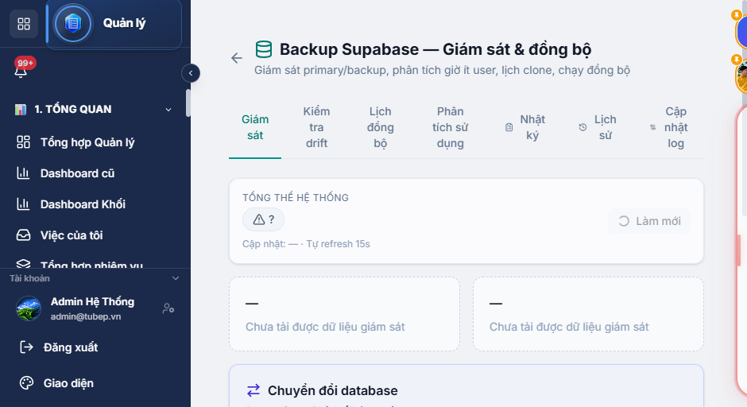
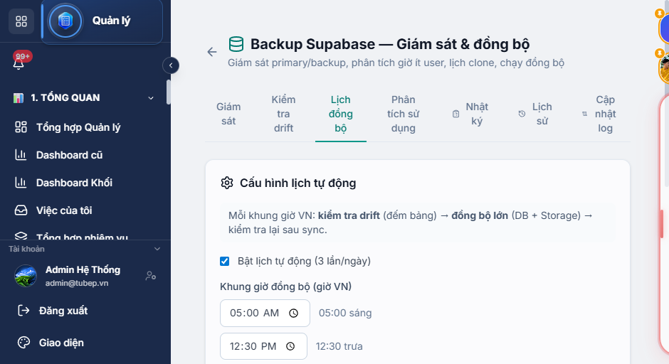
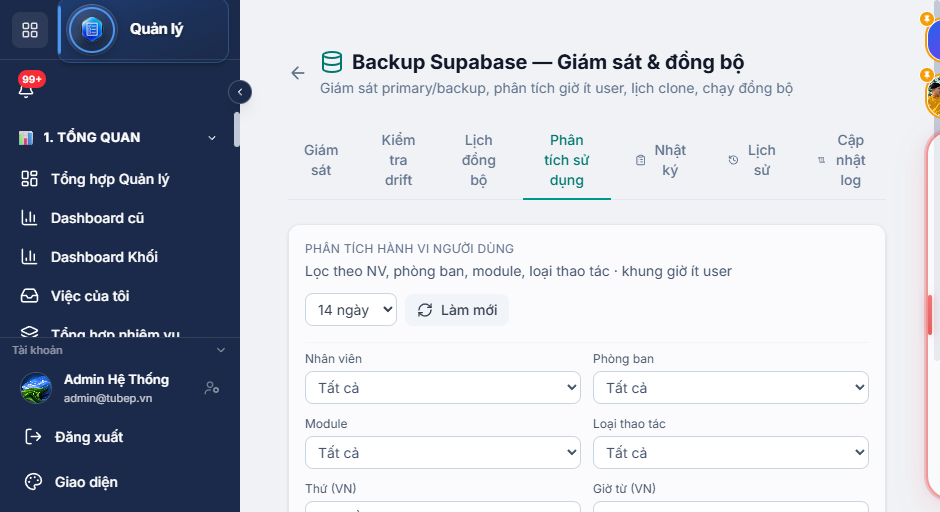
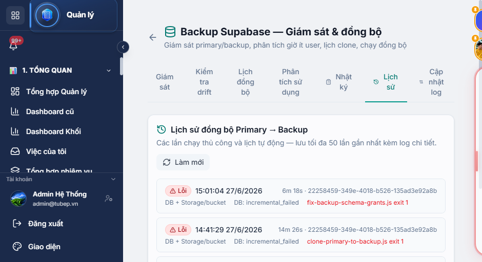
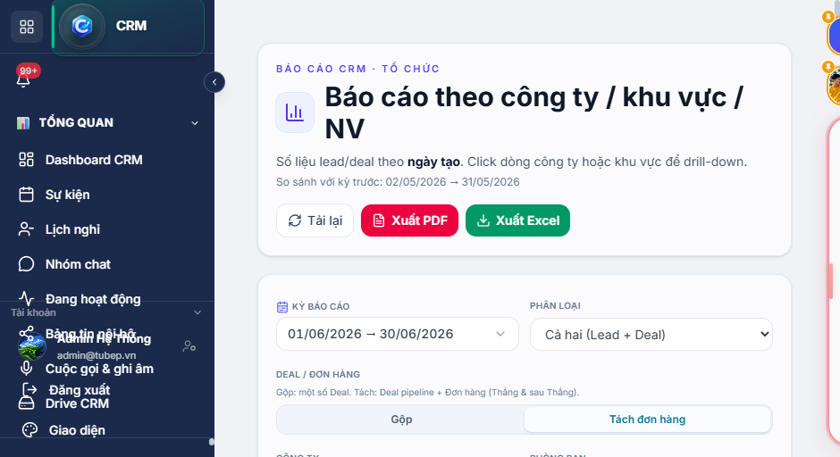
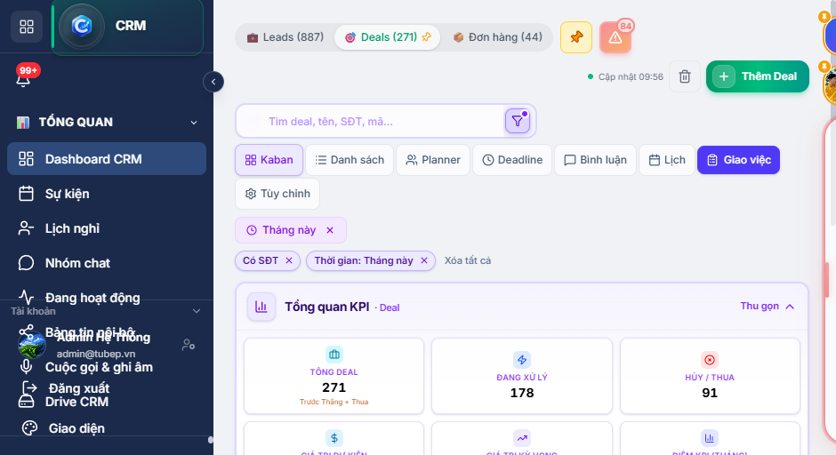
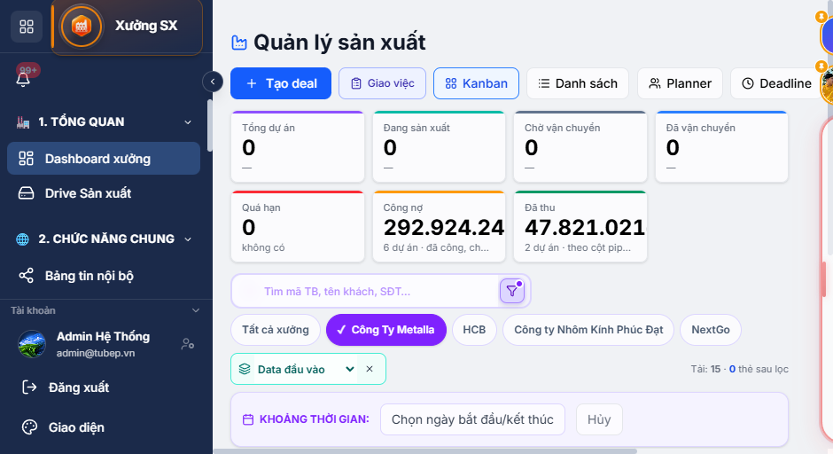
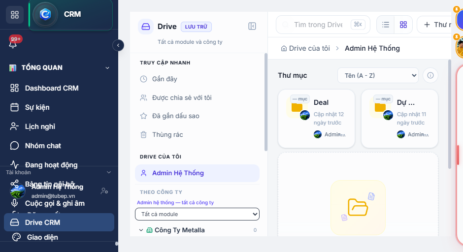

# Báo cáo công việc tuần 22–29/06/2026

| | |
|---|---|
| **Người thực hiện** | Phan Nguyễn Đăng Khoa |
| **Giai đoạn** | 22/06/2026 – 29/06/2026 (tuần vừa qua) |
| **Ngày lập báo cáo** | 29/06/2026 |
| **Số commit** | ~50 |

---

## 1. Tóm tắt

Tuần qua tập trung vào **5 mảng chính**:

1. **Supabase backup / failover / replication** — xây dựng và vận hành hệ thống Primary ↔ Backup trên Render, giám sát, lịch sync, phân tích usage.
2. **Báo cáo CRM theo tổ chức** — mở rộng analytics, biểu đồ, filter; toggle Deal/Order; export Excel có style.
3. **Drive & Messenger** — upload song song, thư viện ảnh Facebook, lưu file Supabase Storage.
4. **Sản xuất (SX)** — KPI Kanban cột, công nợ/đã thu VND, bộ lọc công ty đặt hàng.
5. **Hạ tầng backend** — giảm tải heartbeat/SQL aggregate, Redis, Socket.IO.

---

## 2. Chi tiết theo ngày

### 22/06/2026 — Drive, Messenger, SX Dashboard

**Drive & Facebook Messenger**
- Tăng tốc gửi ảnh Drive: upload song song (pipelined parallel) + Facebook Attachment API trực tiếp.
- Sửa thumbnail Drive trên Messenger; gửi ảnh Facebook nhanh hơn.
- Thêm **Drive image picker** và thư viện ảnh công ty cho inbox Facebook.

**Sản xuất**
- Hiển thị **tổng tiền từng cột Kanban** và KPI **công nợ / đã thu** (VND) trên dashboard xưởng.
- NV CRM xem deal công ty tại xưởng khi xưởng có deal.
- Thu gọn bộ lọc dashboard SX; bộ lọc công ty đặt hàng giống màn Tạo deal.
- Chia sẻ tài liệu xưởng sang CRM; xóa deadline giao hàng khi hoàn thành NV.

**Mobile**
- CRM mobile v2: báo cáo NV phân loại và tỷ lệ SLA (v2.0.93).

---

### 23/06/2026 — Báo cáo org, Messenger Storage, Voice → Lead

**Báo cáo CRM theo tổ chức**
- Mở rộng báo cáo org overview: analytics báo giá/chốt, filter nâng cao.
- Cải thiện biểu đồ, filter ngày, tỷ lệ hủy (cancel rate).
- Đổi biểu đồ tỷ lệ NV từ bar chart sang **pie chart tổng hợp**.
- Thêm cấu hình pipeline: kiểm soát quyền xóa lead/deal theo nhân viên.

**Messenger & tài liệu**
- Lưu file Messenger vào **Supabase Storage**; sửa đường dẫn download legacy.
- Download file qua API có auth; đường dẫn upload local an toàn hơn.
- Sửa tab tài liệu SX: blob download, xóa CRM docs qua project route.
- Sửa xóa tài liệu trên production deal detail (workshop + CRM files).

**Voice recording**
- Tự tạo CRM lead từ ghi âm: scope công ty uploader, phát hiện trùng theo tên/kích thước/SĐT/thời gian gọi.

---

### 24/06/2026 — Tối ưu backend

- Giảm tải backend: tối ưu **heartbeat**, dùng **SQL aggregates** thay vì query nặng.
- Sửa cleanup session khi **logout** (tránh session/device rác).

---

### 25/06/2026 — CRM Pipeline & Mobile

- Tách tab pipeline CRM: **Deal / KH (Khách hàng)** riêng biệt.
- Mở rộng SX mobile: messenger, bubble chat, OTA updates.
- Ngừng track APK mobile releases trong git.

---

### 26/06/2026 — Supabase Failover (triển khai lớn) & Drive

**Supabase backup — triển khai mới**
- Failover, replication, failback và **UI monitor** (`/management/backup-sync`).
- Router Supabase: chuyển Primary ↔ Backup; health probe định kỳ.
- **Chuyển DB thủ công**: drift check → sync log → countdown 15s; yêu cầu verify 100%.
- Log-based switch sync; tab **Cập nhật log**; activity log ghi device + vị trí GPS.
- Lịch sync tự động **05:00 · 12:30 · 18:00** (VN) kèm drift check.
- **Phân tích usage theo giờ** — chọn khung sync ít user.

**Hạ tầng**
- Sửa crash **Redis** trên Render; `REDIS_DISABLED`; malformed Upstash URL.
- Socket.IO adapter không crash khi Redis lỗi.
- Monitor token trong CORS; UI lỗi rõ hơn.

**Drive**
- UX upload batch: refresh danh sách file cục bộ, không reload trang.

---

### 27/06/2026 — Backup sync: sửa lỗi Render & replication

**Kết nối & clone**
- Sửa PG trên Render: pooler auth `postgres.project_ref`, ECIRCUITBREAKER retry.
- pg_restore: tắt trigger, tránh DROP SCHEMA public; tạo pg_trgm trước clone.
- DELETE thay TRUNCATE; skip incremental khi drift lớn; skip clone khi PG auth fail.

**Replication**
- Upsert `crm_leads`, `facebook_contacts` khi UUID backup khác primary (409).
- Đảm bảo parent `crm_leads` tồn tại trước khi replicate contacts.
- Loại generated columns khỏi `crm_leads`; grant service_role toàn schema.

**UI & vận hành**
- **Lịch sử đồng bộ** + verify summary; tăng tốc sync song song (parallel drift + table waves).
- Bubble sync chỉ hiện user khởi chạy; REST fallback verify khi PG pool lỗi.
- Đổi tab **KH → Đơn hàng** trên CRM Dashboard.
- Sửa upload file Messenger và attachment 404 cũ.

---

### 29/06/2026 — Báo cáo org overview

- Toggle **Tách Deal / Order** — tách pipeline deal khỏi đơn hàng thực tế.
- Sửa filter kỳ báo cáo (`crmReportDateBounds.js`).
- **Export Excel nhân viên có style** (`crmOrgEmployeeExcelExport.js`).

---

## 3. Hình ảnh thực tế

> Chụp 29/06/2026 — môi trường dev localhost:5173

### 3.1 Giám sát Supabase — tab Giám sát

Chuyển đổi DB Primary ↔ Backup, failover & replication, countdown chuyển an toàn.

---

### 3.2 Lịch đồng bộ tự động (3 lần/ngày)

Cấu hình 05:00 · 12:30 · 18:00 VN — drift → clone DB → sync Storage → verify sau sync.

---

### 3.3 Phân tích usage — chọn khung giờ ít user

Lọc theo NV, phòng ban, module, loại thao tác, khung giờ VN.

---

### 3.4 Lịch sử đồng bộ Primary → Backup

Theo dõi từng lần chạy (thủ công + lịch), log lỗi chi tiết, thời lượng.

---

### 3.5 Báo cáo theo tổ chức — filter & export

Kỳ báo cáo, so sánh kỳ trước, toggle **Tách đơn hàng**, Xuất PDF/Excel.

---

### 3.6 Báo cáo org — biểu đồ KPI

Drill-down công ty / khu vực / nhân viên; số liệu theo ngày tạo lead/deal.

---

### 3.7 CRM Dashboard — tab Đơn hàng

Pipeline Leads / Deals / **Đơn hàng**; KPI tổng quan theo filter tháng.

---

### 3.8 Dashboard Sản xuất — KPI công nợ / đã thu

Tổng dự án, cột Kanban, **công nợ** và **đã thu** (VND), lọc theo xưởng.

---

### 3.9 Drive CRM — lưu trữ file

Drive cá nhân, thư mục Deal/Dự án, truy cập nhanh Gần đây / Chia sẻ / Sao.

---

## 4. Dữ liệu Supabase MCP (29/06/2026)

| Bảng | Primary | Backup | Lệch |
|------|---------|--------|------|
| `crm_leads` | 4.342 | 4.339 | 3 |
| `facebook_contacts` | 11.747 | 11.745 | 2 |
| `facebook_messages` | 73.003 | 72.924 | 79 |
| `users` | 112 | 112 | 0 |
| `drive_files` | 69 | 69 | 0 |
| `drive_activity_log` | 1.108 | 1.108 | 0 |

| Vai trò | URL |
|---------|-----|
| Primary | `https://kdxypztstbeovyedmvem.supabase.co` |
| Backup | `https://atcfpgxkgbszglrelfgr.supabase.co` |

---

## 5. Module / file tiêu biểu

| Nhóm | File |
|------|------|
| Backup sync | `supabaseBackupSync.js`, `supabaseReplication.js`, `supabaseMonitor.js`, `supabaseFailback.js` |
| Scripts | `clone-primary-to-backup.js`, `sync-tables-to-backup.js`, `fix-backup-schema-grants.js` |
| UI monitor | `ProductionBackupSyncPage.jsx`, `SupabaseMonitorGate.jsx` |
| Báo cáo org | `CrmOrgOverviewReport.jsx`, `crmOrgEmployeeExcelExport.js`, `crmReportDateBounds.js` |
| Drive / Messenger | `DrivePage.jsx`, `driveTransferStore.js`, `messengerStorageResolve.js` |
| SX | `ProductionDashboard.jsx`, `ProductionViews.jsx` |
| Backend perf | `userUsageAnalytics.js`, heartbeat / aggregate routes |

---

## 6. Ghi chú

- Báo cáo chỉ gồm commit của **Phan Nguyễn Đăng Khoa** (git: pkmax-bit).
- Ảnh chụp localhost dev; production frontend Render đang suspended tại thời điểm chụp.

---

*Báo cáo tạo từ git log + Browser MCP + Supabase MCP.*
