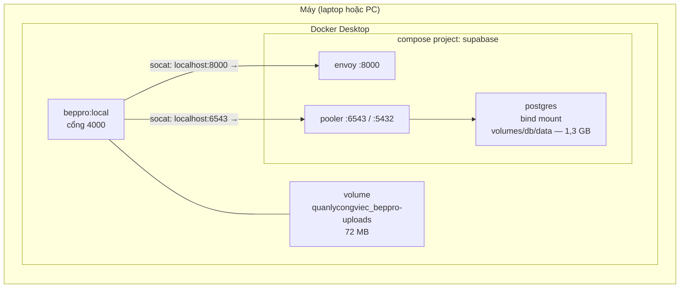

# Chuyển bản chạy Docker từ laptop sang PC

> Viết ngày 04·09·2026, theo đúng cấu hình đang chạy trên laptop.

## Bốn thứ phải chuyển — thiếu một là không chạy

| # | Thứ                       | Ở đâu trên laptop                      | Cỡ     | Git mang được? |
| - | ------------------------- | -------------------------------------- | ------ | -------------- |
| 1 | Mã nguồn                  | `E:\CRMtb\Quanlycongviec`              | 326 MB | **Có** (sau khi commit) |
| 2 | `backend/.env` (79 biến)  | `backend\.env`                          | 7,6 KB | **Không** — nằm trong `.gitignore` |
| 3 | Bộ Supabase self-host + dữ liệu | `E:\supabase\supabase\docker`     | 1,3 GB | **Không** — repo khác |
| 4 | Volume ảnh/tệp đã tải lên | volume `quanlycongviec_beppro-uploads` | 72 MB  | **Không** — nằm trong Docker |

Điểm dễ quên nhất là **#3**: `backend/.env` trỏ Supabase vào `localhost:8000` / `:6543` / `:5432` —
tức bộ Supabase chạy **ngay trên máy**, không phải trên cloud. Chép mỗi mã nguồn sang PC thì ứng
dụng lên được nhưng không có một dòng dữ liệu nào.



---

## Chuẩn bị trên PC

- **Docker Desktop** (backend WSL2), đã khởi động.
- **Git** — nếu đi đường git.
- Bốn cổng phải trống: **4000** (app), **8000** (Supabase API), **5432** và **6543** (Postgres +
  pooler). Kiểm tra: `netstat -ano | findstr ":4000 :8000 :5432 :6543"`.
- Ổ đĩa nào cũng được — không bắt buộc phải là `E:`. Mọi bind mount đều là đường dẫn *tương đối*
  trong `docker-compose.yml`.
- **Không cần** cài Node trên PC nếu chỉ chạy Docker. Chỉ cần Node khi muốn `npm run dev`.

---

## Bước 1 · Mã nguồn

Có **59 mục chưa commit** trên laptop, trong đó toàn bộ tính năng trợ lý hướng dẫn còn ở trạng thái
untracked. `git clone` trên PC sẽ **không** lấy được chúng. Chọn một trong hai đường:

### Đường A — qua Git (khuyên dùng: sau này hai máy còn đồng bộ tiếp)

Trên **laptop**:

```bash
cd E:/CRMtb/Quanlycongviec
git status --short
```

Xem qua danh sách, rồi thêm những gì thật sự thuộc về dự án. Đừng `git add -A` mù — trong danh sách
có cả `debug-fb4228.log`, `.idea/`, `.claude/`:

```bash
git add backend/src frontend/src backend/data/guide-knowledge database docs scripts Dockerfile .dockerignore docker-compose.yml docker-entrypoint.sh backend/package.json backend/package-lock.json frontend/package.json frontend/package-lock.json
git commit -m "Trợ lý hướng dẫn + cấu hình Docker"
git push
```

Trên **PC**:

```bash
git clone https://github.com/backen-pixel/Quanlycongviec.git
```

> ⚠️ **Tên thư mục quyết định tên volume.** Compose lấy tên thư mục làm tên project, nên volume sẽ là
> `<tên thư mục>_beppro-uploads`. Clone ra `Quanlycongviec` thì trùng với laptop và bước 4 chép
> thẳng vào được. Đặt tên khác thì phải sửa tên volume ở bước 4 cho khớp.

### Đường B — chép cả thư mục

Nhanh, không cần commit, không có rủi ro đẩy nhầm thứ gì lên GitHub. Nhược điểm: hai máy sau đó
không đồng bộ được, và `.git` nặng 589 MB.

```powershell
robocopy E:\CRMtb\Quanlycongviec \\PC-CUA-BAN\ChiaSe\Quanlycongviec /E /XD node_modules dist .apk-analysis /XF *.apk *.dump
```

`node_modules` **bắt buộc phải loại** — nó có gói biên dịch theo máy, và image tự cài lại từ đầu.
`dist` cũng không cần: Dockerfile tự build frontend.

---

## Bước 2 · `backend/.env`

Chép tay, không qua git. Trong đó có `JWT_SECRET`, khoá OpenAI, khoá Anthropic, khoá Supabase, thông
tin MISA, Google Drive, VNPay:

```powershell
copy E:\CRMtb\Quanlycongviec\backend\.env <thư mục dự án trên PC>\backend\.env
```

Chép thêm `backend\data\api-keys.json` nếu có — cũng nằm trong `.gitignore`.

**Không sửa gì trong `.env`.** Các dòng `localhost:8000 / :6543 / :5432` vẫn đúng khi chạy trong
container nhờ cầu nối `socat` dựng sẵn trong `docker-entrypoint.sh`.

---

## Bước 3 · Bộ Supabase self-host + dữ liệu

Dữ liệu Postgres nằm ở **bind mount**, không phải volume Docker — nên cách chắc nhất là **chép
nguyên thư mục**, không cần `pg_dump`/`pg_restore`. Cùng một image `supabase/postgres:17.6.1.136`
nên thư mục dữ liệu dùng lại được y nguyên.

Trên **laptop** — dừng hẳn trước khi chép, chép Postgres đang chạy sẽ ra bản hỏng:

```powershell
cd E:\supabase\supabase\docker
docker compose down
robocopy E:\supabase \\PC-CUA-BAN\ChiaSe\supabase /E
```

Trên **PC** — đặt vào đâu cũng được, rồi:

```powershell
cd <nơi vừa chép>\supabase\docker
docker compose up -d
```

Chờ tất cả `healthy` (`docker ps`), thường 30–60 giây lần đầu.

> ⚠️ **Chép cả thư mục, đừng chỉ chép `volumes/db/data`.** File `.env` của bộ Supabase (13,7 KB) giữ
> `JWT_SECRET`, `ANON_KEY`, `SERVICE_ROLE_KEY` — chúng phải **trùng khít** với `backend/.env`. Khoá
> lệch thì mọi request trả 401 mà không nói vì sao.

> ⚠️ **Còn một volume nữa: `supabase_db-config`.** Trong đó có `pgsodium_root.key` — khoá gốc để giải
> mã các cột mã hoá (Supabase Vault). Nó **không** nằm trong `volumes/db/data`, và bộ Supabase mới
> trên PC sẽ sinh ra một khoá **khác**. Nếu dữ liệu có dùng Vault thì phải chép nó sang, nếu không
> phần mã hoá thành rác không đọc được:
>
> ```powershell
> # laptop
> docker run --rm -v supabase_db-config:/d -v ${PWD}:/b alpine tar czf /b/db-config.tgz -C /d .
> # PC — chạy SAU khi bộ Supabase đã lên lần đầu, rồi restart nó
> docker run --rm -v supabase_db-config:/d -v ${PWD}:/b alpine tar xzf /b/db-config.tgz -C /d
> docker compose restart db
> ```

**Đường thay thế, nếu không chép được thư mục 1,3 GB** (mạng chậm, hoặc muốn dữ liệu gọn hơn):

```powershell
# laptop — bộ Supabase đang chạy
docker exec -t supabase-db pg_dump -U postgres -d postgres -Fc -f /tmp/beppro.dump
docker cp supabase-db:/tmp/beppro.dump .\beppro.dump

# PC — sau khi bộ Supabase mới đã lên
docker cp .\beppro.dump supabase-db:/tmp/beppro.dump
docker exec -t supabase-db pg_restore -U postgres -d postgres --clean --if-exists /tmp/beppro.dump
```

`pg_restore` sẽ in một loạt cảnh báo về role và extension đã tồn tại — bình thường, bỏ qua. Nhưng
đường này **không** mang theo dữ liệu Storage (ảnh trong bucket), nên chỉ dùng khi biết chắc là
không cần.

---

## Bước 4 · Volume ảnh/tệp đã tải lên

Ảnh chat, tệp đính kèm ghi thẳng xuống đĩa trong volume `quanlycongviec_beppro-uploads` — 72 MB.
Không chép thì container mới lên với thư mục rỗng, mọi ảnh cũ hiện lỗi 404.

Trên **laptop**:

```powershell
cd E:\CRMtb\Quanlycongviec
docker run --rm -v quanlycongviec_beppro-uploads:/data -v ${PWD}:/backup alpine tar czf /backup/beppro-uploads.tgz -C /data .
```

Trên **PC** (đổi `quanlycongviec` nếu thư mục dự án tên khác):

```powershell
docker volume create quanlycongviec_beppro-uploads
docker run --rm -v quanlycongviec_beppro-uploads:/data -v ${PWD}:/backup alpine tar xzf /backup/beppro-uploads.tgz -C /data
```

---

## Bước 5 · Dựng và chạy

**Thứ tự bắt buộc:** Supabase phải lên trước. `docker-compose.yml` của BepPro ghép vào mạng
`supabase_default` với `external: true` — mạng chưa tồn tại thì lệnh `up` báo lỗi ngay.

```powershell
cd <thư mục dự án trên PC>
docker compose up -d --build
docker compose logs -f beppro
```

Lần build đầu mất vài phút (npm ci + vite build). Xong thì mở **http://localhost:4000**.

Trong log phải thấy các dòng cầu nối:

```
[cau-noi] localhost:8000 -> supabase-envoy:8000  (envoy)
[cau-noi] localhost:6543 -> supabase-pooler:6543 (pooler)
```

### Chạy lược đồ của trợ lý hướng dẫn

Nếu dữ liệu Supabase là bản mới chứ không phải bản chép nguyên, chạy tệp này trong Studio
(`http://localhost:8000` → SQL Editor) — gộp cả kho kinh nghiệm (+ vector ngữ nghĩa), kho kiến
thức, hạn mức ngày, và nhật ký hỏi đáp:

```
database/602_guide_assistant_en.sql
```

Kho kiến thức tự gieo hạt từ tệp JSON ở lần khởi động đầu — không cần nhập tay.

---

## Bảng tra lỗi

| Triệu chứng | Nguyên nhân |
| ----------- | ----------- |
| `network supabase_default not found` | Bộ Supabase chưa chạy. Lên nó trước. |
| App lên nhưng mọi API trả 401 | `.env` của Supabase và `backend/.env` lệch khoá. Chép lại cả thư mục Supabase. |
| Đăng nhập được nhưng không có dữ liệu | Chép mã nguồn mà quên thư mục `volumes/db/data`. |
| Ảnh cũ hiện lỗi 404 | Quên bước 4 (volume uploads), hoặc tên volume không khớp tên thư mục dự án. |
| `port is already allocated` | Cổng 4000/8000/5432/6543 đang bị chiếm. Đổi bằng `BEPPRO_PORT=4001 docker compose up -d`. |
| Postgres không lên, log kêu thiếu `postgresql.conf` | Volume `supabase_db-config` rỗng. Xem ô cảnh báo ở bước 3. |
| Trợ lý bảo một đường dẫn "không tồn tại" | Kho kiến thức chưa có màn hình đó — chạy `npm run guide:sync` rồi dựng lại. |

---

## Sau khi chuyển xong

- Trợ lý hướng dẫn trên bản nội bộ chạy **toàn quyền** (`VITE_GUIDE_FULL_ACCESS=1` trong
  `docker-compose.yml`) — nó bấm nút và điền trường thật, kể cả nút Xoá. Muốn tắt:
  `GUIDE_FULL_ACCESS=0 docker compose up -d --build`.
- Laptop và PC dùng **chung** khoá OpenAI/Anthropic và **chung** dự án Supabase backup trên cloud
  (`SUPABASE_BACKUP_URL`). Chạy cả hai máy cùng lúc thì hai bản sẽ ghi đè nhau ở phần đồng bộ dự
  phòng — nên chỉ bật một máy tại một thời điểm, hoặc tắt `SUPABASE_REPLICATION_ENABLED` ở máy phụ.
- Xem thêm: `docs/docker.md` (chi tiết Dockerfile và entrypoint),
  `docs/tro-ly-huong-dan.md` (kiến trúc trợ lý).
