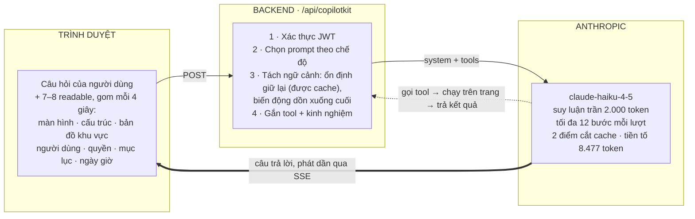
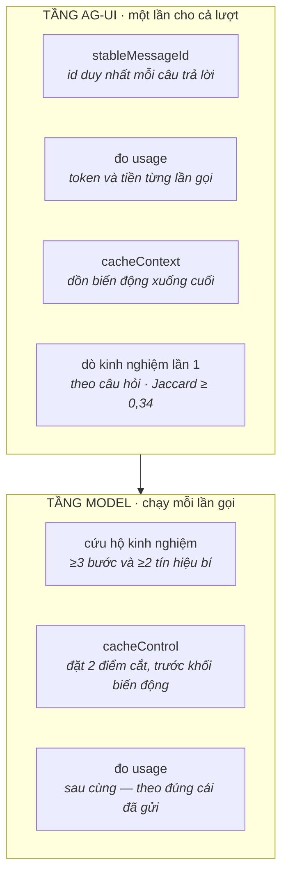

# Trợ lý hướng dẫn TuBep Pro

> Tài liệu hệ thống · cập nhật **03·09·2026**
> Bản web (có sơ đồ màu): https://claude.ai/code/artifact/817b9e9e-f8ea-42c2-a60b-e219b5a1220c

Trợ lý đọc được màn hình người dùng đang xem, tra cứu kho kiến thức nội bộ, mở hướng dẫn từng bước
dựng sẵn trong giao diện, thao tác thật trên trang — và nhớ lại đường đi của những lần trước. Cả kho
kiến thức lẫn bộ nhớ kinh nghiệm nằm trong Supabase, có màn hình quản trị riêng, và bộ nhớ kinh
nghiệm dò được cả **theo nghĩa** chứ không chỉ theo mặt chữ.

Đây **không phải** con bot AI trong chat (`/settings/ai-chat-bot`). Hai thứ khác hẳn nhau:

|               | AI Bot trong chat      | Trợ lý hướng dẫn (tài liệu này) |
| ------------- | ---------------------- | ------------------------------- |
| Chạy ở        | `routes/aiChatBot`     | `routes/guide/copilotkit.js`    |
| Mô hình       | OpenAI                 | Anthropic `claude-haiku-4-5`    |
| Kích hoạt     | theo lịch, tự đăng tin | khi người dùng hỏi              |
| Kho kiến thức | không                  | 316 mục + bộ nhớ kinh nghiệm    |

| Chỉ số        | Giá trị                                 |
| ------------- | --------------------------------------- |
| Mô hình       | `claude-haiku-4-5`, tối đa 12 bước/lượt |
| Kho kiến thức | 316 bản ghi, 4 nguồn                    |
| Ngữ cảnh đẩy  | 7–8 readable mỗi lượt                   |
| Tool          | 9 (chế độ đọc) / 13 (toàn quyền)        |
| Bộ nhớ        | 5 lượt hỏi gần nhất                     |
| Chi phí       | ~500 ₫ một lượt hỏi                     |

---

## 01 · Ba tầng, và ranh giới tải chậm

Thư viện CopilotKit nặng **634 KB gzip**. Nếu nó nằm trong bundle chính thì mọi người — kể cả người
cả ngày không hỏi câu nào — đều trả phí tải ở mọi trang. Ranh giới giữa ba tầng chính là ranh giới
tải chậm.

- **Bundle chính** — ô hỏi nổi (nút tròn góc trái dưới) và hình nhân vật tĩnh. *Không import
  CopilotKit.* Chỉ nhận chữ rồi xếp vào hàng đợi trên `window`.
- **Panel tải chậm** — toàn bộ CopilotKit: provider, khung chat, tool phía client, nhân vật thật,
  cầu nối hàng đợi, bộ ghi kinh nghiệm. Mount lần đầu người dùng *mở ô nhập* — không đợi tới lúc
  gửi, để 634 KB tải xong trong lúc họ còn đang gõ.
- **Backend** — runtime CopilotKit + `BuiltInAgent` dựng mới mỗi request, chỉ dẫn hệ thống, kho kiến
  thức, bộ nhớ kinh nghiệm, đo token, hai tầng middleware.

Hệ quả đáng nhớ: câu hỏi **đầu tiên** phải đi qua hàng đợi. Người dùng gõ trong khi thư viện còn
đang tải; panel mount xong thì cầu nối rút câu hỏi ra gửi cho agent. Từ câu thứ hai là tức thì.

**Giao diện.** Khung chat mặc định **đóng**: mọi phản hồi hiện trên bong bóng của nhân vật, khung
chat đầy đủ chỉ mở khi người dùng bấm ☰. Nhân vật **không hiện lúc vào trang** — lối vào duy nhất là
nút tròn của ô hỏi; nó chỉ xuất hiện khi cuộc trò chuyện bắt đầu, và tan sau 10 giây rảnh. Chữ trong
bong bóng **không tự tắt theo giờ** — chỉ mất khi người dùng bấm ×, hoặc khi hệ thống có thứ mới để
nói. Bong bóng câu trả lời giữ trọn nội dung và cuộn được.

---

## 02 · Trợ lý làm được gì

Bảy nhóm việc. Năm nhóm đầu có ở mọi bản build; hai nhóm cuối chỉ mở khi bật **chế độ toàn quyền**.

### Có ở cả hai chế độ

| Tool                                | Việc                                                                                                                                              |
| ----------------------------------- | ------------------------------------------------------------------------------------------------------------------------------------------------- |
| `tra_cuu_he_thong`                  | Tìm trong 316 mục kiến thức nội bộ theo câu hỏi tiếng Việt (có hoặc không dấu). Trả tối đa 5 mục khớp nhất kèm đường dẫn, tên menu, phần chuyên sâu. |
| `ghi_kinh_nghiem`                   | Trợ lý tự ghi lại thứ vừa học: một lối cụt đã thử, một phát hiện về giao diện, hoặc chỗ vừa bị người dùng sửa lưng.                                 |
| `xoa_kinh_nghiem`                   | Bỏ một kinh nghiệm sai sau khi đã làm theo và thấy nó dẫn sai. Xoá mềm kèm lý do — bản ghi ở lại để đối chiếu và khôi phục.                         |
| `chi_cho_toi_nut`                   | Làm sáng một nút hoặc tab đang hiển thị, theo nhãn. Không điều hướng, không bấm.                                                                    |
| `chi_cho_toi_khu_vuc`               | Khoanh sáng cả một *khu vực*. Dành cho câu “thông tin deadline nằm ở đâu” — thứ được hỏi không có nhãn nút nào để khoanh.                           |
| `doc_chi_so_tren_man_hinh`          | Đọc các con số thống kê đang hiển thị (“Deals 512”, “Quá hạn 12”). Qua tám lớp chặn để không lấy nhầm dữ liệu khách hàng.                           |
| `doc_khu_vuc`                       | Đọc chi tiết một khu vực: bộ lọc kèm giá trị thật, nút bấm được, số mục bên trong. Lớp 2 của ngữ cảnh hai lớp.                                      |
| `mo_huong_dan_tren_trang`           | Mở hướng dẫn từng bước dựng sẵn trong giao diện, nhảy thẳng tới bước liên quan.                                                                     |
| `dieu_huong_toi_trang` *(chế độ đọc)* | Đề nghị chuyển trang. Chỉ chuyển thật khi người dùng bấm “Đồng ý” — nút xác nhận hiện **cả trên nhân vật**, không chỉ trong khung chat đang đóng.  |

### Chỉ khi bật chế độ toàn quyền

| Tool                    | Việc                                                                                                              |
| ----------------------- | ----------------------------------------------------------------------------------------------------------------- |
| `doc_trang`             | Đọc toàn bộ trạng thái màn hình: mọi bộ lọc kèm giá trị, tab đang chọn, danh sách bản ghi mở được, bảng 25 dòng đầu. |
| `tim_tren_trang`        | Tìm gần đúng một chuỗi trong phần đang hiển thị — bỏ dấu, khớp một phần.                                            |
| `bam_nut`               | Bấm thật một nút, tab, hoặc thẻ bản ghi để mở chi tiết. Hành động thật — bao gồm cả nút Xoá.                        |
| `dien_truong`           | Đặt giá trị thật cho ô nhập, ô chọn hoặc ô tích đang hiển thị.                                                      |
| `dieu_huong_toi_trang`  | Chuyển trang ngay, không cần xác nhận. Chỉ nhận đường dẫn có thật trong sổ đăng ký 199 màn hình.                    |

**Lưới an toàn.** Có thêm một tool ẩn tên `*` không gửi cho mô hình. Nó hứng trường hợp mô hình gọi
một tool không tồn tại — nếu không có, thư viện sẽ dừng lượt chat trong im lặng: người dùng thấy
khung suy luận rồi trợ lý không nói gì nữa.

---

## 03 · Hai chế độ, và điều gì đổi

Chế độ do **client** quyết định, không phải server: hằng `FULL_ACCESS` vừa quyết định nhóm tool nào
được nạp, vừa được gửi lên server qua header để server chọn đúng bộ luật. Một nguồn, nên prompt và
tool không thể lệch nhau.

|                         | Chế độ đọc        | Toàn quyền                                     |
| ----------------------- | ----------------- | ---------------------------------------------- |
| Tool                    | 9                 | 13                                             |
| Readable mỗi lượt       | 7                 | 8 — thêm giá trị thật của bộ lọc               |
| Chỉ dẫn hệ thống gửi đi | 11.255 ký tự      | 13.979 ký tự                                   |
| Điều hướng              | Phải bấm xác nhận | Đi ngay                                        |
| Bấm nút / điền trường   | Không             | Có, kể cả nút Xoá                              |
| Đọc nội dung bản ghi    | Chỉ đếm số lượng  | Đọc được tiêu đề, SĐT, giá trị deal            |
| Lọc PII                 | Có, ở mọi đường   | Không — nó chỉ đọc thứ người dùng đang tự nhìn |

Chỉ dẫn hệ thống mô tả cả hai chế độ, nhưng chỉ gửi phần thuộc chế độ đang chạy. Cả hai bản sinh ra
từ một nguồn chữ, không chép tay.

> ⚠️ **Bản nội bộ đang bật toàn quyền.** Cờ đặt ở tầng build của Docker
> (`ARG VITE_GUIDE_FULL_ACCESS=1`), không đặt trong `frontend/.env.production` — file đó dùng chung
> với bản Render của khách hàng thật. Ở chế độ này trợ lý bấm và điền thay người dùng, kể cả nút Xoá.

---

## 04 · Một lượt hỏi đi qua đâu

Vòng lặp tool là chỗ tốn nhiều nhất: mỗi lần quay lại là thêm một lần gọi mô hình. Giới hạn 12 bước
có để một yêu cầu phức tạp vẫn chạy hết chuỗi, thay vì hết bước giữa chừng rồi trợ lý im lặng.

### Bên trong bước 3–4: hai tầng middleware

Thứ tự giữa hai tầng không tuỳ tiện. Tầng AG-UI chạy *một lần cho cả lượt*; tầng model chạy *mỗi lần
gọi*. Thứ gì cần nhìn thấy bước thứ tư của chuỗi thì bắt buộc phải nằm ở tầng model — đó là lý do
cứu hộ kinh nghiệm không thể đặt cùng chỗ với lần dò đầu.

Cứu hộ đứng **trước** `cacheControl` vì nó nối thêm một message vào cuối prompt, mà điểm cắt cache
thì tính từ cuối lên — chèn sau khi đã đặt cắt là điểm cắt nằm nhầm chỗ.

---

## 05 · Ngữ cảnh hai lớp

Vấn đề: gửi hết dữ liệu màn hình mỗi lượt thì vừa tốn tiền vừa lộ thông tin khách hàng; gửi quá ít
thì trợ lý mù. Đo được trên trang khách hàng: **4.892 phần tử bấm được, ngữ cảnh phẳng gửi lên đúng
2 nhãn** — mô hình không hề biết trang đang hiển thị 1.000 khách hàng.

Cách giải: tách làm hai lớp — *biết cái gì tồn tại* thì **đẩy**, *chi tiết* thì **kéo**.

- **Lớp 1 (đẩy, tự động).** Bản đồ khu vực: màn hình có mấy vùng, mỗi vùng tên gì, chứa bao nhiêu
  bản ghi. Trả lời được “màn hình này có gì” mà không cần một cú gọi tool nào.
- **Lớp 2 (kéo, khi cần).** `doc_khu_vuc` / `doc_trang`: giá trị thật của từng bộ lọc, danh sách nút,
  bảng dữ liệu. Chỉ khi người dùng hỏi sâu hơn, mô hình mới trả tiền cho lớp này.

---

## 06 · Dữ liệu được xử lý thế nào

Trợ lý chỉ đọc được thứ trình duyệt đang hiển thị cho chính người đăng nhập — tức thứ máy chủ đã cấp
cho họ. Không có đường leo quyền. Nhưng dữ liệu này rời hệ thống sang máy chủ AI, nên đường đẩy tự
động bị lọc rất chặt.

Bộ lọc theo mẫu bắt được số điện thoại, email, tiền và mã hồ sơ — nhưng **không bắt được tên người**.
Chỗ nào cần chặn tên thì phải chặn bằng **cấu trúc**, không bằng cách đoán chuỗi.

### Ba luật chặn tên người, đều sinh ra từ một lần lộ thật

Khi đặt tên cho các khu vực ở lớp 1, ba lần liên tiếp tên khách hàng lọt qua bộ lọc PII vì nó không
chứa chữ số cũng không có kính ngữ. Cả ba nay chặn bằng **vị trí trong cây DOM**:

1. Tiêu đề nằm trong một mục của vùng thì là tên của mục, không phải tên vùng.
   *Đã lọt:* vùng 999 khách hàng bị đặt tên “THÚY BE”.
2. Vùng “còn lại” không được suy tên — container của nó là cả trang.
   *Đã lọt:* thanh công cụ bị đặt tên “Chờ sale xác nhận”, tên một cột kanban.
3. Tiêu đề nằm trong vùng bấm được là tên bản ghi.
   *Đã lọt:* vùng 3 thẻ bị đặt tên “[FB Deal] Bếp Công Nghiệp”.

Không đặt được tên sạch thì vùng mang tên “Khu vực 3 (không có tiêu đề)” — thà vô danh còn hơn gọi
tên bằng dữ liệu khách hàng.

---

## 07 · Kho kiến thức

316 mục, bốn nguồn, cùng nạp vào một bộ tra cứu. Từ 29·08 kho **nằm trong Supabase** (bảng
`guide_knowledge`), sửa được từ giao diện quản trị. Bốn tệp JSON không mất vai trò: chúng là **hạt
giống** — bảng trống thì backend tự gieo — và là **lưới an toàn** khi DB không với tới. Việc chuyển
sang DB không được phép tạo ra một điểm chết mới: trợ lý mất kiến thức là mất luôn khả năng trả lời.

| Nguồn              | Mục | Ai viết                           | Sửa thế nào                                     |
| ------------------ | --- | --------------------------------- | ----------------------------------------------- |
| `screens.json`     | 199 | Script sinh                       | Sửa tóm tắt / từ khoá tay được — script giữ lại |
| `guides.json`      | 52  | Viết tay                          | Sửa thẳng, script không đụng                    |
| `lead-detail.json` | 63  | Sinh từ tài liệu nghiệp vụ        | Sửa trên giao diện, hoặc sửa `.md` rồi sinh lại |
| `tour-guides.json` | 2   | Sinh từ hướng dẫn trong giao diện | Sửa trên giao diện, hoặc sửa tour rồi sinh lại  |

### Cách chấm điểm

Câu hỏi được bỏ dấu rồi tách từ. Mỗi từ lấy trọng số **cao nhất** trong các trường nó khớp — không
cộng dồn — rồi nhân với độ hiếm của từ. Thêm một khoản thưởng khi câu hỏi chứa **trọn một cụm từ
khoá**. Trả về tối đa 5 mục, và chỉ những mục đạt từ 35% điểm của mục dẫn đầu trở lên.

Trọng số trường: `keywords` 5 · `operation` 4 · `label` 3 · `content` 3 · `menu` 2 · `summary` 1.

Mục gắn cờ cần quyền quản trị bị lọc theo vai trò lấy từ **JWT đã xác thực**, không lấy từ dữ liệu
client gửi lên.

> ⚠️ **Bẫy: bản ghi nam châm.** Một mục liệt kê tên của mọi nút và mọi tab sẽ khớp với *mọi* câu hỏi
> và luôn đứng hạng nhất, đè mất bản ghi chuyên sâu. Khi nạp 63 mục Lead/Deal, hai mục như vậy phải
> bị chặn. Đo sau khi chặn: đúng ở hạng 1 tăng từ 8/12 lên 10/14, có mặt trong top-5 đạt 14/14 — con
> số thứ hai mới là con số quyết định, vì tool trả về 5 kết quả và mô hình đọc cả 5.

### Sửa kiến thức mà generator không xoá mất

Generator vẫn sinh lại tệp như cũ, nhưng khi đồng bộ lên bảng chúng **không được đè hàng đã sửa
tay**. Đo lúc dựng: sửa một mục rồi chạy đồng bộ, kết quả ghi 315 và *bỏ qua đúng 1*. Mỗi mục có nút
“về bản gốc”.

Backend cache cả kho trong RAM kèm bảng IDF (~35 ms dựng) nên không thể hỏi DB mỗi lượt. Một bảng
**số phiên bản** một dòng, tăng bằng trigger cấp câu lệnh, cho mỗi instance biết khi nào phải nạp
lại — nạp 316 hàng chỉ tăng số một lần. Instance vừa sửa thì làm mới ngay; instance khác biết sau
tối đa 60 giây.

> ⚠️ **Khoá là cặp, không phải một.** Lần gieo hạt đầu **mất đúng một mục**: 316 đẩy lên, 315 nạp về.
> Thủ phạm là `/crm/leads/:id` có mặt ở cả `screens.json` lẫn `guides.json`. Khoá đúng là
> `(source, path)`.

> ⚠️ **Gieo hạt một lần là chưa đủ.** Bản đầu chỉ gieo khi bảng *rỗng*, nên sau lần gieo đầu tiên mọi
> màn hình MỚI do generator sinh ra không bao giờ vào được kho. Gặp thật — thêm route
> `/settings/tro-ly-huong-dan`, chạy `guide:sync`, mà trợ lý vẫn khẳng định đường dẫn đó không tồn
> tại. Nay mỗi lần khởi động, mục nào có trong tệp mà chưa có trong bảng thì được **chèn thêm** —
> chỉ chèn, không cập nhật, vì hàng đã có thể đã được sửa tay. Mục admin đã bỏ không mọc lại.

### Cổng chặn lệch, hai lớp

Kiến thức lệch khỏi giao diện là hỏng âm thầm. Hai lớp chạy trong `build:frontend`, deploy dừng nếu
lớp nào đỏ:

1. **Route mới thiếu mô tả.** `guide:sync` chạy ngay trong build, sinh lại danh mục từ `App.jsx` và
   `Sidebar.jsx`; route mới hiện ra với tóm tắt rỗng và bị chặn. Hiện 199/199 có mô tả.
2. **Nhãn nút đã chết.** Đối chiếu từng `operation` với mã nguồn frontend. Đo trước khi bật: 441 nhãn,
   440 tìm thấy nguyên văn — cái duy nhất trượt là lỗi thật (`Thêm· CRM` thiếu một dấu cách). Nhãn
   dựng động được miễn trừ qua một baseline chỉ được co lại.

---

## 08 · Ưu tiên hướng dẫn dựng sẵn

Hệ thống đã có 5 bộ hướng dẫn từng bước tô sáng thẳng lên giao diện — riêng trang chi tiết Lead/Deal
có 52 bước. Khi người dùng hỏi cách dùng một mục trên màn hình có sẵn hướng dẫn, trợ lý **mở hướng
dẫn trước**, nhảy đúng bước, rồi mới nói thêm phần phân biệt lấy từ kho kiến thức.

Nó mở bằng sự kiện nội bộ chứ không bấm hộ nút “Hướng dẫn chi tiết” — bấm nút thì luôn vào bước 1,
còn đi đường sự kiện thì vào đúng bước. Hỏi *“tab Thành viên dùng để làm gì?”* mở thẳng bước 47/52.

Trước khi tour bung ra, nhân vật **nói một câu báo trước kèm tên bước** rồi mới mở. Tour là lớp phủ
trùm cả trang: bật ra không báo thì người dùng đang nhìn dở việc của mình bỗng bị che.

Trang nào không có hướng dẫn thì trợ lý nói thẳng là chưa có, rồi tự hướng dẫn — thay vì mở một bộ
hướng dẫn lạc đề.

---

## 09 · Bộ nhớ kinh nghiệm

Kho kiến thức tĩnh chỉ biết những gì người viết đã soạn sẵn. Bộ nhớ kinh nghiệm ghi lại **đường đi mà
trợ lý tự tìm ra khi chạy thật**, rồi nhắc lại ở những câu hỏi giống nó. Nguyên tắc gốc: *nhớ thao
tác, không nhớ dữ liệu* — không lưu câu trả lời, không lưu giá trị đã điền, không lưu id bản ghi.

### Hai đường ghi

- **Tự động** — client ghi sau mỗi lượt ≥2 bước thành công, không bước nào lỗi. Bước lấy máy móc từ
  luồng message: tốn 0 đồng, nhưng ngây thơ — giữ cả bước thừa, không biết vì sao một hướng bị bỏ.
- **Agent tự ghi** — mô hình gọi `ghi_kinh_nghiem`, chữ do chính nó viết. Rút 5 bước còn 3, thêm ngõ
  cụt và bài học. Tốn thêm một vòng gọi mô hình, nên chỉ dẫn ghìm lại.

### Ba đường đọc

1. **Theo chữ** — Jaccard ≥ 0,34 trên token đã bỏ dấu, chèn ngay từ đầu lượt. Bắt được câu quen, tốn
   **0 token, 0 ₫** khi không khớp.
2. **Theo nghĩa** — chỉ chạy khi lớp chữ chưa lấp đủ chỗ (xem mục dưới).
3. **Cứu hộ** — khi có dấu hiệu bí, dò lại theo *màn hình* ở ngưỡng lỏng hơn. Ngòi nổ **không phải số
   bước** mà là *lặp lại vô ích*: tool trả thất bại, hoặc gọi lại y hệt một lời gọi đã gọi. Ngưỡng:
   ≥3 bước **và** ≥2 tín hiệu bí, chèn tối đa một lần mỗi lượt.

**Đường thứ tư: quên đi.** Mỗi mục kinh nghiệm chèn vào ngữ cảnh mang một mã sáu ký tự trong ngoặc
vuông — thứ duy nhất cho phép trợ lý gọi tên một bản ghi cụ thể mà bỏ nó. Ba lớp chặn, vì bên bấm nút
xoá là chính model: phải viết lý do, mã phải khớp duy nhất, và bỏ rồi thì thôi. Xoá là *xoá mềm* —
bản ghi ở lại kèm lý do để người quản trị lật lại, và khi kho chật thì chúng rụng đầu tiên.

Kho nằm trong **Supabase** (`guide_experiences`), chia theo `company_id` lấy từ JWT. Tệp JSON trong
volume Docker vẫn được ghi song song làm bản dự phòng. Ghi lên DB là *bắn rồi quên*, gộp nhịp hai
giây: một lượt hỏi không được chậm đi vì việc lưu kinh nghiệm.

Mọi chữ đi vào đều bị quét số, tiền, SĐT, email, ngày và id trong đường dẫn, rồi bị ép về **một
dòng** — để không thể giả một mục chỉ dẫn mới trong ngữ cảnh của người khác.

### Dò theo nghĩa, không chỉ theo mặt chữ

Phép dò theo chữ đúng **40/40** khi người dùng hỏi lại gần như nguyên văn, nhưng chỉ **4/6** khi họ
diễn đạt khác. Hai ca trượt không phải lỗi ngưỡng:

- *“đếm số công ty”* vs *“có bao nhiêu cty”* — **0 token chung**.
- *“mở giúp tôi trang cấu hình trợ lý”* vs *“vào seting trợ lý hướng dẫn”* — 2/9 token.

Lớp ngữ nghĩa **không thay thế** lớp chữ, nó **xếp sau**: lớp chữ chạy trước vì tốn 0 ms và 0 ₫, chỉ
khi còn chỗ trống trong số mục được nhắc thì mới nhúng câu hỏi và dò tiếp bằng vector.

Vector do `text-embedding-3-small` của OpenAI sinh (1.536 chiều), nằm ở cột `embedding` của bảng
`guide_experiences`. Nó ở đó để **bền vững** — việc chấm điểm vẫn chạy trong Node trên kho đã nạp sẵn
vào RAM (≤300 bản mỗi công ty, cosine mất chưa tới 1 ms), không truy vấn Postgres mỗi lượt. Vì thế
*không* tạo index HNSW. Bản ghi chưa có vector được nhúng dần ở nền, theo lô, không chặn lượt nào.

Ba chốt để tầng này không bao giờ làm hỏng một lượt hỏi: thiếu khoá hoặc tắt bằng cấu hình → bỏ qua
tầng ngữ nghĩa; lỗi mạng → bỏ qua, không ném; **sai số chiều → bỏ, không tính** (trộn hai không gian
vector cho ra điểm vô nghĩa mà không hề báo lỗi).

#### Nhúng cả nội dung, không chỉ câu hỏi — đo trên 20 câu

Bản đầu chỉ nhúng *câu hỏi* đã lưu. Nhưng thứ trả lời được câu hỏi mới lại nằm ở *nội dung*: đường
đi, ngõ cụt, bài học. Đổi công thức thành **câu hỏi + đường đi + ngõ cụt + bài học** rồi nhúng lại
toàn kho, đo trên 20 câu (15 câu có đáp án trong kho, 5 câu lạc đề):

| Cấu hình                                  | Trúng       |
| ----------------------------------------- | ----------- |
| Chỉ theo chữ                              | 10/15       |
| \+ ngữ nghĩa, nhúng câu hỏi               | 12/15       |
| \+ ngữ nghĩa, nhúng câu hỏi **+ nội dung** | **15/15**   |
| Câu lạc đề bị chặn                        | 5/5 ở cả ba |

Khoảng cách giữa “điểm thấp nhất của câu đúng” và “điểm cao nhất của câu lạc đề” giãn từ **0,002 lên
0,149**. Mặc định chuyển 0,50 → **0,44**, đúng điểm giữa khoảng đó. Trung bình ~222 ms mỗi lượt có
dùng tầng này.

Mỗi vector ghi kèm **mã công thức** (`text-embedding-3-small|nd1`), không chỉ tên model. Đổi cách
dựng chuỗi đem nhúng cũng làm mọi vector cũ thành lạc lõng dù model không đổi. Tăng mã là kho tự
nhúng lại ở nền.

> ⚠️ **Tính năng chết trong im lặng — và cách nó lộ ra.** Lần đo A/B đầu tiên cho kết quả *giống hệt
> nhau, 0 ms chênh lệch*. Không phải embedding vô dụng: nó chưa từng chạy. Lúc hợp nhất hai nguồn
> JSON và DB, bản trong tệp (không có vector) và bản trong DB (có vector) trùng mốc thời gian, và
> luật “bản mới hơn thì thắng” chọn bản JSON — vector bị vứt sạch ngay khi khởi động. Sửa: vector là
> *dữ liệu dẫn xuất*, được ghép vào độc lập với luật tranh chấp nội dung. Nó chỉ lộ ra vì có người
> hỏi thẳng “dùng embedding có chính xác hơn không”.
>
> Hai chỗ khác cùng đợt: trần chờ 4 giây *luôn* giết lần gọi đầu của tiến trình, vì riêng DNS + TLS
> đã mất ~4 giây (cùng request chạy trực tiếp trả về trong 515 ms) — chữa bằng trần 8 giây *và* hâm
> nóng kết nối lúc khởi động. Còn phép “trừ trung bình kho” để giãn khoảng cách thì làm mọi thứ tệ đi
> (khoảng cách +0,002 → −0,032) nên bị bỏ.

---

## 10 · Cửa sổ ngữ cảnh và bảng chỉnh

Trước đây toàn bộ hội thoại được gửi lại ở *mỗi* lượt, và nó chỉ dừng phình khi người dùng tải lại
trang. Prompt cache đỡ được phần tiền nhưng không đỡ được cửa sổ ngữ cảnh của mô hình: một phiên đủ
dài sẽ chạm trần rồi lỗi giữa chừng, không cảnh báo gì trước.

Nay giữ **5 lượt hỏi gần nhất**. Đơn vị là *lượt*, không phải message — một lượt ở chế độ toàn quyền
thường 5–6 bước tool, mà mỗi bước sinh 2–3 message. Đếm theo message thì “5” gần như luôn dừng ngay
trong lượt đang chạy, tức trợ lý không nhớ gì cả. Đếm theo lượt thì toàn bộ phần **xử lý** trong
những lượt được giữ vẫn nằm nguyên trong ngữ cảnh.

Điểm cắt luôn rơi đúng vào một câu hỏi của người dùng. Bắt buộc: một message kết quả tool mà lời gọi
sinh ra nó đã bị cắt mất là *kết quả mồ côi* — Anthropic trả 400 chứ không bỏ qua.

### Mười bốn núm chỉnh được lúc chạy

Mọi núm từng là hằng đọc từ `.env` lúc nạp module: đổi một con số phải dựng lại container — nên trên
thực tế không ai chỉnh. Nay có màn hình chỉnh, chia năm nhóm: tính toán chi phí, bộ nhớ hội thoại,
bộ nhớ kinh nghiệm (8 núm, gồm bật/tắt dò theo nghĩa và ngưỡng cosine), độ dài suy luận, số lần lặp.

`.env` vẫn là **mặc định**; cấu hình chỉ nằm *đè lên* nó, và giá trị trùng mặc định bị xoá khỏi lớp
đè thay vì lưu lại. Agent vốn đã dựng lại mỗi request nên chỉnh xong là lượt kế tiếp đã theo số mới.
Lược đồ (kiểu, khoảng hợp lệ, lời giải thích) khai ở server rồi giao diện dựng form từ đó — đặt
khoảng hợp lệ ở giao diện thì ai gọi thẳng API vẫn nhét được một con số vô lý vào.

**Màn hình quản trị:** `/settings/tro-ly-huong-dan`, tách hẳn khỏi trang “AI Bot trong chat”. Ba tab:

| Tab         | Làm được gì                                            |
| ----------- | ------------------------------------------------------ |
| Tinh chỉnh  | 14 núm, năm nhóm                                       |
| Kiến thức   | Sửa / thêm / bỏ / về bản gốc từng mục, đồng bộ từ tệp  |
| Kinh nghiệm | Xem, bỏ, khôi phục bản đã bỏ                           |

---

## 11 · Chi phí một lượt hỏi

Đo thật trên một câu hỏi ngắn ở Dashboard CRM, gồm 2 lần gọi mô hình: **584 ₫**. Tiếng Việt có dấu
tốn khoảng **1,7 ký tự một token** — gần gấp đôi tiếng Anh. Bảng dưới là số đo ngày 27·08.

| Khoản                         | Token  | Tiền  | Tỷ lệ |
| ----------------------------- | ------ | ----- | ----- |
| **Ghi cache tiền tố** (1,25×) | 10.766 | 350 ₫ | 60%   |
| Suy luận                      | 537    | 70 ₫  | 12%   |
| Ghi cache phần hội thoại mới  | 1.971  | 64 ₫  | 11%   |
| Output chữ thật               | 400    | 52 ₫  | 9%    |
| Đọc cache (0,1×)              | 10.766 | 28 ₫  | 5%    |
| Input tươi                    | 788    | 20 ₫  | 3%    |

Ba điều ngược trực giác:

1. **Đọc cache rẻ, ghi cache đắt** — tiền dồn vào đầu mỗi hội thoại; hỏi câu thứ hai trong vòng 5
   phút thì lượt đó chỉ khoảng 260 ₫.
2. **Tắt cache còn đắt hơn**, vì lượt nào cũng có ít nhất hai lần gọi mô hình.
3. Phần cồng kềnh nhất trên bảng ngữ cảnh lại là phần **nhỏ nhất**: chỉ dẫn hệ thống chiếm 60% tiền
   tố, mô tả tool 17%, còn toàn bộ readable chỉ 18%.

Hai lát cắt bỏ đi **2.541 token mỗi lượt** mà không mất chức năng nào: chỉ gửi bộ luật của chế độ
đang chạy, và bỏ đoạn hướng dẫn bị lặp giữa readable và chỉ dẫn hệ thống. Tiền tố còn 8.477 token.

**Về suy luận.** Haiku 4.5 chỉ nhận *ngân sách cố định*, tức nghĩ ở mọi lượt kể cả câu “nút Xuất
Excel ở đâu”. Kiểu *adaptive* — mô hình tự quyết câu nào cần nghĩ — chỉ có từ đời 4.6 trở lên. Cấu
hình đã chọn kiểu theo model, nên đổi `ANTHROPIC_MODEL` là tự chuyển.

Một chỗ hay bị hiểu nhầm: 2.000 là **trần**, không phải mức chi — dùng bao nhiêu tính tiền bấy nhiêu.
Cái bị bắt buộc là *chế độ*, không phải lượng.

---

## 12 · Giới hạn đã biết

Những chỗ trợ lý *không* làm được, để không ai trông đợi nhầm.

- **Câu hỏi tổng hợp trên lưới trả lời sai.** “Tháng này ngày nào không có sự kiện” — trợ lý đọc chữ
  trên màn hình rồi tự chế cấu trúc. Lưới lịch chỉ render 3 chip mỗi ngày, phần còn lại nằm sau “+7
  khác”, nên đếm chip cũng sai. Cần một tool đếm theo ô; nguyên mẫu chạy đúng nhưng chưa dựng.
- **Xếp hạng tra cứu bị khối chữ dài lấn.** Đo trên câu “xem công việc của nhân viên theo ngày”:
  `/crm/tasks` — đáp án đúng — **hạng 50**, bị năm mục con của trang chi tiết Lead đè. Nó *đạt* ngưỡng
  35%, chỉ bị cắt vì lấy top 5. Cần chuẩn hoá điểm theo độ dài trường, nhưng phải dựng bộ đo trước.
- **Không có tín hiệu phản hồi ngược.** Hệ thống chỉ biết một lượt *chạy trót lọt*, không biết nó
  *đúng*. Một đường đi sai vẫn được ghi và củng cố — nay trợ lý xoá được nó, nhưng chỉ khi chính nó
  nhận ra.
- **Kho *kiến thức* vẫn khớp theo từ khoá, không theo ngữ nghĩa.** Tầng ngữ nghĩa mới chỉ có ở kho
  *kinh nghiệm*; bảng `guide_knowledge` không có cột vector.
- **Bộ đo 20 câu là do tự đặt ra.** Con số 15/15 đo được thật, nhưng câu hỏi không phải của người
  dùng thật — nó chứng minh công thức mới tốt hơn công thức cũ *trên bộ câu đó*. Cần gom câu hỏi thật
  rồi đo lại.
- **Bộ ghi kinh nghiệm còn bốn chỗ sai đã biết, chưa sửa.** Cổng chặn lượt hỏng so với
  `status === 'error'`, mà giá trị thật là `failed/empty/cancelled` — nên lượt thất bại vẫn được ghi
  như đường đi thành công. Một lượt có thể sinh hai bản ghi. Bản do agent tự viết bị bản tự động ghi
  đè mất phần đã rút gọn. Số lần “được nhắc lại” tăng cả khi chỉ là gộp trong cùng một lượt.
- **Tên riêng vẫn lọt vào kho kinh nghiệm.** Số, tiền, SĐT, email, ngày và id bị quét sạch ở cửa vào;
  tên khách thì không có cách dò bằng biểu thức chính quy.
- **29 hộp thoại không vào được ngữ cảnh đẩy.** Chúng vẽ qua portal mà không khai vai trò. Ở chế độ
  toàn quyền thì `doc_trang` chữa được; chế độ đọc thì không có tool đó.
- **Ô chọn không vào ngữ cảnh phẳng.** Bộ lọc dạng `<select>` chỉ lớp 2 nhìn thấy.
- **Nút chỉ có icon bị bỏ.** Không có nhãn trợ năng thì không có tên để gọi — riêng trang Sự kiện có
  2.019 nút như vậy.
- **Trang dựng bằng `div` gần như vô hình với ngữ cảnh phẳng.** Trang khách hàng có đúng 1 thẻ
  `button` thật; bù lại, bản đồ khu vực nhận ra 999 dòng đó theo hình dạng lặp.
- **Phân quyền cho trợ lý chưa làm.** Tool lọc theo vai trò ở kho kiến thức, nhưng chưa thu hẹp phạm
  vi thao tác theo quyền.
- **Kiến thức không còn đi cùng mã nguồn.** Cái giá của việc sửa được qua giao diện: bản dev và bản
  production sẽ khác nhau, sửa hỏng không `git revert` được, và cổng chặn lúc build chỉ kiểm lớp tệp
  chứ không kiểm phần đã sửa trong DB.
- **Chưa có bộ đo chất lượng tra cứu kiến thức.** Mọi thay đổi trọng số hiện chỉ kiểm được bằng vài
  câu hỏi lẻ.

---

## Tham chiếu

**Mã nguồn**

| Đường dẫn                                 | Vai trò                                             |
| ----------------------------------------- | --------------------------------------------------- |
| `frontend/src/features/guide/`            | Nhân vật, ô hỏi, panel CopilotKit, tool phía client  |
| `backend/src/routes/guide/copilotkit.js`  | Runtime, prompt, middleware, endpoint quản trị       |
| `backend/src/helpers/guideKnowledge*.js`  | Kho kiến thức (RAM + Supabase)                       |
| `backend/src/helpers/guideExperience*.js` | Bộ nhớ kinh nghiệm (RAM + Supabase + JSON)           |
| `backend/src/helpers/guideEmbedding.js`   | Nhúng ngữ nghĩa (OpenAI)                             |
| `backend/src/helpers/guideSettings.js`    | 14 núm cấu hình                                      |
| `frontend/src/pages/GuideAssistant*.jsx`  | Màn hình quản trị, ba tab                            |

**Lược đồ CSDL** — một tệp duy nhất trên Supabase (gộp lại 2026-09-09, thay cho 6 file cũ
554/555/556/557/591/592 — cả sáu chưa từng chạy trên production nên gộp an toàn):

| Tệp                                    | Nội dung                                                                  |
| --------------------------------------- | -------------------------------------------------------------------------- |
| `database/602_guide_assistant_en.sql` | Bảng kinh nghiệm (+ vector ngữ nghĩa, + `fail_count`), bảng kiến thức + số phiên bản + trigger, hạn mức ngày (+ 3 hàm RPC), nhật ký hỏi đáp |

**Tài liệu khác** — `docs/guide-assistant-current.md` (nhật ký từng lần sửa, rất dài),
`docs/copilotkit-integration.md`, `docs/guide-assistant-architecture.md` (bản kiến trúc đầu, đã cũ).
